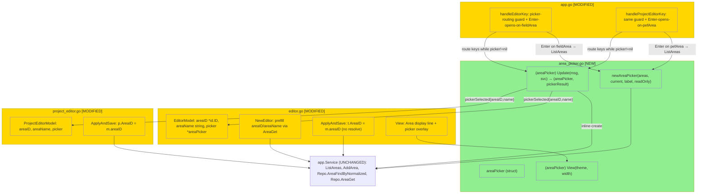

# area-picker (BL-8) — Design

## 2.1 Overview

Заменяем free-text поле Area в обоих редакторах на интерактивный overlay-picker.
Решение состоит из трёх частей:

1. **Новый общий компонент** `areaPicker` (`internal/tui/area_picker.go`) —
   список `[нет area] + areas + [+ New area…]`, навигация, inline-create.
2. **Интеграция в task editor** (`editor.go`) — поле Area становится
   display-only (хранит `areaID *id.ID` + `areaName string`), picker открывается
   по Enter, результат пишется в `areaID`; `ApplyAndSave` больше не резолвит
   имя.
3. **Интеграция в project editor** (`project_editor.go`) — то же, с лейблом
   «No area» вместо «Inbox».

Сервисный, доменный и storage-слои **не меняются** — используем готовые
`svc.ListAreas`, `svc.AddArea`, `svc.Repo().AreaFindByNormalized`,
`svc.Repo().AreaGet`.

## 2.2 Architecture



### Implementation Order

1. **`areaPicker` компонент** (`area_picker.go`) + unit/PBT — изолирован, не
   зависит от редакторов; строится и тестируется первым.
2. **task editor интеграция** (`editor.go` + `handleEditorKey`) — заменить
   textinput на `areaID/areaName/picker`, открытие/роутинг, save-контракт.
3. **project editor интеграция** (`project_editor.go` + `handleProjectEditorKey`)
   — тот же паттерн.
4. **Обновление существующих тестов**, сломанных сменой структуры
   (`editor_test.go`, `project_editor_test.go`, при необходимости `app_test.go`).

## 2.3 Components and Interfaces

### Files Requiring Changes

| File | Change Type | Description |
|------|-------------|-------------|
| `internal/tui/area_picker.go` | `[NEW]` | `areaPicker` struct + `newAreaPicker`, `Update`, `View`, row-helpers, `pickerResult` тип |
| `internal/tui/editor.go` | `[MODIFIED]` | `EditorModel`: убрать `area textinput.Model`, добавить `areaID *id.ID`, `areaName string`, `picker *areaPicker`; `NewEditor` префилл `areaID/areaName`; убрать `fieldArea` из `focusCurrent`/`UpdateForm` input-веток; `View` рендерит Area как display-line и picker-overlay; `ApplyAndSave` ставит `t.AreaID = m.areaID` без `AreaFindByNormalized` |
| `internal/tui/project_editor.go` | `[MODIFIED]` | то же для `ProjectEditorModel`/`pefArea`; лейбл «No area» |
| `internal/tui/app.go` | `[MODIFIED]` | `handleEditorKey`: в начале — guard `if m.editor.picker != nil` (роутинг в picker, перехват Esc/Up/Down/Enter); добавить кейс «Enter на `fieldArea` → открыть picker через `ListAreas`». `handleProjectEditorKey`: аналогично для `pefArea` |
| `internal/tui/area_picker_test.go` | `[NEW]` | unit + PBT для picker (CP-1..CP-11, CP-15) |
| `internal/tui/editor_test.go` | `[MODIFIED]` | обновить тесты, ссылавшиеся на area-textinput / «area not found»; добавить тесты save-контракта (CP-12), Enter-open (CP-14), preservation (CP-13) |
| `internal/tui/project_editor_test.go` | `[MODIFIED]` | обновить area-тесты под новый контракт; лейбл «No area» |

### Files NOT Requiring Changes

| File | Reason Unchanged |
|------|-----------------|
| `internal/app/queries.go`, `internal/app/service.go` | `ListAreas`/`AddArea` уже существуют — новых методов не нужно |
| `internal/domain/area/area.go` | модель и `Normalize` не меняются |
| `internal/storage/bbolt/bbolt.go` | `AreaCreate`/`AreaList`/`AreaFindByNormalized` уже отдают нужное поведение (вкл. `ErrAlreadyExists`) |
| `internal/tui/keys.go` | `Enter`, `Up`, `Down`, `CloseModal` биндинги уже есть — переиспользуем, новых не добавляем |
| `internal/tui/project_list.go` | используется только как образец рендера; не модифицируется |
| `internal/tui/msgs.go` | picker — sub-state внутри редактора, новый `screenKind`/msg не нужен |

### Interfaces (signatures only)

```go
// area_picker.go [NEW]

// pickerResult communicates the outcome of routing one key into the picker.
type pickerOutcome int
const (
    pickerNone     pickerOutcome = iota // still open, keep routing
    pickerCancel                        // Esc — close, no change
    pickerSelected                      // close, apply areaID/areaName
)
type pickerResult struct {
    outcome  pickerOutcome
    areaID   *id.ID // valid when outcome == pickerSelected (nil = no-area)
    areaName string // display name for the selection ("" for no-area)
}

// newAreaPicker builds a picker. cursor is positioned on `current`
// (the no-area row when current == nil). readOnly hides the create row.
func newAreaPicker(areas []area.Area, current *id.ID, noAreaLabel string, readOnly bool) areaPicker

// Update routes one key. svc is used only for inline-create (AddArea /
// AreaFindByNormalized). Pure for navigation/cancel keys.
func (p areaPicker) Update(msg tea.KeyMsg, svc *app.Service) (areaPicker, pickerResult)

// View renders the picker panel (list, or name-input when creating).
func (p areaPicker) View(theme Theme, width int) string

// editor.go [MODIFIED] — signatures unchanged except internal field swap
func NewEditor(ctx context.Context, t task.Task, svc *app.Service) EditorModel
func (m EditorModel) ApplyAndSave(ctx context.Context, svc *app.Service) (task.Task, error)

// project_editor.go [MODIFIED]
func newProjectEditor(create bool, p *project.Project, svc *app.Service) ProjectEditorModel
func (m ProjectEditorModel) ApplyAndSave(ctx context.Context, svc *app.Service) (project.Project, bool, error)
```

## 2.4 Key Decisions (ADR)

**Decision: Picker как sub-state редактора, а не отдельный `screenKind`**
- **Context:** Редактор рендерится полноэкранно через `m.editor.View()`
  (`app.go:897`), мимо обычного overlay-пути `m.confirm != nil`. Нужно
  место для picker-состояния и маршрутизации клавиш.
- **Options considered:** (A) новый `screenKind` (screenAreaPicker) с полями в
  `Model`; (B) nilable sub-model внутри `EditorModel`/`ProjectEditorModel` +
  guard в key-handler; (C) переиспользовать `m.confirm` инфраструктуру.
- **Decision:** B — `picker *areaPicker` внутри каждого редактора.
- **Rationale:** Picker логически принадлежит редактору (живёт и умирает
  вместе с ним), не требует нового экрана/msg, повторяет проверенный
  flag-gated паттерн (`m.confirm != nil`, `m.editingProject`). C не подходит:
  `m.confirm` рендерится только для не-editor экранов.
- **Consequences:** Key-handler редактора получает guard-ветку в начале;
  `View()` редактора получает раннюю ветку «picker активен → рисуем picker».
  Состояние picker не переживает закрытие редактора (это и нужно).

**Decision: Хранить `areaID *id.ID` + `areaName string`, поле Area — display-only**
- **Context:** Раньше поле хранило имя-строку и резолвило её на save (с
  ошибкой «not found»). Picker выбирает конкретную area → у нас сразу есть ID.
- **Options considered:** (A) оставить textinput, синхронизировать с выбором;
  (B) заменить на `areaID` + `areaName` (display); (C) хранить только `areaID`,
  имя резолвить в `View` (но `View` не имеет доступа к `svc`).
- **Decision:** B.
- **Rationale:** Убирает целый класс ошибок (резолв имени на save), `View`
  остаётся чистым (имя уже под рукой), `ApplyAndSave` упрощается. C невозможен —
  `View(theme, width)` не получает `svc`.
- **Consequences:** `fieldArea` перестаёт быть textinput — ведёт себя как
  `fieldWhen` (фокусируемая display-строка, спец-клавиша). Нужно убрать его из
  `focusCurrent`/`UpdateForm` input-веток. Существующие тесты area придётся
  обновить.

**Decision: Общий компонент `areaPicker` для обоих редакторов**
- **Context:** Оба редактора получают идентичный picker; разница только в
  лейбле «нет area» и (потенциально) read-only.
- **Options considered:** (A) один параметризуемый компонент; (B) две копии.
- **Decision:** A — компонент принимает `noAreaLabel` и `readOnly` параметрами.
- **Rationale:** DRY; единственная логика навигации/создания; тесты пишутся
  один раз против компонента, интеграция проверяется тонким слоем.
- **Consequences:** Компонент не знает про конкретный редактор — общается через
  `pickerResult`. Редакторы владеют применением результата.

**Decision: inline-create выполняется синхронно внутри key-handler**
- **Context:** В кодовой базе быстрые bbolt-операции вызываются синхронно
  (`NewEditor` → `AreaGet`; `ApplyAndSave` → `UpsertTag`). Тяжёлые операции
  оборачиваются в `tea.Cmd` (`saveEditor`).
- **Options considered:** (A) синхронный `svc.AddArea` в picker.Update;
  (B) асинхронно через новый `tea.Cmd` + msg.
- **Decision:** A.
- **Rationale:** `AddArea` — одна короткая bbolt-транзакция, как `AreaGet`/
  `UpsertTag`, которые уже вызываются синхронно. Async добавил бы msg/состояние
  без выигрыша.
- **Consequences:** `areaPicker.Update` принимает `svc` и может вернуть `err`
  в самом picker (остаётся открытым). Никаких новых msg-типов.

> **Versioning / Backward Compatibility:** не применимо — нет изменений в
> публичных API, протоколах, схеме хранения или конфиге. Меняется только
> внутреннее представление TUI-моделей; данные (`Task.AreaID`,
> `Project.AreaID`) и их формат не затрагиваются.

## 2.5 Data Models

```go
// [NEW] internal/tui/area_picker.go
// areaPicker is an overlay list for choosing an area, clearing it, or
// creating a new one inline. Editor-agnostic; communicates via pickerResult.
areaPicker struct {
    areas       []area.Area     // from svc.ListAreas (display order preserved)
    cursor      int             // 0 = no-area row; 1..N = areas; N+1 = create row
    noAreaLabel string          // "Inbox" (task) | "No area" (project)
    readOnly    bool            // true → no create row, AddArea never called
    creating    bool            // true → name-input mode
    nameInput   textinput.Model // active only while creating
    err         string          // inline-create error (keeps picker open)
}

// [NEW] pickerResult — see §2.3 Interfaces.

// [MODIFIED] internal/tui/editor.go — EditorModel
// [REMOVED field: area textinput.Model]
EditorModel struct {
    // ...unchanged: original, title, notes, start, deadline, project, heading, tags, when, focus, err...
    areaID   *id.ID       // [NEW] selected area (nil = Inbox)
    areaName string       // [NEW] display name of selected area ("" = Inbox)
    picker   *areaPicker  // [NEW] non-nil while picker is open
}

// [MODIFIED] internal/tui/project_editor.go — ProjectEditorModel
// [REMOVED field: area textinput.Model]
ProjectEditorModel struct {
    // ...unchanged: original, name, notes, deadline, autoClose, focus, err...
    areaID   *id.ID       // [NEW] selected area (nil = No area)
    areaName string       // [NEW]
    picker   *areaPicker  // [NEW]
}
```

Row indexing (used by cursor math and selection): index `0` → no-area;
`1..len(areas)` → `areas[i-1]`; `len(areas)+1` → create row (present iff
`!readOnly`).

## 2.6 Correctness Properties

```
Property 1: Select area sets matching ID
Category: Propagation
Statement: For all area lists and a chosen area row, confirming with Enter yields
  pickerResult{outcome=pickerSelected, areaID=&chosen.ID, areaName=chosen.Name}.
Validates: Requirements 3.3, 6.1

Property 2: Select no-area clears ID
Category: Propagation
Statement: For all area lists, confirming the no-area row yields
  pickerResult{outcome=pickerSelected, areaID=nil, areaName=""}.
Validates: Requirements 3.4, 6.2

Property 3: Esc preserves prior selection
Category: Absence
Statement: For all initial areaID values, opening the picker then pressing Esc
  yields outcome=pickerCancel and leaves the editor's areaID byte-equal to its
  pre-open value.
Validates: Requirements 3.5

Property 4: Cursor opens on current selection
Category: Propagation
Statement: For all area lists and a `current *id.ID`, newAreaPicker positions
  cursor on the row matching current (or the no-area row when current == nil).
Validates: Requirements 3.1

Property 5: Cursor stays in bounds
Category: Absence
Statement: For all sequences of Up/Down keys, picker.cursor always remains in
  [0, lastRowIndex] (never negative, never past the last row).
Validates: Requirements 3.2

Property 6: Row layout is no-area ++ areas ++ create
Category: Equivalence
Statement: For all area lists and readOnly flags, the rendered rows equal
  [noAreaLabel] ++ areas (in ListAreas order) ++ (["+ New area…"] iff !readOnly).
Validates: Requirements 1.2, 1.3, 5.1

Property 7: No-area label is context-correct
Category: Propagation
Statement: For all task-editor pickers the no-area label is "Inbox"; for all
  project-editor pickers it is "No area".
Validates: Requirements 2.1, 2.2

Property 8: Inline-create of a new name creates and selects it
Category: Round-trip
Statement: For all non-empty names whose Normalize form is absent from the store,
  confirming create calls AddArea and yields pickerSelected with areaID pointing
  to a stored area whose Name equals the trimmed input.
Validates: Requirements 4.1, 4.2

Property 9: Empty name does not create
Category: Absence
Statement: For all inputs that are empty after TrimSpace, confirming create does
  NOT call AddArea, sets picker.err, and yields outcome=pickerNone (still open).
Validates: Requirements 4.3

Property 10: Duplicate name selects existing, no duplicate
Category: Exclusion
Statement: For all names whose Normalize form already exists, confirming create
  does NOT add a second area (area count unchanged) and yields pickerSelected
  with areaID of the pre-existing area.
Validates: Requirements 4.4

Property 11: Read-only never creates
Category: Absence
Statement: For all key sequences applied to a readOnly picker, AddArea is never
  invoked and no create row exists in the rendered rows.
Validates: Requirements 5.1, 5.2

Property 12: Save persists exactly the selected AreaID
Category: Equivalence
Statement: For all tasks and chosen areaID values, ApplyAndSave persists a task
  whose AreaID equals the editor's areaID, without calling AreaFindByNormalized.
Validates: Requirements 6.1, 6.2

Property 13: Project/Heading resolution unchanged
Category: Equivalence
Statement: For all tasks with a valid project name (and optional heading), the
  ApplyAndSave Project/Heading outcome is identical to the pre-change behavior.
Validates: Requirements 7.1

Property 14: Enter on Area field opens the picker
Category: Propagation
Statement: For all editor states with focus on the Area field, an Enter key event
  results in a non-nil picker sub-model.
Validates: Requirements 1.1

Property 15: Non-conflict create error keeps picker open
Category: Absence
Statement: For all AddArea errors other than ErrAlreadyExists, confirming create
  sets picker.err, yields outcome=pickerNone, and leaves areaID unchanged.
Validates: Requirements 4.5
```

## 2.7 Error Handling

| Scenario | Detection | Action |
|----------|-----------|--------|
| Имя для create пустое (после TrimSpace) | проверка перед `AddArea` | не вызывать `AddArea`; `picker.err = "name required"`; picker открыт (REQ-4.3) |
| Дубликат имени (нормализованно) | `AddArea` → `errors.Is(err, storage.ErrAlreadyExists)` | резолвить существующую через `AreaFindByNormalized`, выбрать её; picker закрыт (REQ-4.4) |
| Прочая ошибка `AddArea` | `err != nil && !ErrAlreadyExists` | `picker.err = err.Error()`; picker открыт; `areaID` без изменений (REQ-4.5) |
| Read-only попытка create | `picker.readOnly == true` | create-строки нет (REQ-5.1); `AddArea` не вызывается (REQ-5.2) |
| `ListAreas` падает при открытии picker | ошибка из `svc.ListAreas` в `handleEditorKey`/`handleProjectEditorKey` | picker не открывается; ошибка пишется в `editor.err`/`projectEditor.err`; фокус остаётся в форме |
| Esc в picker | `key.Matches(msg, m.keys.CloseModal)` внутри picker-guard | закрыть picker, `areaID` без изменений (REQ-3.5); НЕ закрывать редактор |
| Курсор за границей при пустом списке areas | row-индексация: всегда есть no-area row (index 0) | cursor клампится в `[0, lastRow]` (REQ-1.3, REQ-3.2) |

## 2.8 Testing Strategy

**Test Style Source:** Tier 2
- Нет `test_skill` в конфиге (`.spec/config.yaml` отсутствует).
- Соседние тесты: `internal/tui/editor_test.go`, `internal/tui/project_editor_test.go`,
  `internal/tui/project_navigation_pbt_test.go`.
- Паттерны: `stretchr/testify` (`require`), property-based `pgregory.net/rapid`
  (`rapid.Check`, `rapid.SliceOf`, `rapid.StringMatching`); хелперы
  `newTestModelWithService(t)`, `setupModelWithInboxTasks(t, ...)` для
  построения `Model`/`Service` поверх in-memory repo.

**Project Commands:**
| Action | Command |
|--------|---------|
| Test | `task test` |
| Build | `task build` |
| Lint | `task lint` |

### Unit Tests

| Test | Description | Tags |
|------|-------------|------|
| `TestAreaPicker_OpensCursorOnCurrent` | `newAreaPicker` с `current` ставит cursor на нужную строку | `Feature/area-picker` |
| `TestAreaPicker_NoAreaLabelContextual` | лейбл «Inbox» vs «No area» по параметру | `Feature/area-picker` `Property/7` |
| `TestAreaPicker_EnterOnAreaSelects` | Enter на area → `pickerSelected` с её ID/Name | `Feature/area-picker` `Property/1` |
| `TestAreaPicker_EnterOnNoAreaClears` | Enter на no-area → `pickerSelected{nil,""}` | `Feature/area-picker` `Property/2` |
| `TestAreaPicker_EscCancels` | Esc → `pickerCancel`, без выбора | `Feature/area-picker` `Property/3` |
| `TestAreaPicker_RowsLayout` | строки = no-area ++ areas ++ create(если !readOnly) | `Feature/area-picker` `Property/6` |
| `TestAreaPicker_ReadOnlyHidesCreate` | readOnly → нет create-строки | `Feature/area-picker` `Property/6` `Property/11` |
| `TestAreaPicker_CreateEmptyNameErrors` | пустое имя → нет `AddArea`, err, open | `Feature/area-picker` `Property/9` |
| `TestAreaPicker_CreateDuplicateSelectsExisting` | дубликат → выбор существующей, count не растёт | `Feature/area-picker` `Property/10` |
| `TestAreaPicker_CreateServiceErrorKeepsOpen` | прочая ошибка → err, open, areaID не тронут | `Feature/area-picker` `Property/15` |
| `TestEditor_EnterOnAreaOpensPicker` | Enter на `fieldArea` → `picker != nil` | `Feature/area-picker` `Property/14` |
| `TestEditor_ApplyAndSaveUsesAreaID` | save пишет `m.areaID`, без `AreaFindByNormalized` | `Feature/area-picker` `Property/12` |
| `TestEditor_ApplyAndSaveNilAreaID` | `areaID==nil` → сохранён `AreaID==nil` | `Feature/area-picker` `Property/12` |
| `TestEditor_ProjectHeadingUnchanged` | резолв Project/Heading не изменился | `Feature/area-picker` `Property/13` |
| `TestProjectEditor_EnterOnAreaOpensPicker` | Enter на `pefArea` → `picker != nil` | `Feature/area-picker` `Property/14` |
| `TestProjectEditor_ApplyAndSaveUsesAreaID` | project save пишет `m.areaID` | `Feature/area-picker` `Property/12` |

### Property-Based Tests

| Test | Property | Generator description | Tags |
|------|----------|-----------------------|------|
| `TestProp_SelectAreaSetsID` | Property 1 | случайный список areas (имена через `rapid.StringMatching`) + случайный выбранный индекс | `Property/1` |
| `TestProp_NoAreaClearsID` | Property 2 | случайный список areas, выбор no-area | `Property/2` |
| `TestProp_EscPreservesSelection` | Property 3 | случайный начальный `current *id.ID` + список | `Property/3` |
| `TestProp_CursorOpensOnCurrent` | Property 4 | список areas + `current` из множества {nil} ∪ ids | `Property/4` |
| `TestProp_CursorInBounds` | Property 5 | случайная последовательность Up/Down (`rapid.SliceOf`) над случайным списком | `Property/5` |
| `TestProp_RowLayout` | Property 6 | случайный список + случайный `readOnly` bool | `Property/6` |
| `TestProp_NoAreaLabelContextual` | Property 7 | оба лейбла; targeted (фиксированные значения) — отмечено ниже | `Property/7` |
| `TestProp_CreateNewNameRoundTrip` | Property 8 | случайные непустые имена, отсутствующие в сторе | `Property/8` |
| `TestProp_EmptyNameNoCreate` | Property 9 | строки из пробелов/пустые (`rapid.StringMatching("\\s*")`) | `Property/9` |
| `TestProp_DuplicateNameNoDup` | Property 10 | предсозданная area + варианты её имени в другом регистре | `Property/10` |
| `TestProp_ReadOnlyNeverCreates` | Property 11 | случайные key-последовательности над readOnly picker | `Property/11` |
| `TestProp_SaveUsesAreaID` | Property 12 | случайный `areaID` из {nil} ∪ существующие | `Property/12` |
| `TestProp_ProjectHeadingUnchanged` | Property 13 | случайные валидные project/heading имена | `Property/13` |
| `TestProp_EnterOpensPicker` | Property 14 | targeted (фокус на Area, событие Enter) — отмечено ниже | `Property/14` |
| `TestProp_CreateErrorKeepsOpen` | Property 15 | read-only repo / форсированная ошибка `AddArea` | `Property/15` |

> **Примечание:** CP-7 и CP-14 имеют фиксированное входное пространство
> (два лейбла; одно событие Enter) — для них PBT вырождается в targeted unit
> tests, помеченные тегом `Property/N` (разрешено правилами §2.8).
