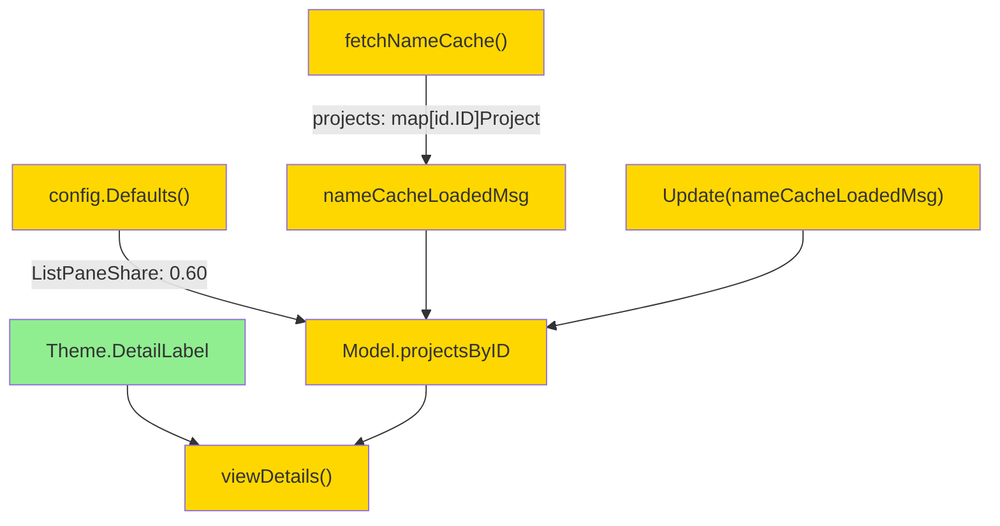

# Details Pane Redesign — Design

**Status:** Draft
**Date:** 2026-05-27

## 2.1 Overview

Дизайн объединяет три бэклог-пункта в единое изменение `viewDetails`:

1. **Стилизация лейблов**: новое поле `Theme.DetailLabel` (Bold + Accent в цветной теме; Bold-only в монохромной); `viewDetails` оборачивает каждый лейбл через него и расставляет пустые строки между логическими группами полей.
2. **Ширина details**: дефолт `ListPaneShare` меняется с `0.45` на `0.60`, что даёт details ≤ 40% при дефолтном конфиге; YAML-override остаётся.
3. **Расширенный project info**: кэш `Model.projectNamesByID map[id.ID]string` заменяется на `Model.projectsByID map[id.ID]project.Project`; `fetchNameCache` и `nameCacheLoadedMsg` мигрируют на полные сущности; `viewDetails` отображает sub-fields (`Project status:`, `Project due:`, `Project notes:`) с 2-пробельным отступом.

Heading остаётся на отдельной строке (без изменений в layout относительно текущего поведения).

## 2.2 Architecture



**Порядок реализации:** Style (новое поле в Theme) → Config (дефолт) → Model + msg shape (тип `projectsByID`) → fetchNameCache (выдача полной Project) → Update handler (запись в новый кэш) → viewDetails (использование DetailLabel + sub-fields + пустые строки) → тесты.

Эта последовательность обеспечивает, что промежуточные компилирующие состояния минимальны: после смены типа `Model.projectsByID` все читатели обновляются согласованно.

## 2.3 Components and Interfaces

### Files Requiring Changes

| File | Change Type | Description |
|------|-------------|-------------|
| `internal/tui/style.go` | `[MODIFIED]` | Добавить поле `DetailLabel lipgloss.Style` в struct `Theme`. Заполнить в `newColorTheme` (Bold + Accent) и `NewMonochromeTheme` (Bold-only). |
| `internal/config/app.go` | `[MODIFIED]` | `Defaults()`: `ListPaneShare: 0.45` → `0.60`. |
| `internal/tui/app.go` | `[MODIFIED]` | Заменить поле `Model.projectNamesByID map[id.ID]string` на `Model.projectsByID map[id.ID]project.Project`. Обновить инициализацию в `NewModel`. Обновить handler `case nameCacheLoadedMsg` — копирование `project.Project` вместо string. Добавить импорт `internal/domain/project`. |
| `internal/tui/msgs.go` | `[MODIFIED]` | `nameCacheLoadedMsg.projects` тип: `map[id.ID]string` → `map[id.ID]project.Project`. Добавить импорт. |
| `internal/tui/details.go` | `[MODIFIED]` | `fetchNameCache`: класть полный `project.Project` (получаемый из `ProjectGet`) вместо name. `viewDetails`: лейблы через `m.theme.DetailLabel.Render(...)`; пустые строки между группами (Status / Notes / Dates / Relations / Tags / Someday); project sub-fields (Status если != Open, Deadline если nil-check, Notes wrapped 3 lines). |
| `internal/config/app_test.go` | `[MODIFIED]` | `TestDefaults_AppConfig` — обновить ожидание `ListPaneShare: 0.45 → 0.60`. |
| `internal/tui/details_test.go` | `[MODIFIED]` | Тесты, которые используют `m.projectNamesByID[pid] = "..."`, мигрируют на `m.projectsByID[pid] = project.Project{Name: "..."}`. Существующие substring-assertions (`Contains(out, "Project:")`) survive стилизации (REQ-4.2). |
| `internal/tui/app_test.go` | `[MODIFIED]` | `TestNameCache_LoadedMsgPopulatesModel` обновляется: ожидает `m.projectsByID[pid] == project.Project{...}` вместо string. |
| `internal/tui/details_redesign_test.go` | `[NEW]` | Новые unit + property тесты для новых REQ (стилизация, пустые строки, sub-fields, fallback). |

### Files NOT Requiring Changes

| File | Reason Unchanged |
|------|-----------------|
| `internal/tui/editor.go` | Editor использует `theme.Label` (Bold + Subtext) для своих form-лейблов — это специально оставляется отличным от `DetailLabel`, чтобы визуально различать editor и details. |
| `internal/tui/app.go:viewList` | Список не затрагивается (BL-1 уже сделал dates removal в предыдущей feature). |
| `internal/tui/details.go:paneWidths` | Формула не меняется; только дефолтное значение `ListPaneShare` в config. |
| `internal/domain/project/project.go` | Сущность Project уже имеет нужные поля (Name, Status, Deadline, Notes). |
| `internal/storage/repository.go` | `ProjectGet` уже существует — других методов добавлять не надо. |

### Interface Signatures

```go
// theme.go (Theme struct extension)
type Theme struct {
    // ... existing fields ...
    DetailLabel lipgloss.Style // new: Bold + Accent (color), Bold-only (mono)
}

// msgs.go (changed)
type nameCacheLoadedMsg struct {
    tags     map[id.ID]string
    areas    map[id.ID]string
    projects map[id.ID]project.Project // type changed
    headings map[id.ID]string
}

// app.go (Model field changed)
type Model struct {
    // ... existing fields ...
    projectsByID map[id.ID]project.Project // replaces projectNamesByID
}

// details.go (signatures unchanged, behaviour expanded)
func fetchNameCache(svc *app.Service, tasks []task.Task) tea.Cmd
func viewDetails(m Model, width int) string

// New private helper for project name resolution
func resolveProjectName(cache map[id.ID]project.Project, pid id.ID) string
```

## 2.4 Key Decisions (ADR)

### ADR-1: Replace, не extend, `projectNamesByID`

- **Context:** в текущей реализации кэш проектов — `map[id.ID]string`. BL-6 требует показать project.Status, .Deadline, .Notes. Два пути: добавить параллельный `projectsByID` рядом со старым (двойной источник), или заменить.
- **Options:** (a) Keep `projectNamesByID` + add new `projectsByID`. (b) Replace `projectNamesByID` with `projectsByID`.
- **Decision:** (b) Replace.
- **Rationale:** один источник истины, нет рассинхрона имён, нет дублирующих fetch'ей в `fetchNameCache`. Тесты, использующие старое поле, легко мигрируются механически.
- **Consequences:** все callsites (`m.projectNamesByID[k]` в app.go + 1 место в details.go + 2 теста) меняются. Read-сторона: `cache[pid].Name` или fallback `id.Short(pid)`. Не публичное API — миграция safe.

### ADR-2: Новый `Theme.DetailLabel` вместо переиспользования `Theme.Label`

- **Context:** требование BL-1.1 — Bold + Accent. Существующий `Theme.Label` — Bold + Subtext (используется в editor.go).
- **Options:** (a) Перекрасить существующий `theme.Label` в Bold + Accent. (b) Добавить отдельный `theme.DetailLabel`.
- **Decision:** (b) Новый стиль.
- **Rationale:** не ломает визуальную дифференциацию editor (subtle) vs details (prominent). Editor labels — это форма ввода, не должны конкурировать за внимание с активным input box.
- **Consequences:** +1 поле в `Theme` struct, +2 строки в `newColorTheme`/`NewMonochromeTheme`. Минимально.

### ADR-3: Дефолт `ListPaneShare = 0.60` (breaking dev-config compat)

- **Context:** требование BL-2: details ≤ 40%. Текущий дефолт даёт 55%. Меняется значение по умолчанию, не контракт YAML.
- **Options:** (a) Менять дефолт. (b) Ввести флаг `details_max_share` отдельным полем.
- **Decision:** (a) Менять дефолт.
- **Rationale:** существующих файлов конфига в репозитории нет; downstream-пользователи (если есть свои YAML) получают свои значения, default не override-ит их. Двойной знаменатель (две настройки одной величины) — over-engineering.
- **Consequences:** `TestDefaults_AppConfig` ломается → одно явное обновление теста. Документируется в commit message.

## 2.5 Data Models

```go
// [MODIFIED] Theme — added one field.
type Theme struct {
    // ... existing fields unchanged ...
    DetailLabel lipgloss.Style // [NEW] Bold + Accent (color) / Bold-only (mono)
}

// [MODIFIED] nameCacheLoadedMsg — projects field type change.
type nameCacheLoadedMsg struct {
    tags     map[id.ID]string
    areas    map[id.ID]string
    projects map[id.ID]project.Project // [CHANGED from map[id.ID]string]
    headings map[id.ID]string
}

// [MODIFIED] Model — projectsByID replaces projectNamesByID.
type Model struct {
    // ... other cache fields unchanged ...
    tagNamesByID     map[id.ID]string
    areaNamesByID    map[id.ID]string
    projectsByID     map[id.ID]project.Project // [REPLACES projectNamesByID map[id.ID]string]
    headingNamesByID map[id.ID]string
}
```

`project.Project` (`internal/domain/project/project.go:21-34`) — без изменений, используется как есть.

## 2.6 Correctness Properties

```
Property 1: DetailLabel is Bold + Accent in color theme
Category: Equivalence
Statement: For all themes constructed via newColorTheme(p) for any palette p, theme.DetailLabel rendered output contains the ANSI bold escape (CSI 1) AND the foreground color sequence matching p.accent.
Validates: Requirements 1.1
```

```
Property 2: DetailLabel is Bold-only in monochrome
Category: Equivalence
Statement: For all themes constructed via NewMonochromeTheme(), theme.DetailLabel rendered output contains the ANSI bold escape (CSI 1) and no foreground color sequence (no CSI 38;2 or CSI 38;5).
Validates: Requirements 1.1
```

```
Property 3: All visible labels rendered through DetailLabel
Category: Propagation
Statement: For all tasks rendered by viewDetails with at least one optional field set (Start | Due | Pinned | Area | Project | Heading | Tags | non-Open Status), the resulting output for each visible label substring ("Status:", "Start:", "Due:", "Pinned:", "Area:", "Project:", "Heading:", "Tags:") is wrapped by the ANSI escape sequence produced by theme.DetailLabel.Render(label) (verified by checking the label appears immediately preceded by the bold ANSI escape).
Validates: Requirements 1.2
```

```
Property 4: No orphan blank lines for absent fields
Category: Absence
Statement: For all tasks rendered by viewDetails, the output SHALL NOT contain two consecutive empty lines (`"\n\n\n"` substring) — i.e., empty lines only appear once between two non-empty groups.
Validates: Requirements 1.3, 1.4
```

```
Property 5: Details pane <= 40% with default ListPaneShare
Category: Equivalence
Statement: For all m.width >= 100 (dual-pane threshold) with default config.Defaults(), paneWidths(m).details / m.width <= 0.40.
Validates: Requirements 2.1, 2.2
```

```
Property 6: YAML override preserves ListPaneShare
Category: Equivalence
Statement: For all ListPaneShare values v in (0, 1), AppConfig{ListPaneShare: v}.Validate().ListPaneShare == v.
Validates: Requirements 2.3, 4.1
```

```
Property 7: project.Project flows end-to-end
Category: Propagation
Statement: For all Project entities p added via svc.AddProject before fetchNameCache is invoked, the returned Cmd's nameCacheLoadedMsg.projects[p.ID] equals p (or at least Name/Status/Deadline/Notes match what the Repository returns).
Validates: Requirements 3.1, 3.2
```

```
Property 8: Project sub-fields visible iff cache present and value set
Category: Equivalence
Statement: For all tasks t with non-nil t.ProjectID, viewDetails(m, w) contains "Project status:" iff m.projectsByID[*t.ProjectID].Status != StatusOpen AND the project entry exists in cache; similarly for "Project due:" iff Deadline != nil; similarly for "Project notes:" iff Notes != "".
Validates: Requirements 3.3, 3.4, 3.5
```

```
Property 9: Project fallback when cache miss
Category: Absence
Statement: For all tasks t with non-nil t.ProjectID such that m.projectsByID[*t.ProjectID] is absent (zero value or no key), viewDetails(m, w) contains "Project: <id.Short(*t.ProjectID)>" AND does NOT contain "Project status:", "Project due:", "Project notes:".
Validates: Requirements 3.6
```

```
Property 10: Project and Heading on separate lines
Category: Exclusion
Statement: For all tasks t with non-nil t.ProjectID AND non-nil t.HeadingID, the substring "Project:" and "Heading:" are NOT both present on the same output line (any line in strings.Split(viewDetails(m,w), "\n") contains at most one of them).
Validates: Requirements 3.7
```

```
Property 11: Existing substring contracts preserved
Category: Equivalence
Statement: For all tasks t with respective fields set, viewDetails(m, w) contains each of the substrings "Status:", "Start:", "Due:", "Area:", "Project:", "Tags:" (regression-lock for details_test.go).
Validates: Requirements 4.2
```

## 2.7 Error Handling

| Scenario | Detection | Action |
|----------|-----------|--------|
| Task has ProjectID but project is not in cache (`projectsByID` miss) | `cache[*t.ProjectID]` returns zero-value `project.Project{}` with `Name == ""` | Fall back to `Project: <id.Short(*t.ProjectID)>`; skip all sub-fields. (REQ-3.6) |
| `m.width == 0` (initial state, no `WindowSizeMsg`) | `paneWidths(m)` returns negative details width | Existing `wrapAndTruncate` returns empty for width<=0; sub-field lines still rendered (single-line) without wrap. Acceptable initial-frame artifact. |
| Project has `Status == StatusCompleted/Cancelled` but no `CompletedAt`/`CancelledAt` | Not detectable here — data integrity is Service-layer concern | viewDetails uses `Status` field directly; no special handling. |
| Project `Notes` is multi-paragraph long text | `wrapAndTruncate` truncates to 3 lines with `…` suffix | Already correct behaviour; no change. |
| `nameCacheLoadedMsg` arrives twice (race) | Update handler is idempotent — second write overwrites with same data | Acceptable; no special handling. |
| Migration leftover: test code writes `m.projectNamesByID[pid] = "..."` (old field) | Compile error after field rename | Tests get updated as part of T-N implementation tasks. |

## 2.8 Testing Strategy

**Test Style Source:** Tier 2
- Reference test files: `internal/tui/details_test.go`, `internal/tui/app_test.go`, `internal/tui/shell_test.go`, `internal/config/app_test.go`.
- Key patterns:
  - `testify/require` для unit assertions.
  - `pgregory.net/rapid` (`rapid.Check`) для property-based tests.
  - Helpers: `newTestModel(t)`, `newTestModelWithService(t)`, `setupRapidModel(rt, titles...)`.
  - Для ANSI-sensitive assertions — `lipgloss.SetColorProfile(termenv.TrueColor)` с `t.Cleanup(... Ascii)`.
  - Tests, mutating Model cache directly: уже широко используется (`m.areaNamesByID[a.ID] = "work"`).

**Project Commands:**

| Action       | Command           |
|--------------|-------------------|
| Test         | `task test`       |
| Test (race)  | `task test-race`  |
| Build        | `task build`      |
| Lint         | `task lint`       |

### Unit Tests

| Test | Description | Tags |
|------|-------------|------|
| `TestTheme_DetailLabelColorTheme` | Build `NewTheme()`; assert `theme.DetailLabel.Render("X")` contains bold ANSI (`\x1b[1`) and accent foreground. | `Feature/label-style`, `Property/1` |
| `TestTheme_DetailLabelMonochrome` | Build `NewMonochromeTheme()`; assert output contains bold ANSI, no `\x1b[38;`. | `Feature/label-style`, `Property/2` |
| `TestViewDetails_LabelsStyled` | Set `TrueColor`; task with Start/Due/Area; render `viewDetails`; for each label assert it is preceded by the same ANSI sequence as `theme.DetailLabel.Render("")` prefix. | `Feature/label-style`, `Property/3` |
| `TestViewDetails_NoOrphanBlankLines` | Render task with only Title + Status (minimal). Assert output does NOT contain `\n\n\n`. | `Feature/spacing`, `Property/4` |
| `TestViewDetails_EmptyLineBetweenGroups` | Task with Status + Start + Area + Tags. Assert output has exactly one blank line between each non-empty group (e.g., between status row and dates group). | `Feature/spacing`, `Property/4` |
| `TestConfig_DefaultsListPaneShareIs06` | `config.Defaults().ListPaneShare == 0.60`. | `Feature/pane-width`, `Property/5` |
| `TestPaneWidths_DetailsAtMost40Percent` | For `m.width ∈ {100, 120, 150, 200}` with default config, assert `paneWidths(m).details / m.width <= 0.40`. | `Feature/pane-width`, `Property/5` |
| `TestConfig_ValidatePreservesValidListPaneShare` | `AppConfig{ListPaneShare: 0.50}.Validate()` returns 0.50; for 0.20, 0.30, 0.45 — same. | `Feature/pane-width`, `Property/6` |
| `TestNameCache_FetchEmitsFullProject` | Add Project via svc with Name+Status+Deadline+Notes; call `fetchNameCache`, assert returned msg has full `project.Project`. | `Feature/project-cache`, `Property/7` |
| `TestNameCache_UpdateStoresFullProject` | Send `nameCacheLoadedMsg{projects: {pid: Project{Name:"foo", Status:Completed, ...}}}`; assert `mm.projectsByID[pid]` equals project. | `Feature/project-cache`, `Property/7` |
| `TestViewDetails_ProjectStatusSubField` | Task with ProjectID; cache has Project with Status=Completed. Assert output contains `"Project status:"` after `"Project:"`. | `Feature/project-info`, `Property/8` |
| `TestViewDetails_ProjectDeadlineSubField` | Project with non-nil Deadline. Assert output contains `"Project due:"` with formatted date. | `Feature/project-info`, `Property/8` |
| `TestViewDetails_ProjectNotesSubField` | Project with non-empty Notes. Assert output contains `"Project notes:"` and the notes text. | `Feature/project-info`, `Property/8` |
| `TestViewDetails_ProjectSubFieldsHiddenWhenOpenAndEmpty` | Project with Status=Open, Deadline=nil, Notes="". Assert output contains `"Project:"` but NOT `"Project status:"`, `"Project due:"`, `"Project notes:"`. | `Feature/project-info`, `Property/8` |
| `TestViewDetails_ProjectFallbackOnCacheMiss` | Task with ProjectID; cache empty. Assert output contains `"Project: <short-id>"` and no sub-fields. | `Feature/project-info`, `Property/9` |
| `TestViewDetails_ProjectAndHeadingSeparateLines` | Task with both ProjectID and HeadingID, cache hits. Assert no single output line contains both `"Project:"` and `"Heading:"`. | `Feature/project-info`, `Property/10` |
| `TestViewDetails_RegressionContains` | Migration-lock: task with all fields set. Assert all original substrings: `"Status:"`, `"Start:"`, `"Due:"`, `"Area:"`, `"Project:"`, `"Tags:"`. | `Regression`, `Property/11` |

### Property-Based Tests

| Test | Property | Generator description | Tags |
|------|----------|-----------------------|------|
| `TestProp_DetailLabelHasBold` | Property 1, 2 | Generate theme choice (color/mono). Assert bold ANSI presence. | `Property/1`, `Property/2` |
| `TestProp_AllLabelsStyled` | Property 3 | Generate task with random subset of optional fields populated. Assert every present label is ANSI-wrapped through DetailLabel. | `Property/3` |
| `TestProp_NoConsecutiveBlankLines` | Property 4 | Generate task with random subset of fields. Assert output never contains `\n\n\n`. | `Property/4` |
| `TestProp_DetailsLeq40Percent` | Property 5 | `m.width ∈ [100..400]` with default config. Assert details share ≤ 0.40. | `Property/5` |
| `TestProp_ListPaneShareRoundtrip` | Property 6 | `v ∈ rapid.Float64Range(0.01, 0.99)`. Assert `Validate(AppConfig{ListPaneShare: v}).ListPaneShare == v`. | `Property/6` |
| `TestProp_ProjectFlowsEndToEnd` | Property 7 | Random project Name (1-20 chars), Status (any), optional Deadline, optional Notes. Add via svc, run fetchNameCache, assert msg has equivalent Project. | `Property/7` |
| `TestProp_ProjectSubFieldsVisibilityMatchesCache` | Property 8 | Random combinations of project fields (open/non-open status × nil/non-nil deadline × empty/non-empty notes). Assert sub-fields appear iff value is set. | `Property/8` |
| `TestProp_ProjectFallbackOnMissing` | Property 9 | Task with ProjectID, empty cache. Generate over random ProjectIDs. Assert `"Project:"` line shows short-id and no sub-fields appear. | `Property/9` |
