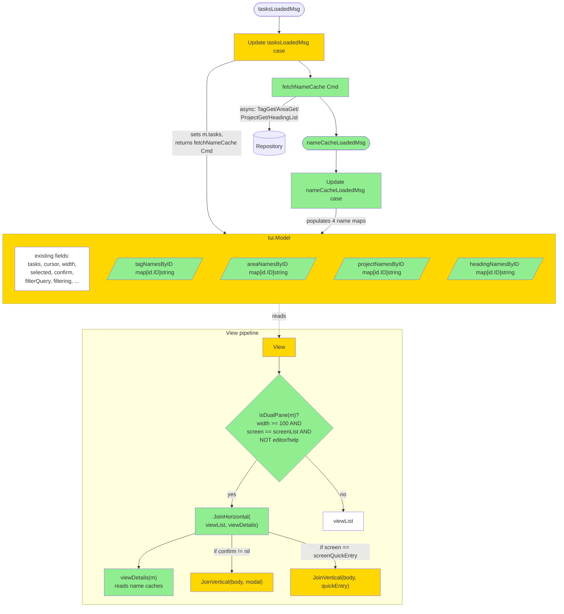

# Dual-Pane Layout for TUI — Design

## 2.1 Overview

Фича добавляет адаптивный layout: при `m.width >= 100` и `screen == screenList` (без editor / help) TUI рендерит горизонтальный split `lipgloss.JoinHorizontal(list, details)` с double-line border между панелями. Левая панель — текущий `viewList` (фильтр / selection / bulk сохранены). Правая — read-only детали `displayedTasks(m)[m.cursor]`. Name resolution для tags/area/project/heading кэшируется в Model через batch-fetch при `tasksLoadedMsg`; View() остаётся pure (никакого IO). Confirm modal и quick-entry overlay стекаются под весь split-body через `JoinVertical`. Реализация изолирована в `internal/tui/`.

## 2.2 Architecture



### Implementation Order

1. **Name Cache foundation** — `Model` поля `{tag,area,project,heading}NamesByID`, `nameCacheLoadedMsg` тип, `fetchNameCache(svc, tasks)` Cmd, обновление `tasksLoadedMsg` Update'а для дисптача Cmd, новый `nameCacheLoadedMsg` Update case.
2. **Details Pane content** — `viewDetails(m Model, width int) string` в новом файле `details.go`. Тестируется в изоляции от layout.
3. **Layout decision** — `isDualPane(m Model) bool`, `cursorTask(m Model) *task.Task` в `details.go`. Pane width calculation.
4. **View() integration** — диспетчер single vs dual через `viewBody()` в `app.go`. Modal/QuickEntry stack-below.
5. **Tests** — unit + property для всех CP.

## 2.3 Components and Interfaces

### Files Requiring Changes

| File | Change Type | Description |
|------|-------------|-------------|
| `internal/tui/app.go` | `[MODIFIED]` | Добавление 4 name-cache map'ов в `Model`; init их в `NewModel`; `tasksLoadedMsg` case теперь возвращает `tea.Batch(loadCmd, fetchNameCacheCmd)`; новый `nameCacheLoadedMsg` Update case; рефактор `View()` для диспатча через `viewBody()` хелпер. |
| `internal/tui/msgs.go` | `[MODIFIED]` | Добавление типа `nameCacheLoadedMsg`. |
| `internal/tui/details.go` | `[NEW]` | `isDualPane(m Model) bool`; `cursorTask(m Model) *task.Task`; `viewDetails(m Model, width int) string`; `fetchNameCache(svc *app.Service, tasks []task.Task) tea.Cmd`; helper `formatDate`, `formatStatus`, `wrapAndTruncate(text string, width, maxLines int) string`. |
| `internal/tui/details_test.go` | `[NEW]` | Unit + property tests для всех details- и layout-функций. |
| `internal/tui/app_test.go` | `[MODIFIED]` | Тесты на layout switching (width thresholds), name cache propagation через `nameCacheLoadedMsg`, mode interactions (filter/quick-entry/confirm/editor). |

### Files NOT Requiring Changes

| File | Reason Unchanged |
|------|-----------------|
| `internal/storage/repository.go` | Используем существующие `TagGet`, `AreaGet`, `ProjectGet`, `HeadingList`. |
| `internal/storage/bbolt/*` | Та же причина. |
| `internal/storage/fakes/*` | Та же причина — fakes уже поддерживают эти методы. |
| `internal/app/service.go` | Никаких новых service-методов — TUI напрямую читает через `Repo()`. |
| `internal/domain/*` | Никаких domain-изменений. |
| `internal/tui/keys.go` | Dual-pane активируется автоматически по ширине — нет новых keybindings. |
| `internal/tui/filter.go` | Filter не зависит от layout — работает в обеих режимах. |
| `internal/tui/bulk.go` | Bulk не зависит от layout — работает в обеих режимах. |
| `internal/tui/editor.go` | Editor — full-pane screen (REQ-1.6) — не затрагивается. |
| `internal/tui/style.go` | `lipgloss.DoubleBorder()` — built-in constructor, не требует темы. Border окрашивается через существующий `theme.Help` или `theme.Dim`. |
| `cmd/todushka/main.go` | TUI wiring без изменений. |
| `internal/cli/*` | Не затрагивается. |

### Interface Signatures

```go
// details.go

// isDualPane reports whether the renderer should use horizontal split.
// True only when width >= dualPaneMinWidth AND screen is screenList
// AND no full-pane screen is active. Filter mode and quick-entry overlay
// do NOT disable dual-pane (left pane handles them).
func isDualPane(m Model) bool

// cursorTask returns the task at m.cursor inside displayedTasks(m),
// or nil if the cursor is out of range or the displayed list is empty.
func cursorTask(m Model) *task.Task

// viewDetails renders the right pane content given a target width.
// Pure function — reads only m and width. Returns placeholder
// "(no task selected)" when cursorTask(m) is nil.
func viewDetails(m Model, width int) string

// fetchNameCache returns a Cmd that resolves all referenced
// tag/area/project/heading IDs in tasks and emits nameCacheLoadedMsg.
// Designed to be batched into Update's tasksLoadedMsg handler.
func fetchNameCache(svc *app.Service, tasks []task.Task) tea.Cmd

// wrapAndTruncate soft-wraps text to width and truncates to maxLines
// lines, appending "…" indicator if truncated.
func wrapAndTruncate(text string, width, maxLines int) string

// app.go

// viewBody dispatches between single-pane and dual-pane rendering.
// Handles confirm modal stacking, quick-entry overlay, editor/help full-width.
func (m Model) viewBody() string
```

## 2.4 Key Decisions (ADR)

### ADR-1: Name cache fetch trigger — per-`tasksLoadedMsg` batch

- **Context:** Details Pane needs tag/area/project/heading names. View() must remain pure (no IO).
- **Options:**
  - **A. Per-cursor-move fetch:** каждый `j`/`k` → N service calls для текущей задачи.
  - **B. Per-`tasksLoadedMsg` batch:** один Cmd резолвит ВСЕ referenced IDs из `m.tasks`, кэширует в Model.
  - **C. Lazy fetch on View access:** запрещено — нарушает View purity.
- **Decision:** B.
- **Rationale:** Batch амортизирует stoимость I/O; типичная operation (открытие списка) делает один проход. Cursor movement не делает IO вообще. `tasksLoadedMsg` уже триггерится после bulk операций и refresh — cache синхронизируется автоматически без дополнительных механизмов.
- **Consequences:** При rename'е tag в другом процессе TUI покажет старое имя до следующего `tasksLoadedMsg`. Приемлемо для v1 (refresh через `r` key обновит).

### ADR-2: Word-wrap — `lipgloss.Style.Width(N)`

- **Context:** Title и Notes могут быть длинее ширины details pane.
- **Options:**
  - **A. `lipgloss.Style.Width(N).Render(text)`** — встроенный soft-wrap.
  - **B. Ручная разбивка по `\n` + rune-based wrap.**
- **Decision:** A.
- **Rationale:** Стандартный pattern; меньше кода; корректно handle'ит ANSI escapes (для подсветки). Lipgloss wrap'нет по spaces при возможности.
- **Consequences:** Очень длинные слова без spaces (URLs) могут wrap'нуться неудачно. Acceptable для v1.

### ADR-3: Field order in details — fixed sequence

- **Context:** Details pane показывает 8+ полей; порядок влияет на UX.
- **Options:**
  - **A. Фиксированный порядок:** Title → Status → Notes → Start → Due → Pinned → Area → Project → Heading → Tags → Someday.
  - **B. Priority-based:** заполненные поля первыми, nil/empty в конец (или скрыты).
- **Decision:** A.
- **Rationale:** Стабильная визуальная позиция: пользователь учит "Status в строке 2" и не теряет его при переключении на задачу без notes. Priority-based создаёт layout jitter.
- **Consequences:** Если важное поле (Deadline) внизу, его не видно сразу при overflow. Mitigation: REQ-2.11 omit'ит nil поля, так что overflow редок.

### ADR-4: New file `details.go` vs extend `app.go`

- **Context:** Layout decision + details rendering — это ~150-200 строк кода. `app.go` уже 530+ строк.
- **Options:**
  - **A. Всё в `app.go`.**
  - **B. New `details.go` (как `filter.go`, `bulk.go`).**
- **Decision:** B.
- **Rationale:** Consistency с pattern feature #1. `app.go` остаётся Model definition + dispatcher.
- **Consequences:** +1 file. Acceptable.

### ADR-5: Name cache fetch — sync vs async Cmd

- **Context:** `tasksLoadedMsg` Update handler. IO нельзя в Update — это нарушает Bubble Tea.
- **Options:**
  - **A. Sync IO inside Update:** запрещено фреймворком.
  - **B. Async Cmd → `nameCacheLoadedMsg`:** Update возвращает `tea.Batch(existingCmds, fetchNameCache(...))`.
- **Decision:** B.
- **Rationale:** Единственный правильный pattern в Bubble Tea.
- **Consequences:** Между `tasksLoadedMsg` и `nameCacheLoadedMsg` есть короткий gap (~5-50ms на bbolt-вызовы), в котором viewDetails покажет short-ID fallback (REQ-4.3). Пользователь не успевает заметить — но это явно специфицировано.

### ADR-6: Pane width allocation

- **Context:** REQ-1.4 говорит "list_width = floor((m.width - 1) * 0.45)".
- **Options:**
  - **A. `floor((m.width - 1) * 0.45)`** — детали получают остаток (~55%).
  - **B. Fixed `min(m.width / 2, 50)` для left** — list ≤ 50 cols.
  - **C. Dynamic по контенту:** не подходит для строгого split.
- **Decision:** A.
- **Rationale:** Пропорциональное разделение масштабируется на любые ширины. Details обычно длиннее (notes) — больше пространства details оправдано.
- **Consequences:** На очень широких терминалах (200+) list может стать "тонким" по содержимому (короткие task titles + 90 cols). Acceptable trade-off.

## 2.5 Data Models

```go
// [MODIFIED] tui.Model — добавлены 4 name-cache map'а. Существующие поля сохранены.
type Model struct {
    // ... existing fields ...
    service     *app.Service
    keys        KeyMap
    theme       Theme
    screen      screenKind
    activeList  listKind
    tasks       []task.Task
    cursor      int
    statusMsg   string
    statusUntil time.Time
    quickInput  textinput.Model
    editor      EditorModel
    width       int
    selected    map[id.ID]struct{}
    confirm     *confirmState
    filterQuery string
    filtering   bool

    // [NEW] Name caches populated by nameCacheLoadedMsg.
    // Read by viewDetails (pure, no I/O). nil-safe via short-ID fallback.
    tagNamesByID     map[id.ID]string
    areaNamesByID    map[id.ID]string
    projectNamesByID map[id.ID]string
    headingNamesByID map[id.ID]string
}

// [NEW] nameCacheLoadedMsg carries the result of fetchNameCache.
// All maps are pre-built; Update merges them into Model directly.
type nameCacheLoadedMsg struct {
    tags     map[id.ID]string
    areas    map[id.ID]string
    projects map[id.ID]string
    headings map[id.ID]string
}

// [NEW] Constants in details.go.
const (
    dualPaneMinWidth = 100  // minimum terminal width for dual-pane layout
    listPaneShare   = 0.45  // fraction of width allocated to left pane
    detailsNotesMaxLines = 8
)
```

## 2.6 Correctness Properties

### Property 1: Layout mode exclusion

- **Category:** Exclusion
- **Statement:** For all `Model M`, exactly one of `single-pane` and `dual-pane` is rendered. `viewBody(M)` contains `JoinHorizontal` iff `isDualPane(M)` is true.
- **Validates:** Requirements 1.1, 1.2, 1.3, 1.6, 1.7

### Property 2: Pane width arithmetic

- **Category:** Equivalence
- **Statement:** For all `Model M` with `isDualPane(M) == true`, `listWidth(M) + 1 + detailsWidth(M) == M.width`, where `listWidth(M) == floor((M.width - 1) * 0.45)` and `detailsWidth(M) == M.width - 1 - listWidth(M)`.
- **Validates:** Requirement 1.4

### Property 3: Border rendering

- **Category:** Propagation
- **Statement:** For all `Model M` with `isDualPane(M) == true`, `viewBody(M)` contains the double-line border glyph `║` at the boundary between panes.
- **Validates:** Requirement 1.5

### Property 4: Editor and help force full-width

- **Category:** Absence
- **Statement:** For all `Model M` with `M.screen ∈ {screenEditor, screenHelp}`, `isDualPane(M) == false` regardless of `M.width`.
- **Validates:** Requirements 1.6, 1.7

### Property 5: Fixed field order

- **Category:** Equivalence
- **Statement:** For all `Cursor Task t` with all fields non-empty, `viewDetails(M, w)` lines appear in order: Title, Status, Notes, Start, Due, Pinned, Area, Project, Heading, Tags, Someday.
- **Validates:** Requirements 2.1, 2.2, 2.3, 2.4, 2.5, 2.6, 2.7, 2.8, 2.9, 2.10, 2.12

### Property 6: Nil-field omission

- **Category:** Absence
- **Statement:** For all `Cursor Task t`, `viewDetails(M, w)` does NOT contain the labels `Start:`, `Due:`, `Pinned:`, `Area:`, `Project:`, `Heading:`, `Tags:`, `Someday` respectively when the corresponding field is nil / empty / false.
- **Validates:** Requirement 2.11

### Property 7: Notes truncation

- **Category:** Equivalence
- **Statement:** For all `Cursor Task t` with `wrapAndTruncate(t.Notes, w, 8)` producing > 8 lines naturally, the actual output contains exactly 8 lines plus the truncation indicator `…`.
- **Validates:** Requirement 2.3

### Property 8: Placeholder on empty cursor

- **Category:** Propagation
- **Statement:** For all `Model M` with `cursorTask(M) == nil`, `viewDetails(M, w)` contains the exact substring `(no task selected)`.
- **Validates:** Requirements 3.1, 3.2

### Property 9: View purity — no Repository access

- **Category:** Absence
- **Statement:** For all `Model M` with all name caches pre-populated, `viewDetails(M, w)` makes ZERO calls to `M.service.Repo()` or any other I/O sink. (Verified via deterministic recording of repo calls during View execution.)
- **Validates:** Requirement 4.2

### Property 10: Name cache populated after tasksLoadedMsg → nameCacheLoadedMsg

- **Category:** Propagation
- **Statement:** For all `Model M` and tasks `T` referencing tag/area/project/heading IDs `I`, after applying `tasksLoadedMsg{tasks: T}` followed by execution of the returned Cmd and consumption of the emitted `nameCacheLoadedMsg`, the resulting Model has every ID from `I` present in the corresponding name cache map.
- **Validates:** Requirement 4.1

### Property 11: Short-ID fallback for missing names

- **Category:** Propagation
- **Statement:** For all `Cursor Task t` referencing TagID `T` where `T ∉ M.tagNamesByID`, `viewDetails(M, w)` contains `id.Short(T)` as the displayed tag name (same for Area/Project/Heading).
- **Validates:** Requirement 4.3

### Property 12: Cursor change reflects in details

- **Category:** Propagation
- **Statement:** For all `Model M1, M2` differing only in `cursor` such that `cursorTask(M1) != cursorTask(M2)`, `viewDetails(M1, w) != viewDetails(M2, w)`.
- **Validates:** Requirement 5.1

### Property 13: Filter does not disable dual-pane

- **Category:** Propagation
- **Statement:** For all `Model M` with `M.width >= 100 AND M.screen == screenList AND M.filtering == true`, `isDualPane(M) == true`.
- **Validates:** Requirement 6.1

### Property 14: Confirm modal stacks below dual-pane

- **Category:** Propagation
- **Statement:** For all `Model M` with `isDualPane(M) == true AND M.confirm != nil`, `View(M)` output contains the rendered `JoinHorizontal(list, details)` AND the modal `<Action> N tasks? (y/n)`, with the modal positioned after (below) the split body in the vertical layout.
- **Validates:** Requirement 1.8

## 2.7 Error Handling

| Scenario | Detection | Action |
|----------|-----------|--------|
| `Repo().TagGet/AreaGet/...` returns error during `fetchNameCache` | Per-call error check inside the Cmd closure | Skip that ID (don't add to cache map); display short-ID fallback per REQ-4.3. Do NOT abort the whole Cmd. |
| `fetchNameCache` returns Cmd that emits `nameCacheLoadedMsg` with partial maps | Always — by design (per-ID resilience) | Merge whatever names successfully resolved into Model. Unknown IDs fall back to short-ID via REQ-4.3. |
| `m.cursor < 0` or `m.cursor >= len(displayedTasks(m))` | Bound check in `cursorTask` | Return nil → viewDetails emits placeholder. |
| Terminal resize narrows below `dualPaneMinWidth` while viewing details | `WindowSizeMsg` updates `m.width`; next `View()` call detects | Switch to single-pane on next render. No data loss. |
| Terminal resize widens above `dualPaneMinWidth` | Same as above, inverse | Switch to dual-pane on next render. Name cache already populated from earlier `tasksLoadedMsg`. |
| Task's TagID exists but was deleted out-of-band (e.g. via CLI) | `fetchNameCache` gets `storage.ErrNotFound` for that ID | Skipped per row 1 above. Short-ID fallback. |
| `m.width == 0` (no WindowSizeMsg yet) | `isDualPane` checks `width < dualPaneMinWidth` (0 < 100 = true) | Single-pane fallback. No special-case needed. |
| Details pane width too narrow for any meaningful render (e.g. width allocation gives details_width < 20) | Bound check inside `viewDetails` | If `width < 20`, force single-pane (safety net). |
| Notes contain ANSI escape codes that lipgloss can't wrap | lipgloss handles ANSI via Width() | If wrapping breaks visually, acceptable — domain task should not contain ANSI. |
| Concurrent `tasksLoadedMsg` and `nameCacheLoadedMsg` ordering | Bubble Tea Update is serialized | No race. nameCacheLoadedMsg from older fetch may arrive AFTER newer tasksLoadedMsg — merging is safe (maps additive). |

## 2.8 Testing Strategy

**Test Style Source:** Tier 2
- Adjacent test files: `internal/tui/app_test.go`, `internal/tui/filter_test.go`, `internal/tui/bulk_test.go`. Established `newTestModel(t)`, `setupModelWithInboxTasks(t, ...)`, `bareTestModel()` fixtures.
- Property tests: `pgregory.net/rapid` with `rapid.Check(t, func(t *rapid.T) {...})`.
- Key patterns: testify `require`; direct `Update(tea.KeyMsg/Msg)`; `cmd()` invocation to type-assert resulting message.

### Project Commands

| Action     | Command          |
|------------|------------------|
| Test       | `task test`      |
| Test race  | `task test-race` |
| Build      | `task build`     |
| Lint       | `task lint`      |
| Format     | `task fmt`       |

### Unit Tests

| Test | Description | Tags |
|------|-------------|------|
| `TestIsDualPane_WideTerminal` | `m.width = 100`, `screen = screenList`, others zero → `true` | `Feature/layout` `Property/1` |
| `TestIsDualPane_NarrowTerminal` | `m.width = 99` → `false` | `Feature/layout` `Property/1` |
| `TestIsDualPane_ZeroWidth` | `m.width = 0` → `false` | `Feature/layout` `Property/1` |
| `TestIsDualPane_EditorScreen` | `m.width = 200`, `screen = screenEditor` → `false` | `Feature/layout` `Property/4` |
| `TestIsDualPane_HelpScreen` | `m.width = 200`, `screen = screenHelp` → `false` | `Feature/layout` `Property/4` |
| `TestIsDualPane_FilterAllowed` | `m.width = 200`, `filtering = true`, `screen = screenList` → `true` (REQ-6.1) | `Feature/layout` `Property/13` |
| `TestPaneWidth_SumEqualsTotal` | для `m.width = 100, 120, 150, 200`: `listWidth + 1 + detailsWidth == m.width` | `Feature/layout` `Property/2` |
| `TestViewBody_DualPaneContainsBothPanes` | `m.width = 120`, task in list → output contains list-marker `>` AND task Title | `Feature/layout` |
| `TestViewBody_BorderPresent` | `m.width = 120` → output contains `║` glyph | `Feature/layout` `Property/3` |
| `TestViewBody_SinglePaneNoBorder` | `m.width = 80` → output does NOT contain `║` | `Feature/layout` |
| `TestViewDetails_AllFieldsOrdered` | Task with title, status, notes, start, due, pinned, area, project, heading, tags, someday → fixed order verified by line position | `Feature/details` `Property/5` |
| `TestViewDetails_OmitsNilStart` | Task with `StartDate = nil` → output does NOT contain `Start:` | `Feature/details` `Property/6` |
| `TestViewDetails_OmitsNilDeadline` | Task with `Deadline = nil` → output does NOT contain `Due:` | `Feature/details` `Property/6` |
| `TestViewDetails_OmitsEmptyTags` | Task with `len(Tags) == 0` → output does NOT contain `Tags:` | `Feature/details` `Property/6` |
| `TestViewDetails_OmitsNilArea` | Task with `AreaID = nil` → output does NOT contain `Area:` | `Feature/details` `Property/6` |
| `TestViewDetails_OmitsSomedayWhenFalse` | Task with `Someday = false` → output does NOT contain `Someday` | `Feature/details` `Property/6` |
| `TestViewDetails_NotesTruncated` | Notes with 100 lines (single column wrap) → 8 lines + `…` | `Feature/details` `Property/7` |
| `TestViewDetails_NotesShortNotTruncated` | Notes with 3 lines → no `…` indicator | `Feature/details` `Property/7` |
| `TestViewDetails_EmptyTasksPlaceholder` | `m.tasks = nil` → output equals `(no task selected)` | `Feature/details` `Property/8` |
| `TestViewDetails_OutOfRangeCursorPlaceholder` | `m.tasks` size 2, `m.cursor = 5` → placeholder | `Feature/details` `Property/8` |
| `TestViewDetails_TagShortIDFallback` | Task with TagID T, `m.tagNamesByID = {}` → output contains `id.Short(T)` | `Feature/details` `Property/11` |
| `TestNameCache_PopulatedByMsg` | dispatch `nameCacheLoadedMsg{tags: {T1: "work"}}` → `m.tagNamesByID[T1] == "work"` | `Feature/cache` `Property/10` |
| `TestNameCache_FetchCmdEmitsMsg` | call `fetchNameCache(svc, tasks)` Cmd → message is `nameCacheLoadedMsg` with names resolved | `Feature/cache` `Property/10` |
| `TestUpdate_TasksLoadedDispatchesFetch` | `m.Update(tasksLoadedMsg{tasks: [t1]})` returns `tea.Batch` Cmd that includes `fetchNameCache` | `Feature/cache` |
| `TestViewDetails_NoRepoAccessAfterCachePopulated` | viewDetails called with sentinel repo that panics on access → no panic | `Feature/cache` `Property/9` |
| `TestLayout_ConfirmStacksBelowDual` | `m.width = 120`, `confirm != nil` → output has split body then modal vertically | `Feature/layout` `Property/14` |
| `TestLayout_QuickEntryStacksBelowDual` | `m.width = 120`, `screen = screenQuickEntry` → output has split body then quick-entry vertically | `Feature/layout` |
| `TestLayout_EditorFullPaneIgnoresWidth` | `m.width = 200`, `screen = screenEditor` → no `║` border, full-width editor | `Feature/layout` `Property/4` |
| `TestCursorChange_DetailsUpdates` | two tasks; render details at cursor=0 vs cursor=1 → different outputs | `Feature/cursor` `Property/12` |
| `TestWrapAndTruncate_BasicWrap` | 50-char line, width=20 → multiple wrapped lines | `Feature/details` |
| `TestWrapAndTruncate_PreservesShortText` | text shorter than width → unchanged | `Feature/details` |

### Property-Based Tests

| Test | Property | Generator description | Tags |
|------|----------|-----------------------|------|
| `TestProp_LayoutModeExclusion` | Property 1 | `rapid.IntRange(0, 300)` for width, `rapid.SampledFrom` for screen | `Property/1` |
| `TestProp_PaneWidthArithmetic` | Property 2 | `rapid.IntRange(100, 400)` for width | `Property/2` |
| `TestProp_BorderRenders` | Property 3 | Wide width + screenList → output contains `║` | `Property/3` |
| `TestProp_EditorHelpForceFullPane` | Property 4 | `rapid.SampledFrom({screenEditor, screenHelp})` + wide width | `Property/4` |
| `TestProp_FieldOrderInvariant` | Property 5 | randomized tasks with all fields populated → fixed line order | `Property/5` |
| `TestProp_NilFieldsOmitted` | Property 6 | tasks with subset of fields nil → labels absent | `Property/6` |
| `TestProp_NotesTruncationCorrect` | Property 7 | notes of variable length → output ≤ 8 lines + `…` if truncated | `Property/7` |
| `TestProp_PlaceholderOnEmptyCursor` | Property 8 | random cursor (in/out of range) on random task slice | `Property/8` |
| `TestProp_NoRepoAccessInView` | Property 9 | mock Service with panicking Repo → viewDetails must not panic | `Property/9` |
| `TestProp_NameCachePopulation` | Property 10 | random tasks referencing random IDs → after Cmd execution, all IDs in caches | `Property/10` |
| `TestProp_ShortIDFallback` | Property 11 | task with TagID not in cache → output contains `id.Short(TagID)` | `Property/11` |
| `TestProp_CursorChangeReflects` | Property 12 | two random cursors on the same task list → different details outputs | `Property/12` |
| `TestProp_FilterPreservesDualPane` | Property 13 | wide width + `filtering=true` → `isDualPane` true | `Property/13` |
| `TestProp_ConfirmStacksBelowDual` | Property 14 | wide width + confirm != nil → output has both elements with vertical structure | `Property/14` |
