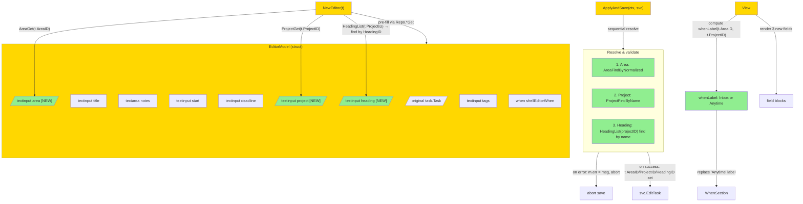

# Editor When + Area/Project/Heading Picker (v0.6.0) — Design

## 2.1 Overview

Editor получает 3 новых textinput-поля (Area, Project, Heading) + context-aware "When" label. Реализация изолирована в `internal/tui/editor.go` + минимальное обновление в `app.go` (handleEditorKey routing). Никаких изменений в storage/app/domain слоях — используются существующие `Repo.AreaFindByNormalized`, `Repo.ProjectFindByName`, `Repo.HeadingList`, `Repo.AreaGet`, `Repo.ProjectGet`.

Save algorithm — sequential resolve: Area → Project → Heading. Первая ошибка останавливает дальнейшую обработку; `m.err` populated; editor остаётся открытым для коррекции.

## 2.2 Architecture



### Implementation Order

1. **`editorField` enum extension** — add `fieldArea`, `fieldProject`, `fieldHeading` constants between `fieldDeadline` and `fieldTags`; `fieldCount = 9`.
2. **`EditorModel` struct** — add 3 textinput fields.
3. **`NewEditor`** — initialize textinputs; pre-fill via `Repo.*Get` calls.
4. **`focusCurrent`, `nextField`, `prevField`, `UpdateForm`** — extend для новых field cases.
5. **`whenLabel` helper** — pure function returning "Inbox" или "Anytime" based on `(AreaID, ProjectID)`.
6. **`View()`** — render 3 new field blocks; use context-aware whenLabel; remove old hint.
7. **`ApplyAndSave`** — sequential resolve: Area, Project, Heading. Return error from first failure.
8. **Tests** — unit + property.

## 2.3 Components and Interfaces

### Files Requiring Changes

| File | Change Type | Description |
|------|-------------|-------------|
| `internal/tui/editor.go` | `[MODIFIED]` | 3 new textinput fields в `EditorModel`; 3 new editorField const; `NewEditor` инициализирует new fields via Repo lookups (signature changes to accept `svc *app.Service` для pre-fill); `focusCurrent`/`nextField`/`prevField`/`UpdateForm` extended; `View()` renders new blocks + context-aware label; `ApplyAndSave` sequentially resolves Area/Project/Heading; new helper `whenLabel(t task.Task) string` |
| `internal/tui/app.go` | `[MODIFIED]` | `openEditor` passes `m.service` to `NewEditor` constructor (signature change). No other changes — handleEditorKey already routes Tab/Save/Esc; UpdateForm dispatches to focused field. |
| `internal/tui/editor_test.go` | `[MODIFIED]` | Existing tests updated: `TestEditor_FieldCountIsSix` → `TestEditor_FieldCountIsNine`; add new tests for area/project/heading lookup; new tests for context-aware label; new tests for error paths |
| `internal/tui/app_test.go` | `[MODIFIED]` | `TestTUI_EditorTabCyclesFields` may need `NewEditor` signature update (passes service param) |

### Files NOT Requiring Changes

| File | Reason Unchanged |
|------|-----------------|
| `internal/storage/repository.go` | Уже имеет `AreaFindByNormalized`, `ProjectFindByName`, `HeadingList`, `AreaGet`, `ProjectGet`. |
| `internal/storage/bbolt/*` | Те же методы. |
| `internal/storage/fakes/*` | Те же методы. |
| `internal/app/service.go`, `queries.go` | Используем существующее API через `svc.Repo()`. |
| `internal/domain/*` | task.Task имеет AreaID/ProjectID/HeadingID. |
| `internal/tui/shell.go`, `app.go` (View), `style.go`, `keys.go`, `details.go`, `filter.go`, `bulk.go`, `run.go` | Editor self-contained. |
| `internal/config/*` | Никаких новых config options. |
| `internal/cli/*`, `cmd/*` | TUI-only change. |

### Interface Signatures

```go
// internal/tui/editor.go

// whenLabel returns the "When" section header label based on whether the
// task is currently in Inbox (no Area/Project) or Anytime (has at least one).
//
//   - "Inbox"   when task.AreaID == nil AND task.ProjectID == nil
//   - "Anytime" otherwise
//
// Used by View() to replace the misleading static "Anytime" label.
func whenLabel(t task.Task) string

// NewEditor signature change — now takes svc to pre-fill names from IDs.
// Returns error only if a critical lookup fails (e.g., repo unreachable);
// missing entries (404) result in empty pre-fill, not error.
func NewEditor(ctx context.Context, t task.Task, svc *app.Service) EditorModel

// editorField enum:
const (
    fieldTitle editorField = iota
    fieldNotes
    fieldStart
    fieldDeadline
    fieldArea        // [NEW]
    fieldProject     // [NEW]
    fieldHeading     // [NEW]
    fieldTags
    fieldWhen
    fieldCount       // = 9
)

// resolvePickers — internal helper called by ApplyAndSave.
// Sequentially resolves Area, Project, Heading textinput values into
// task.Task pointer fields. Returns the first error encountered, or nil.
// On error: t is partially updated up to the failing step (acceptable
// since editor stays open).
func (m EditorModel) resolvePickers(ctx context.Context, svc *app.Service, t *task.Task) error
```

## 2.4 Key Decisions (ADR)

### ADR-1: Context-aware label via pure helper

- **Context:** "When" label должен отражать реальное состояние, не маппинг `Someday=false`.
- **Options:**
  - **A. Helper `whenLabel(t task.Task) string`** — pure function from task fields.
  - **B. New `shellEditorWhen` variant `whenInbox`** — split enum, переключение Inbox↔Anytime автоматическое.
- **Decision:** A.
- **Rationale:** Label — это visual representation, не state. `Someday bool` остаётся single source of truth. Pure function проще тестировать; нет state synchronization issues.
- **Consequences:** Если user редактирует Area в editor (теперь possible через Part B), label не обновляется live — обновится при следующем open. Acceptable.

### ADR-2: Picker через textinput (не modal screen)

- **Context:** Selected в explore phase.
- **Options:**
  - **A. textinput с lookup-on-save.**
  - **B. Modal screen со списком.**
- **Decision:** A.
- **Rationale:** Already decided. Consistent с Tags pattern. Меньше scope.
- **Consequences:** No autocomplete; пользователь должен помнить имена; error message если name не найден.

### ADR-3: Save ordering — sequential resolve

- **Context:** 3 pickers могут вернуть errors. Resolve sequentially или batch validate?
- **Options:**
  - **A. Sequential: Area → Project → Heading; first error aborts.**
  - **B. Validate-all-then-apply: collect errors, return all, no partial update.**
- **Decision:** A.
- **Rationale:** Sequential проще; user видит первую проблему и фиксит её. Order matters: Heading depends on resolved ProjectID (from same save). Atomicity не критична т.к. EditTask — single repo update (atomic via bbolt tx).
- **Consequences:** Если у user есть errors в Area AND Heading — он увидит Area first. После фикса — увидит Heading. Two iterations. Acceptable.

### ADR-4: Heading case-insensitive match

- **Context:** REQ-4.6 mentions "case-insensitive name match".
- **Options:**
  - **A. Case-insensitive** (e.g., `strings.EqualFold`).
  - **B. Strict case match.**
- **Decision:** A.
- **Rationale:** UX typo tolerance. Heading names обычно short ("Q1 Planning", "Bugs"). Case-insensitive consistent с `AreaFindByNormalized`.
- **Consequences:** Не отличает "Bugs" vs "bugs" within same project. Edge case unlikely.

### ADR-5: Auto-clear heading on project change

- **Context:** User меняет project с A на B. Original HeadingID — heading from project A — не valid в project B.
- **Options:**
  - **A. Detect project change in ApplyAndSave; if changed, force HeadingID = nil unless heading textinput has new value.**
  - **B. Always re-resolve heading: if pre-filled name not in new project's headings → clear with error.**
- **Decision:** A.
- **Rationale:** Если user не tronнул heading field — он не имел intent к heading. При смене project — auto-clear avoids stale state. Если user указал heading explicitly → REQ-4.6 resolution handles.
- **Consequences:** Heading silently disappears if user changes project without explicitly setting heading. Acceptable; matches Things 3.

### ADR-6: NewEditor signature change

- **Context:** Pre-fill area/project/heading names требует Repo calls.
- **Options:**
  - **A. NewEditor takes svc; performs sync Repo calls at construction.**
  - **B. NewEditor returns plain struct; separate async PrefillNames Cmd.**
  - **C. Pass pre-computed names map (from Model.areaNamesByID etc.).**
- **Decision:** A (sync Repo calls; allows future deferred to Cmd if perf bottleneck).
- **Rationale:** Simple. Repo calls — typically <1ms на bbolt. Editor open is interactive; <10ms latency unnoticeable. Option C нагружает caller (Model) doing the work.
- **Consequences:** NewEditor blocks Update goroutine briefly. Не critical для editor open use case.

### ADR-7: shellEditorWhen — keep 2-state, label adapts

- **Context:** Should `shellEditorWhen` get a third state `whenInbox`?
- **Options:**
  - **A. Keep 2 states (whenAnytime, whenSomeday); label compute at render.**
  - **B. Add whenInbox; toggle becomes 3-state cycle.**
- **Decision:** A.
- **Rationale:** Inbox vs Anytime — это derived bucket, не user-selected state. User не "выбирает Inbox" — это default for tasks без area/project. Внутренний state остаётся бинарный (`Someday bool`). Label adapts via `whenLabel(t)`.
- **Consequences:** Space cycles только Inbox↔Someday или Anytime↔Someday (т.е. фактически Someday true↔false). Label обновляется по AreaID/ProjectID. No third state to manage.

## 2.5 Data Models

```go
// [MODIFIED] EditorModel — 3 new textinput fields.
type EditorModel struct {
    original task.Task

    title    textinput.Model
    notes    textarea.Model
    start    textinput.Model
    deadline textinput.Model
    area     textinput.Model    // [NEW]
    project  textinput.Model    // [NEW]
    heading  textinput.Model    // [NEW]
    tags     textinput.Model
    when     shellEditorWhen
    focus    editorField

    err string
}

// [MODIFIED] editorField enum — 3 new constants, fieldCount = 9.
type editorField int
const (
    fieldTitle editorField = iota
    fieldNotes
    fieldStart
    fieldDeadline
    fieldArea         // [NEW]
    fieldProject      // [NEW]
    fieldHeading      // [NEW]
    fieldTags
    fieldWhen
    fieldCount        // = 9
)

// No new domain types. shellEditorWhen unchanged.
```

## 2.6 Correctness Properties

### Property 1: Label "Inbox" iff no Area/Project

- **Category:** Equivalence
- **Statement:** For all `task.Task t`, `whenLabel(t) == "Inbox"` if and only if `t.AreaID == nil AND t.ProjectID == nil`.
- **Validates:** Requirements 1.1, 1.2

### Property 2: Pre-fill round-trip preserves IDs

- **Category:** Round-trip
- **Statement:** For all `task.Task t` with valid AreaID/ProjectID/HeadingID, after `NewEditor(ctx, t, svc)` + immediate `ApplyAndSave` (no field edits), the resulting task has identical AreaID, ProjectID, HeadingID values.
- **Validates:** Requirements 2.2, 3.2, 4.2

### Property 3: Empty area picker clears AreaID

- **Category:** Propagation
- **Statement:** For all `EditorModel m` with `m.area.Value() == ""`, after `ApplyAndSave`, the resulting task has `AreaID == nil`.
- **Validates:** Requirement 2.4

### Property 4: Empty project picker clears ProjectID AND HeadingID

- **Category:** Propagation
- **Statement:** For all `EditorModel m` with `m.project.Value() == ""`, after `ApplyAndSave`, the resulting task has `ProjectID == nil AND HeadingID == nil`.
- **Validates:** Requirement 3.4

### Property 5: Invalid area name returns error

- **Category:** Absence
- **Statement:** For all `EditorModel m` with `m.area.Value()` non-empty and no matching area in repo, `ApplyAndSave` returns a non-nil error containing the substring `"area"` AND the entered name. The repo state is unchanged.
- **Validates:** Requirement 2.5

### Property 6: Project ambiguity returns ambiguous error

- **Category:** Propagation
- **Statement:** For all `EditorModel m` with `m.project.Value()` matching ≥2 projects, `ApplyAndSave` returns an error containing `"ambiguous"` AND the match count.
- **Validates:** Requirement 3.5

### Property 7: Heading without project returns error

- **Category:** Absence
- **Statement:** For all `EditorModel m` with `m.heading.Value() != ""` AND resolved `ProjectID == nil` after Group 3, `ApplyAndSave` returns an error containing `"heading requires a project"`.
- **Validates:** Requirement 4.5

### Property 8: Heading found in project sets HeadingID

- **Category:** Propagation
- **Statement:** For all `EditorModel m` with valid `ProjectID` and `m.heading.Value()` matching (case-insensitive) a heading in that project, `ApplyAndSave` sets `task.HeadingID = found.ID`.
- **Validates:** Requirement 4.6

### Property 9: fieldCount equals 9

- **Category:** Equivalence
- **Statement:** `int(fieldCount) == 9`.
- **Validates:** Requirement 5.2

### Property 10: Tab cycle order

- **Category:** Equivalence
- **Statement:** Starting from `fieldTitle`, applying `nextField()` 9 times returns to `fieldTitle`. The intermediate sequence is `fieldNotes, fieldStart, fieldDeadline, fieldArea, fieldProject, fieldHeading, fieldTags, fieldWhen, fieldTitle`.
- **Validates:** Requirements 5.1, 5.4

### Property 11: Sequential resolve order

- **Category:** Equivalence
- **Statement:** When multiple pickers have errors (e.g., invalid area + invalid project), `ApplyAndSave` returns the Area error first; Project and Heading resolution skipped.
- **Validates:** REQ-2.5, REQ-3.5 (ordering via ADR-3)

### Property 12: Case-insensitive heading match

- **Category:** Equivalence
- **Statement:** For all heading names `H` in a project, `m.heading.Value() == strings.ToUpper(H)` or any other case variation resolves to the same heading ID.
- **Validates:** Requirement 4.6

### Property 13: Project change auto-clears heading

- **Category:** Propagation
- **Statement:** For all `EditorModel m` where `m.original.ProjectID != nil` AND `m.project.Value()` resolves to different ProjectID AND `m.heading.Value() == ""` (user didn't type new heading), `ApplyAndSave` results in `task.HeadingID == nil`.
- **Validates:** ADR-5 / requirement subset

## 2.7 Error Handling

| Scenario | Detection | Action |
|----------|-----------|--------|
| `Repo.AreaGet` fails during NewEditor pre-fill (e.g., area deleted out-of-band) | Error from AreaGet | Skip pre-fill; leave area textinput empty. Editor still opens. |
| `Repo.ProjectGet` fails during NewEditor pre-fill | Error from ProjectGet | Skip pre-fill; leave project textinput empty. |
| `Repo.HeadingList` fails during NewEditor pre-fill | Error from HeadingList | Skip pre-fill; leave heading textinput empty. |
| User enters area name `"foo"`, `AreaFindByNormalized` returns ErrNotFound | `errors.Is(err, storage.ErrNotFound)` | Return error `"area 'foo' not found"` from ApplyAndSave; m.err populated; editor stays open. |
| User enters project name matching ≥2 projects | `len(matches) >= 2` | Return error `"project 'foo' is ambiguous (N matches), use CLI"`; editor stays open. |
| User enters project `""` but heading `"X"` | Resolved `t.ProjectID == nil` AND `heading.Value() != ""` | Return error `"heading requires a project"`; editor stays open. |
| User enters heading name not in project's headings | `HeadingList.find` returns no match | Return error `"heading 'foo' not found in project 'bar'"`; editor stays open. |
| User changes project, original heading from old project becomes orphaned | Detected via `m.original.ProjectID != *t.ProjectID` AND user didn't type new heading | Auto-clear `t.HeadingID = nil`; no error. |
| `Repo` call timeouts (e.g., bbolt locked) | Context cancellation OR storage.ErrDatabaseLocked | Return error as-is from `ApplyAndSave`; editor surfaces in `m.err`. |

## 2.8 Testing Strategy

**Test Style Source:** Tier 2
- Adjacent test files: `internal/tui/editor_test.go`, `internal/tui/app_test.go`. Established fixtures: `newTestModel(t)`, `newTestModelWithService(t)`, `setupModelWithInboxTasks(t, ...)`.
- Property tests: `pgregory.net/rapid`.
- Key patterns: testify `require`; table-driven; direct `Update(tea.Msg)` dispatch; rapid PBT.

### Project Commands

| Action     | Command          |
|------------|------------------|
| Test       | `task test`      |
| Test race  | `task test-race` |
| Build      | `task build`     |
| Lint       | `task lint`      |
| Format     | `task fmt`       |

### Unit Tests

| Test | Description | Tags |
|------|-------------|------|
| `TestWhenLabel_InboxForUnrelatedTask` | Task без area/project → `whenLabel` returns `"Inbox"` | `Feature/label` `Property/1` |
| `TestWhenLabel_AnytimeForAreaTask` | Task with AreaID set → `whenLabel` returns `"Anytime"` | `Feature/label` `Property/1` |
| `TestWhenLabel_AnytimeForProjectTask` | Task with ProjectID set → `whenLabel` returns `"Anytime"` | `Feature/label` `Property/1` |
| `TestEditor_ViewShowsContextLabel_Inbox` | Editor for Inbox task shows `Inbox` в When section, не `Anytime` | `Feature/label` `Property/1` |
| `TestEditor_ViewShowsContextLabel_Anytime` | Editor for Area-tagged task shows `Anytime` | `Feature/label` `Property/1` |
| `TestEditor_ViewHidesOldHint` | Editor View does NOT contain `"will appear in Inbox"` (REQ-1.3) | `Feature/label` |
| `TestEditor_FieldCountIsNine` | `fieldCount == 9` | `Feature/picker` `Property/9` |
| `TestEditor_NewEditorPrefillArea` | NewEditor with task.AreaID → area textinput value == area name | `Feature/picker` `Property/2` |
| `TestEditor_NewEditorPrefillProject` | NewEditor with task.ProjectID → project textinput value == project name | `Feature/picker` `Property/2` |
| `TestEditor_NewEditorPrefillHeading` | NewEditor with task.HeadingID → heading textinput value == heading name | `Feature/picker` `Property/2` |
| `TestEditor_NewEditorEmptyArea` | NewEditor with task.AreaID==nil → area textinput value is empty | `Feature/picker` |
| `TestEditor_SaveEmptyAreaClearsID` | area textinput empty → ApplyAndSave: t.AreaID == nil | `Feature/picker` `Property/3` |
| `TestEditor_SaveValidAreaSetsID` | area textinput = existing name → ApplyAndSave: t.AreaID == match.ID | `Feature/picker` |
| `TestEditor_SaveInvalidAreaErrors` | area textinput = "nonexistent" → ApplyAndSave returns error | `Feature/picker` `Property/5` |
| `TestEditor_SaveEmptyProjectClearsBothIDs` | project textinput empty → ProjectID == nil AND HeadingID == nil | `Feature/picker` `Property/4` |
| `TestEditor_SaveValidProjectSetsID` | project textinput = existing unique → t.ProjectID set | `Feature/picker` |
| `TestEditor_SaveAmbiguousProjectErrors` | project textinput name matches ≥2 → error contains "ambiguous" | `Feature/picker` `Property/6` |
| `TestEditor_SaveInvalidProjectErrors` | project textinput = "nonexistent" → error | `Feature/picker` |
| `TestEditor_SaveHeadingWithoutProjectErrors` | heading non-empty + project empty → error "heading requires a project" | `Feature/picker` `Property/7` |
| `TestEditor_SaveValidHeadingSetsID` | project + heading valid → HeadingID == found.ID | `Feature/picker` `Property/8` |
| `TestEditor_SaveInvalidHeadingErrors` | heading name not in project's headings → error | `Feature/picker` |
| `TestEditor_SaveCaseInsensitiveHeading` | heading "BUGS" matches heading "bugs" in project | `Feature/picker` `Property/12` |
| `TestEditor_SaveProjectChangeAutoClearsHeading` | original ProjectID=A, project textinput=B (different), heading empty → HeadingID cleared (no error) | `Feature/picker` `Property/13` |
| `TestEditor_SaveSequentialResolveOrder` | invalid area + invalid project → error contains "area", not "project" | `Feature/picker` `Property/11` |
| `TestEditor_TabCycleNewOrder` | nextField from Title 8 times → cycles back to Title; intermediate matches REQ-5.1 order | `Feature/picker` `Property/10` |
| `TestEditor_ViewRendersAllNewFields` | View output contains labels "Area", "Project", "Heading" | `Feature/picker` |

### Property-Based Tests

| Test | Property | Generator | Tags |
|------|----------|-----------|------|
| `TestProp_WhenLabelInboxOrAnytime` | Property 1 | random task with nullable AreaID/ProjectID | `Property/1` |
| `TestProp_PreFillRoundTrip` | Property 2 | tasks with valid IDs; NewEditor+ApplyAndSave→identical | `Property/2` |
| `TestProp_EmptyAreaClears` | Property 3 | random initial state | `Property/3` |
| `TestProp_EmptyProjectClearsBoth` | Property 4 | random task with optional area/project/heading | `Property/4` |
| `TestProp_InvalidAreaErrors` | Property 5 | random fake area name | `Property/5` |
| `TestProp_AmbiguousProjectErrors` | Property 6 | construct 2+ projects with same name | `Property/6` |
| `TestProp_HeadingWithoutProject` | Property 7 | random heading name without project | `Property/7` |
| `TestProp_ValidHeadingResolves` | Property 8 | random project + heading in it | `Property/8` |
| `TestProp_FieldCountInvariant` | Property 9 | sanity check | `Property/9` |
| `TestProp_TabCycleOrder` | Property 10 | iterate nextField 9 times | `Property/10` |
| `TestProp_SequentialErrorOrder` | Property 11 | random combination of invalid pickers | `Property/11` |
| `TestProp_HeadingCaseInsensitive` | Property 12 | random case variation | `Property/12` |
| `TestProp_ProjectChangeClearsOrphanHeading` | Property 13 | original project A + heading; switch to project B without heading typed | `Property/13` |
