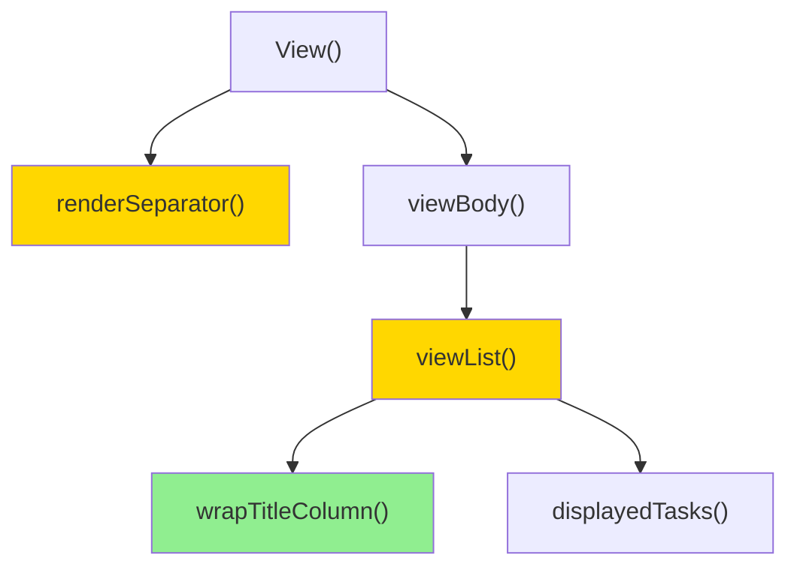

# List Rendering Polish — Design

**Status:** Draft
**Mode:** fast-track
**Date:** 2026-05-27

## 2.1 Overview

Дизайн покрывает три косметических изменения в TUI-рендерере (BL-1/BL-3/BL-4 из бэклога):

1. **Очистка строк списка от `start`/`due`** — удаление блока конкатенации дат в `viewList`.
2. **Жирные разделители зон** — смена руны `─` → `━` в `renderSeparator`.
3. **Wrap title-колонки с hanging indent** — новая вспомогательная функция `wrapTitleColumn` и переход `viewList` от однострочного `Sprintf` к многострочному билду со sticky-indent для каждой задачи.

Все изменения локализованы в `internal/tui/app.go`. Новых пакетов, типов или конфигов не вводим.

## 2.2 Architecture



**Порядок реализации:** BL-1 → BL-3 → BL-4. BL-4 самый сложный (новая функция + перестройка цикла рендера), поэтому идёт последним, чтобы предыдущие изменения уже прошли тесты и упростили дебаг.

## 2.3 Components and Interfaces

### Files Requiring Changes

| File | Change Type | Description |
|------|-------------|-------------|
| `internal/tui/app.go` | `[MODIFIED]` | `viewList`: удалить блок построения `dates` (lines 648-655) и переписать рендер строки на многострочный с hanging indent через `wrapTitleColumn`. `renderSeparator`: заменить `"─"` на `"━"`. Добавить новую функцию `wrapTitleColumn(title string, prefixWidth, availWidth int) []string`. |
| `internal/tui/shell_test.go` | `[MODIFIED]` | `TestProp_SeparatorsConditional`, `TestProp_SeparatorWidth`: обновить ожидание `─` → `━`. |
| `internal/tui/app_test.go` | `[MODIFIED]` | Добавить новые unit/property тесты для wrap и удаления дат. |

### Files NOT Requiring Changes

| File | Reason Unchanged |
|------|-----------------|
| `internal/tui/details.go` | `viewDetails` уже показывает `Start:`/`Due:` корректно — REQ-1.2 это контракт, а не изменение. |
| `internal/tui/style.go` | Темы и стили не меняются; `theme.Help` продолжает оборачивать разделитель. |
| `internal/tui/editor.go` | Editor pane имеет собственный рендер, разделители не его. |
| `internal/tui/filter.go` | Фильтрация работает на уровне `displayedTasks` — упорядочение list-rows этим не затрагивается. |
| `internal/domain/task/task.go` | Модель задачи неизменна; rendering — чисто view-слой. |

### Interface Signatures

```go
// wrapTitleColumn soft-wraps title to availWidth (lipgloss-width counted)
// and prepends prefixWidth spaces to lines [1..]. Returns single-element
// slice ([title]) when availWidth <= 0 OR prefixWidth <= 0 (no-op safeguard
// for unknown terminal width / paranoia).
//
// The wrapping uses lipgloss.NewStyle().Width(availWidth).Render(title)
// to leverage existing terminal-aware soft-wrap. Continuation indent is
// raw spaces (ASCII), preserving ANSI styling already applied to title.
func wrapTitleColumn(title string, prefixWidth, availWidth int) []string
```

`viewList` signature unchanged: `func (m Model) viewList() string`. `renderSeparator` signature unchanged.

## 2.4 Key Decisions (ADR)

**Decision: how `viewList` computes available width for title wrap.**

- **Context:** `viewList` сейчас не знает свою область рендера — рендерит «как есть», ширину контролирует обёртка `viewBody` через `lipgloss.NewStyle().Width(listW)`. Для wrap-логики нужен явный `availWidth`.
- **Options considered:**
  1. **Прокинуть `availWidth` как аргумент** в `viewList(availWidth int)` — изменит сигнатуру, нужно править все вызовы.
  2. **Использовать `m.width` напрямую внутри `viewList`** + рассчитывать listW аналогично `paneWidths(m)` если dual-pane активен.
  3. **Считать `availWidth` через rendered-width после первого прохода** — слишком сложно для cosmetic-change.
- **Decision:** Вариант 2. `viewList` уже имеет доступ к `m`, что включает `m.width`, `m.config.DualPaneMinWidth`, `m.config.ListPaneShare`, и `m.screen`. Логика `paneWidths` чистая, безопасно reuse.
- **Rationale:** не ломает сигнатуру, переиспользует уже-существующие `isDualPane`/`paneWidths`. Если `m.width==0`, wrap пропускается (REQ-3.2).
- **Consequences:** `viewList` становится менее «pure» относительно ширины — но он уже зависит от `m.width` транзитивно через статусы (e.g., `displayedTasks` reads `m.filterQuery`). Семантически приемлемо.

## 2.6 Correctness Properties

```
Property 1: List rows omit dates
Category: Absence
Statement: For all tasks with non-nil StartDate or Deadline, the rendered output of viewList() SHALL NOT contain the substrings "start:" or "due:" anywhere in any row.
Validates: Requirements 1.1
```

```
Property 2: Details preserves date display
Category: Equivalence
Statement: For all tasks with non-nil StartDate, the output of viewDetails(m, w) contains the substring "Start:  " followed by the date in YYYY-MM-DD format; analogous for Deadline → "Due:    ".
Validates: Requirements 1.2
```

```
Property 3: Separator uses heavy horizontal
Category: Equivalence
Statement: For all widths w > 0, renderSeparator(theme, w) contains exactly w occurrences of rune '━' (U+2501) and zero occurrences of '─' (U+2500).
Validates: Requirements 2.1, 2.3
```

```
Property 4: Separator boundary
Category: Absence
Statement: For all widths w <= 0, renderSeparator(theme, w) returns the empty string.
Validates: Requirements 2.2
```

```
Property 5: Title wrap keeps column alignment
Category: Equivalence
Statement: For all titles whose lipgloss-rendered width exceeds availWidth = (paneWidth - prefixWidth), every line in the rendered row output that belongs to that task starts at column `prefixWidth` when measured by lipgloss.Width of the leading prefix. Equivalently: lines [1..] of one task are prefixed by exactly prefixWidth ASCII spaces.
Validates: Requirements 3.1
```

```
Property 6: No-wrap on unknown width
Category: Absence
Statement: For all titles and all task counts, when m.width == 0, the output of viewList() contains no '\n' character between rows that wraps a single task — i.e., each task occupies exactly one line.
Validates: Requirements 3.2
```

```
Property 7: Strikethrough on all wrapped lines
Category: Propagation
Statement: For all tasks with Status in {Completed, Cancelled} whose title wraps to N>1 lines, every one of those N lines contains the strikethrough ANSI escape (CSI 9).
Validates: Requirements 3.3
```

```
Property 8: Single cursor marker per task
Category: Exclusion
Statement: For all rendered viewList outputs and all tasks at index i == m.cursor, the cursor marker substring "> " (rendered via theme.Selected) appears in exactly one physical line within that task's block — specifically the first line.
Validates: Requirements 3.4
```

## 2.7 Error Handling

| Scenario | Detection | Action |
|----------|-----------|--------|
| `m.width == 0` (initial state, no `WindowSizeMsg` yet) | `wrapTitleColumn(..., availWidth)` is called with `availWidth <= 0` derived from `paneWidth - prefixWidth` ≤ 0 | Return `[]string{title}` unchanged — no-op, REQ-3.2. |
| `prefixWidth >= paneWidth` (degenerate narrow pane) | same calculation path | Return `[]string{title}` unchanged — degraded but stable; no panic, no infinite-loop wrap. |
| Empty `displayedTasks` | Already handled in `viewList` (returns `"(no tasks)"` / `"(no matches)"`) | No change. |

## 2.8 Testing Strategy

**Test Style Source:** Tier 2
- Reference test files: `internal/tui/app_test.go`, `internal/tui/shell_test.go`, `internal/tui/filter_test.go`
- Key patterns: `testify/require` for unit assertions, `pgregory.net/rapid` (`rapid.Check`) for property-based tests; `setupRapidModel(rt, titles...)` helper at `app_test.go:598` for rapid scenarios; for ANSI assertion tests use `lipgloss.SetColorProfile(termenv.TrueColor)` + `t.Cleanup(...ASCII)` because go test has no TTY.

**Project Commands:**

| Action | Command           |
|--------|-------------------|
| Test   | `task test`       |
| Test (race) | `task test-race` |
| Build  | `task build`      |
| Lint   | `task lint`       |

### Unit Tests

| Test | Description | Tags |
|------|-------------|------|
| `TestTUI_ViewListOmitsDates` | Build model with task having `StartDate` and `Deadline` set; assert `viewList()` does NOT contain `"start:"` or `"due:"`. | `Feature/list-omit-dates`, `Property/1` |
| `TestTUI_ViewDetailsKeepsDates` | Build model with task having dates set; assert `viewDetails(m, 60)` contains `"Start:"` and `"Due:"`. | `Feature/list-omit-dates`, `Property/2` |
| `TestTUI_RenderSeparatorHeavy` | Call `renderSeparator(NewTheme(), 10)`; assert output contains exactly 10 `'━'` runes and zero `'─'`. | `Feature/heavy-separator`, `Property/3` |
| `TestTUI_RenderSeparatorBoundary` | `renderSeparator(theme, 0)` returns `""`; `renderSeparator(theme, -5)` returns `""`. | `Feature/heavy-separator`, `Property/4` |
| `TestTUI_ViewListWrapsTitleWithHangingIndent` | Configure `m.width=60`, single-pane (or set small dual-pane), task with title much longer than available column. Assert output has ≥2 lines for that task and continuation lines begin with `prefixWidth` spaces equal to first-line leading-blank width. | `Feature/title-wrap`, `Property/5` |
| `TestTUI_ViewListNoWrapWhenWidthZero` | `m.width=0`, long-title task. Assert single task row = exactly 1 line. | `Feature/title-wrap`, `Property/6` |
| `TestTUI_ViewListStrikethroughOnWrappedLines` | Set `t.Status=Completed`, long title, force wrap. Assert every wrapped line contains the ANSI strikethrough escape sequence (`\x1b[9`). Use the `lipgloss.SetColorProfile(termenv.TrueColor)` test fixture. | `Feature/title-wrap`, `Property/7` |
| `TestTUI_ViewListCursorMarkerOnFirstLineOnly` | Place cursor on a wrapping task. Assert the rendered selected-marker substring `"> "` (post-Selected.Render) appears in exactly one line of that task's block. | `Feature/title-wrap`, `Property/8` |

### Property-Based Tests

| Test | Property | Generator description | Tags |
|------|----------|-----------------------|------|
| `TestProp_ViewListOmitsDates` | Property 1 | `setupRapidModel(rt, titles...)` with random title count [0..10]; randomly assign `StartDate` and/or `Deadline` to each. | `Property/1` |
| `TestProp_DetailsKeepsDates` | Property 2 | Same setup; assert `viewDetails` contract for each random task placed under cursor. | `Property/2` |
| `TestProp_SeparatorHeavy` | Property 3 | width ∈ [1..200]; assert rune count of `'━'` equals width and `'─'` count is 0. (Replaces existing `TestProp_SeparatorWidth`.) | `Property/3` |
| `TestProp_SeparatorBoundary` | Property 4 | width ∈ [-50..0]; assert empty output. | `Property/4` |
| `TestProp_TitleWrapHangingIndent` | Property 5 | random title length [1..200], `m.width ∈ [40..200]`, random pane share. For each wrap-eligible task, compute `prefixWidth` and assert continuation lines start with exactly that many spaces. | `Property/5` |
| `TestProp_NoWrapWidthZero` | Property 6 | random title length, `m.width=0`. Each rendered task occupies 1 line. | `Property/6` |
| `TestProp_StrikethroughPropagatesAcrossWrap` | Property 7 | Completed/Cancelled tasks with long titles, random widths forcing wrap. Use `lipgloss.SetColorProfile(termenv.TrueColor)`. | `Property/7` |
| `TestProp_SingleCursorMarker` | Property 8 | Random cursor position, random title lengths. Count occurrences of cursor-marker per task block. | `Property/8` |

`TestProp_SeparatorsConditional` (existing) — обновляется на новую руну `━` (full-width pattern check). Не нумеруется как новый property — это regression-lock существующего invariant.
