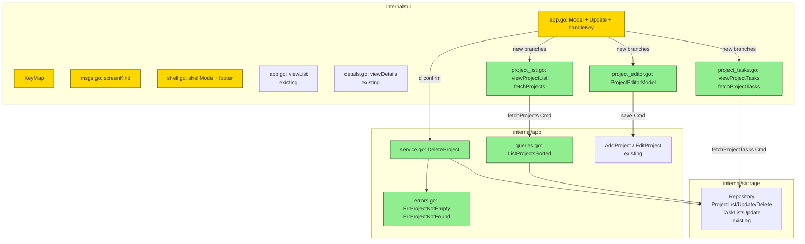

# Project Navigation — Design

## 2.1 Overview

Реализуем BL-5 в три логические части:

1. **Service layer** — `DeleteProject(ctx, pid, confirm)` и
   `ListProjectsSorted(ctx, areaID, includeAllStatuses)`. Эти методы —
   фундамент; они изолированы и тестируются отдельно от TUI.
2. **TUI: project list & navigation** — новый `screenProjects` +
   `screenProjectTasks`, новый `shellMode` `modeProjects`, расширение
   `KeyMap`, рендеры `viewProjectList` / `viewProjectTasks`, диспетчер
   клавиш в `handleKey`.
3. **TUI: project editor modal** — `ProjectEditorModel` (struct-аналог
   `EditorModel`, но для проекта), валидация Name / Area / Deadline,
   создание через `AddProject`, редактирование через `EditProject`.

Затрагиваем `internal/app`, `internal/tui`. Storage уже умеет всё
нужное (`ProjectList`, `ProjectGet`, `ProjectCreate`, `ProjectUpdate`,
`ProjectDelete`, `TaskList`, `TaskUpdate`) — контракт не меняется.

## 2.2 Architecture



**Implementation order:**

1. Service (`DeleteProject`, `ListProjectsSorted`, `ErrProjectNotEmpty`,
   `ErrProjectNotFound`) — фундамент, изолированно тестируется.
2. TUI scaffolding (`screenKind` enum, `modeProjects` в shell,
   `KeyMap` расширения, navigation skeleton без рендеринга).
3. `viewProjectList` + `fetchProjects` Cmd + key dispatch (P/j/k/Esc/a/`/`).
4. `ProjectEditorModel` + create (`n`) + edit (`e`) + save.
5. `confirm` для delete (`d`).
6. `screenProjectTasks` (Enter zoom, переиспользование viewList, headings
   inline-бейдж, Esc back).
7. Property tests + integration polishing.

## 2.3 Components and Interfaces

### Files Requiring Changes

| File | Change Type | Description |
|------|-------------|-------------|
| `internal/app/errors.go` | `[MODIFIED]` | Добавить `ErrProjectNotEmpty`, `ErrProjectNotFound` |
| `internal/app/service.go` | `[MODIFIED]` | Добавить метод `DeleteProject(ctx, pid id.ID, confirm bool) error` |
| `internal/app/queries.go` | `[MODIFIED]` | Добавить `ListProjectsSorted(ctx, areaID *id.ID, includeAllStatuses bool) ([]project.Project, error)`; добавить хелпер `countProjectTasks(ctx, pid) (open, total int, err error)` |
| `internal/tui/msgs.go` | `[MODIFIED]` | Добавить `screenProjects`, `screenProjectTasks`; добавить msgs `projectsLoadedMsg`, `projectTasksLoadedMsg`, `projectSavedMsg`, `projectDeletedMsg`; добавить `projectStatusFilterMode` enum |
| `internal/tui/keys.go` | `[MODIFIED]` | Добавить `KeyMap.Projects` (`P`); добавить `KeyMap.ToggleAllStatuses` (`a`). Существующие keys (`n/e/d/Enter/Esc/Tab/j/k`) переиспользуются |
| `internal/tui/shell.go` | `[MODIFIED]` | Добавить `modeProjects` в `shellMode`; обновить `currentMode`/`modeKeyHints`/`modeLabel` |
| `internal/tui/app.go` | `[MODIFIED]` | Добавить поля `Model.projects`, `Model.projectCursor`, `Model.activeProjectID`, `Model.projectStatusFilter`, `Model.projectTasks`, `Model.projectEditor`; добавить ветки `screenProjects`/`screenProjectTasks` в `handleKey`; добавить `viewBody` dispatch для новых экранов; обработать новые msgs в `Update` |
| `internal/tui/project_list.go` | `[NEW]` | `viewProjectList(m, width)`, `fetchProjects(svc, includeAll bool)`, helpers (рендер строки, sort применяется в сервисе) |
| `internal/tui/project_editor.go` | `[NEW]` | `ProjectEditorModel` struct + конструкторы (для create/edit), `UpdateForm`, `ApplyAndSave`, `View(theme, width)` |
| `internal/tui/project_tasks.go` | `[NEW]` | `viewProjectTasks(m, width)`, `fetchProjectTasks(svc, pid)`, helper для inline-бейджа heading |
| `internal/tui/project_list_test.go` | `[NEW]` | Unit tests для рендера / навигации / фильтра проектов |
| `internal/tui/project_editor_test.go` | `[NEW]` | Unit tests для валидации, create/edit flow |
| `internal/tui/project_tasks_test.go` | `[NEW]` | Unit tests для zoom-in, headings бейдж |
| `internal/tui/project_navigation_pbt_test.go` | `[NEW]` | Property tests для навигации и инвариантов |
| `internal/app/service_test.go` | `[MODIFIED]` | Тесты для `DeleteProject` (empty / non-empty / read-only / not-found) |
| `internal/app/queries_test.go` | `[NEW]` или `[MODIFIED]` если есть | Тесты для `ListProjectsSorted` (сортировка, status filter) |

### Files NOT Requiring Changes

| File | Reason Unchanged |
|------|------------------|
| `internal/domain/project/project.go` | Тип `Project` уже содержит все нужные поля (Name, Notes, AreaID, Deadline, Status, AutoClose, Position, ...); валидация уже корректна |
| `internal/storage/repository.go` | Контракт уже содержит `ProjectCreate/Get/Update/Delete/List/FindByName` + `TaskList/Update`. Никакие новые методы не нужны |
| `internal/storage/bbolt/bbolt.go` | Реализации этих методов уже корректны для наших нужд (сортировка делается в сервисе) |
| `internal/storage/fakes/inmemrepo.go` | InMemRepo уже реализует все нужные методы |
| `internal/tui/editor.go` | Существующий task editor не меняется. Project picker внутри него остаётся через name-typing (deferred v2) |
| `internal/tui/details.go` | `viewDetails` для задач остаётся как есть; в screenProjectTasks переиспользуется |
| `internal/tui/bulk.go` | `dispatch` / `confirmState` / `runBulk` уже работают через cursor. В screenProjectTasks вызываем тот же dispatch. Для delete-project используем новый отдельный confirm flow (потому что target — Project, не Task) |
| `internal/tui/filter.go` | `handleFilterKey` универсален: он только меняет `m.filterQuery`. Для проектов используем тот же handler — `displayedTasks` ↔ `displayedProjects` будет аналогом |
| `internal/cli/project.go` | CLI неизменён |
| `internal/config/app.go` | Никаких новых config fields не требуется |
| `internal/tui/style.go` | Используем существующие стили (Title, Selected, Dim, DetailLabel, StatusInfo, StatusError, Help, Modal, Field, FieldFocus) |

### Interface Signatures

**Service:**

```go
// internal/app/service.go
func (s *Service) DeleteProject(ctx context.Context, pid id.ID, confirm bool) error
// Pre: pid is non-empty.
// Post (confirm=false, project non-empty):  returns ErrProjectNotEmpty; no mutation.
// Post (confirm=true):                       all tasks with ProjectID==pid have ProjectID=HeadingID=nil; project soft-deleted.
// Post (project not found):                  returns ErrProjectNotFound.
// Post (repo read-only):                     returns ErrReadOnly on first write attempt; no partial mutation.

// internal/app/queries.go
func (s *Service) ListProjectsSorted(ctx context.Context, areaID *id.ID, includeAllStatuses bool) ([]project.Project, error)
// Post: returns projects sorted by Position ASC, then Name case-fold ASC.
//       If includeAllStatuses==false, filters Status==StatusOpen.
//       Soft-deleted projects always excluded.

func (s *Service) countProjectTasks(ctx context.Context, pid id.ID) (open, total int, err error)
// Post: open = count of tasks with ProjectID==pid AND Status==StatusOpen AND DeletedAt==nil.
//       total = count of tasks with ProjectID==pid AND DeletedAt==nil.
```

**Errors:**

```go
// internal/app/errors.go
var (
    ErrProjectNotEmpty = errors.New("app: project has active tasks; confirm required")
    ErrProjectNotFound = errors.New("app: project not found")
)
```

**TUI:**

```go
// internal/tui/msgs.go
const (
    screenList screenKind = iota
    screenQuickEntry
    screenHelp
    screenEditor
    screenProjects        // [NEW]
    screenProjectTasks    // [NEW]
)

type projectStatusFilterMode int
const (
    psfOpen projectStatusFilterMode = iota
    psfAll
)

type projectsLoadedMsg struct{ projects []project.Project; counts map[id.ID][2]int /* {open,total} */ }
type projectTasksLoadedMsg struct{ projectID id.ID; tasks []task.Task }
type projectSavedMsg struct{ project project.Project; created bool }
type projectDeletedMsg struct{ projectID id.ID }

// internal/tui/project_editor.go
type ProjectEditorModel struct {
    original  *project.Project // nil = create
    name      textinput.Model
    notes     textarea.Model
    area      textinput.Model
    deadline  textinput.Model
    autoClose bool
    focus     projectEditorField
    err       string
}

type projectEditorField int
const (
    pefName projectEditorField = iota
    pefNotes
    pefArea
    pefDeadline
    pefAutoClose
    pefCount
)

func NewProjectEditor(create bool, p *project.Project, svc *app.Service, ctx context.Context) ProjectEditorModel
func (m ProjectEditorModel) UpdateForm(msg tea.Msg) (ProjectEditorModel, tea.Cmd)
func (m ProjectEditorModel) ApplyAndSave(ctx context.Context, svc *app.Service) (project.Project, bool /*created*/, error)
func (m ProjectEditorModel) View(theme Theme, width int) string

// internal/tui/project_list.go
func viewProjectList(m Model, width int) string
func fetchProjects(svc *app.Service, includeAll bool) tea.Cmd  // emits projectsLoadedMsg
func displayedProjects(m Model) []project.Project              // applies filterQuery to m.projects

// internal/tui/project_tasks.go
func viewProjectTasks(m Model, width int) string
func fetchProjectTasks(svc *app.Service, pid id.ID) tea.Cmd    // emits projectTasksLoadedMsg
```

**Model field additions** (in `internal/tui/app.go`):

```go
type Model struct {
    // ... existing fields ...

    // [NEW] Projects screen state
    projects             []project.Project
    projectCounts        map[id.ID][2]int  // pid → {open, total}
    projectCursor        int
    activeProjectID      *id.ID            // set when in screenProjectTasks
    projectStatusFilter  projectStatusFilterMode
    projectTasks         []task.Task       // tasks of activeProjectID
    projectEditor        ProjectEditorModel
}
```

## 2.4 Key Decisions (ADR)

### ADR-1: Отдельный `screenKind` vs седьмой `listKind`

- **Context:** Куда поместить «проекты»: добавить `listProjects` к шести
  GTD-спискам (1..7 + Tab/Shift+Tab), или сделать отдельный экран
  через `screenKind`.
- **Options:**
  - **A.** `listKind` extension — 7-я кнопка в header, ключ `7`,
    включена в Tab-цикл.
  - **B.** Новый `screenKind` (`screenProjects`), активируется по `P`,
    выходит из header-полосы.
- **Decision:** B.
- **Rationale:** Проекты — это не задачи, у них другой набор операций
  (CRUD, zoom-in). Включать их в Tab-цикл GTD сломает мысленную
  модель пользователя («все 6 = списки задач»). Отдельный screen даёт
  чистую изоляцию state и не трогает существующие тесты header'а.
- **Consequences:** Нужен новый shellMode + дополнительная ветка в
  `handleKey`. Footer chip явно показывает «PROJECTS» — пользователь
  всегда знает, где он.

### ADR-2: `DeleteProject` reassign vs cascade

- **Context:** При удалении проекта что делать с его задачами?
- **Options:**
  - **A.** Reassign — task.ProjectID = nil (→ задачи переезжают в Inbox).
  - **B.** Cascade delete — задачи soft-удаляются вместе с проектом.
  - **C.** Block — запрет удаления, пока есть задачи.
- **Decision:** A (с подтверждением через `confirm=true`).
- **Rationale:** Уже есть прецедент `DeleteArea(confirm=true)` —
  reassigns projects/tasks. Зеркалит mental model: «удалить проект»
  ≠ «удалить мои задачи». Это безопасно, обратимо (юзер видит, что
  задачи появились в Inbox).
- **Consequences:** Если у пользователя 500 задач в одном проекте, удаление
  потенциально медленное (по одному `TaskUpdate`). На текущих масштабах
  это не проблема (bbolt в памяти на dev-машине). Если станет — можно
  оптимизировать в будущем (bulk-update в одной транзакции).

### ADR-3: ProjectEditorModel vs generic-ная модалка

- **Context:** Можно сделать generic-ную форму, переиспользуемую и для
  Task editor, и для Project editor, и для будущего Heading editor.
- **Options:**
  - **A.** Generic `FormModel` с пере-настройкой полей.
  - **B.** Свой `ProjectEditorModel`, похожий по структуре на
    `EditorModel`.
- **Decision:** B.
- **Rationale:** `EditorModel` сейчас уже специализированный
  (whenAnytime/whenSomeday, fieldArea/fieldProject/fieldHeading,
  textarea для notes). Generic-ция потребовала бы переписать его —
  out of scope BL-5. Делать generic «на будущее» — premature
  abstraction (правило «don't add features beyond what the task
  requires»).
- **Consequences:** Дублирование части кода (focusCurrent/nextField).
  Но дублирование небольшое (~50 строк); можно вычислить generic-ный
  helper позже, когда появится третий case (heading editor в v2).

### ADR-4: Где хранится `projectCounts` (open/total)

- **Context:** REQ-2.1 требует показать `[open/total]` рядом с проектом.
  Считать на лету при каждом ререндере или закэшировать.
- **Options:**
  - **A.** Кэшировать в Model `projectCounts map[id.ID][2]int`,
    обновлять только при `fetchProjects`.
  - **B.** Считать в `viewProjectList` через repo-вызов на каждый рендер.
- **Decision:** A.
- **Rationale:** `View` в Bubble Tea вызывается часто (после каждого
  key event). Запросы к repo внутри `View` нарушают чистоту функции
  и могут зависнуть рендер. Кэш в Model — стандартный паттерн (как
  существующий `nameCacheLoadedMsg`).
- **Consequences:** При изменении задач в `screenProjectTasks` нужно
  инвалидировать `projectCounts` при выходе обратно в screenProjects
  → trigger `fetchProjects`. Это естественно вписывается в Esc-handler.

### ADR-5: Транзакционность `DeleteProject`

- **Context:** REQ-6.2 и Open Design Question — что если `TaskUpdate`
  упал посередине цикла очистки задач?
- **Options:**
  - **A.** Best-effort: продолжать, копить ошибки, возвращать
    summary.
  - **B.** Fail-fast: первая же ошибка прерывает, project НЕ
    удаляется (но задачи могут остаться частично reassigned).
  - **C.** Транзакция через bbolt (полностью атомарно).
- **Decision:** B (fail-fast без транзакции).
- **Rationale:** C требует расширения `storage.Repository` (новый
  `WithTx` или `BulkUpdate`) — out of scope. A создаёт неконсистентные
  частичные удаления. B — простейший корректный путь: если что-то
  упало (read-only, database locked), задачи могли частично переехать
  в Inbox, проект остался — пользователь видит ошибку, может попробовать
  снова (повторный delete пройдёт уже на меньшем числе задач).
- **Consequences:** В edge case (storage.ErrDatabaseLocked в середине)
  состояние частично reassigned. Документируем это в REQ-6.5.
  Повторный вызов идемпотентен. UI показывает ошибку через `statusMsg`.

## 2.5 Data Models

Никаких новых доменных типов. Все изменения в TUI-layer
(`ProjectEditorModel`, msgs) описаны в §2.3 как сигнатуры; они не
являются persistable доменными моделями.

## 2.6 Correctness Properties

```
Property 1: Screen entry returns to original
Category: Round-trip
Statement: For all Model m with m.screen == screenList, applying KeyMsg(P) and then KeyMsg(P) returns m.screen == screenList. (Не утверждаем, что весь state идентичен — projectCursor/projects могут отличаться.)
Validates: REQ-1.1, REQ-1.2

Property 2: GTD keys blocked in screenProjects
Category: Absence
Statement: For all Model m with m.screen == screenProjects and m.confirm == nil and m.filtering == false, applying any of KeyMsg(1..6, Tab, Shift+Tab) does NOT change m.activeList and does NOT change m.screen.
Validates: REQ-1.4

Property 3: Status filter equivalence
Category: Equivalence
Statement: For all project set P with mixed Status values, displayedProjects(m{filter=psfOpen}) ≡ {p ∈ P | p.Status == StatusOpen ∧ p.DeletedAt == nil}, and displayedProjects(m{filter=psfAll}) ≡ {p ∈ P | p.DeletedAt == nil}.
Validates: REQ-2.3, REQ-2.4

Property 4: Sort stability
Category: Equivalence
Statement: For all project list P, ListProjectsSorted(P) yields ordering equivalent to sortBy(Position ASC, NameFolded ASC). Двойной вызов даёт ту же последовательность.
Validates: REQ-2.5, REQ-7.1

Property 5: Cursor bounded
Category: Absence
Statement: For all Model m in screenProjects, after applying any sequence of KeyMsg(j/k), 0 <= m.projectCursor <= max(0, len(displayedProjects(m))-1).
Validates: REQ-2.7

Property 6: Delete reassigns tasks to Inbox
Category: Propagation
Statement: For all project p with tasks T = {t | t.ProjectID == p.ID}, after DeleteProject(p.ID, confirm=true), for all t' ∈ T fetched again: t'.ProjectID == nil ∧ t'.HeadingID == nil.
Validates: REQ-3.9, REQ-6.2

Property 7: Soft-delete invisibility
Category: Absence
Statement: For all project p, after DeleteProject(p.ID, confirm=true), ListProjectsSorted(...includeAllStatuses=true) does NOT contain p (p.DeletedAt != nil).
Validates: REQ-6.3

Property 8: Empty-project guard
Category: Exclusion
Statement: For all project p with at least one task t such that t.ProjectID == p.ID and t.DeletedAt == nil, calling DeleteProject(p.ID, confirm=false) returns ErrProjectNotEmpty AND does NOT modify either p or any t.
Validates: REQ-6.1

Property 9: Read-only blocks writes
Category: Absence
Statement: For all Model m with m.readOnly == true and m.screen == screenProjects, applying KeyMsg(n/e/d) does NOT open ProjectEditorModel and does NOT set m.confirm. m.statusMsg gets RO message.
Validates: REQ-5.1

Property 10: Editor save returns to screenProjects
Category: Round-trip
Statement: For all valid ProjectEditorModel (Name non-empty, Area resolvable, Deadline parseable), applying KeyMsg(Ctrl+S) leads to m.screen == screenProjects and projects list contains updated/new project.
Validates: REQ-3.3

Property 11: Editor invalid stays open
Category: Absence
Statement: For all ProjectEditorModel where Name is empty after TrimSpace, OR Area is unknown, OR Deadline is malformed, applying KeyMsg(Ctrl+S) does NOT change m.screen from screenEditor-like state. The model.err is populated.
Validates: REQ-3.4, REQ-3.5, REQ-3.6

Property 12: Zoom-in/zoom-out preserves position
Category: Round-trip
Statement: For all Model m in screenProjects at projectCursor=i with non-empty list, applying Enter (zoom into project) then Esc returns to screenProjects with m.projectCursor == i (или к ближайшей валидной позиции, если проект исчез).
Validates: REQ-4.1, REQ-4.4

Property 13: Project tasks filter
Category: Equivalence
Statement: For all task set T, displayed tasks in screenProjectTasks for project p are EQ to {t ∈ T | t.ProjectID == p.ID ∧ t.DeletedAt == nil}.
Validates: REQ-4.2, REQ-4.3

Property 14: Mode label is PROJECTS
Category: Equivalence
Statement: For all Model m with m.screen == screenProjects and m.confirm == nil and m.filtering == false and m.readOnly == false, currentMode(m) == modeProjects ∧ modeLabel(modeProjects) == "PROJECTS".
Validates: REQ-1.3

Property 15: P key ignored in screenProjectTasks
Category: Absence
Statement: For all Model m with m.screen == screenProjectTasks, applying KeyMsg(P) does NOT change m.screen. Only Esc returns to screenProjects.
Validates: REQ-4.6
```

## 2.7 Error Handling

| Scenario | Detection | Action |
|----------|-----------|--------|
| `fetchProjects` repo error | `repo.ProjectList` returns err | `m.statusMsg = err.Error()` + fade; `m.projects = nil` (показывается `(no projects)`) |
| `fetchProjectTasks` repo error | `repo.TaskList` returns err | Аналогично: statusMsg + пустой список |
| `DeleteProject(confirm=false)` for non-empty project | `ErrProjectNotEmpty` from service | `m.statusMsg = "project has tasks; confirm required"`. UI логика — confirm=true устанавливается через `Model.confirm` ДО вызова, так что попадание сюда означает баг диспетчера. |
| `DeleteProject(confirm=true)` partial failure (read-only / db-locked) | First write fails with `ErrReadOnly` or `ErrDatabaseLocked` | Service возвращает ошибку, остаётся либо ничего не изменено (RO до 1-го write), либо partial (db-locked после нескольких updates). UI: `statusMsg = err.Error()`; reload `fetchProjects` чтобы синхронизироваться. Документировано в REQ-6.5. |
| `ProjectEditor` Name empty | `strings.TrimSpace(name) == ""` в `ApplyAndSave` | Возвращаем `errors.New("name required")`; UI: `m.projectEditor.err = "name required"`; модалка остаётся открытой. |
| `ProjectEditor` Area unknown | `AreaFindByNormalized` returns `ErrNotFound` | `model.err = "area \"<name>\" not found"`; модалка остаётся. |
| `ProjectEditor` Deadline malformed | `time.ParseInLocation` returns err | `model.err = fmt.Errorf("deadline: %w", err).Error()`; модалка остаётся. |
| `ProjectEditor` AddProject/EditProject service err (e.g., constraint) | service error | `model.err = err.Error()`; модалка остаётся. |
| Empty project list при попытке `n` (создать) | `len(m.projects)==0` | Разрешено. Не блокируется. |
| Empty project list при попытке `e`/`d` (нечего редактировать/удалять) | `len(displayedProjects) == 0 ∨ cursor out of range` | No-op (как `openEditor` для пустой задачи в screenList). |
| Read-only mode при `n/e/d` | `m.readOnly == true` | `statusMsg = "read-only mode: writes disabled"` + fade tick. |
| Filter-mode ввод spaces, backspace на пустом | Existing `handleFilterKey` | Уже корректно (no-op). |
| Concurrent project deleted while in screenProjectTasks | `fetchProjectTasks` returns empty | `(no tasks)` плейсхолдер; Esc возвращает в screenProjects, где проект уже отсутствует |

## 2.8 Testing Strategy

**Test Style Source:** Tier 2
- `internal/tui/details_redesign_test.go` (24 tests, BL-1.1/BL-2/BL-6)
- `internal/tui/list_render_polish_test.go` (15 tests, v0.7.3)
- `internal/tui/app_test.go`, `internal/tui/editor_test.go`
- `internal/app/service_test.go`
- **Framework:** `testing` + `github.com/stretchr/testify/require`
- **PBT:** `pgregory.net/rapid` — see `internal/tui/testdata/rapid/` and `*_pbt_test.go`
- **Naming:** `TestXxx_Scenario` (unit), `TestProp_Xxx` (PBT)
- **Termenv discipline:** `lipgloss.SetColorProfile(termenv.TrueColor)` + `t.Cleanup(... termenv.Ascii)` для color-aware тестов
- **Repository fake:** `internal/storage/fakes/inmemrepo.go` — `NewInMemRepo()` для service tests

**Project Commands:**

| Action     | Command          |
|------------|------------------|
| Test       | `task test`      |
| Test (race)| `task test-race` |
| Build      | `task build`     |
| Lint       | `task lint`      |
| Format     | `task fmt`       |

### Unit Tests

| Test | Description | Tags |
|------|-------------|------|
| `TestService_DeleteProject_NonEmpty_NoConfirm` | Project с задачами, confirm=false → ErrProjectNotEmpty, ни проект ни задачи не изменены | Feature/delete-project |
| `TestService_DeleteProject_NonEmpty_Confirm` | Project с N задачами, confirm=true → задачи получают ProjectID=nil+HeadingID=nil, project soft-deleted | Feature/delete-project, Property/6 |
| `TestService_DeleteProject_Empty_Confirm` | Project без задач, confirm=true → project soft-deleted, ProjectList без него | Feature/delete-project, Property/7 |
| `TestService_DeleteProject_Empty_NoConfirm` | Project без задач, confirm=false → ok, project удалён (нечего проверять на empty-guard) | Feature/delete-project |
| `TestService_DeleteProject_NotFound` | pid не существует → ErrProjectNotFound | Feature/delete-project |
| `TestService_DeleteProject_ReadOnly` | ReadOnly repo → ErrReadOnly без частичного эффекта (на пустом проекте) | Feature/delete-project |
| `TestService_ListProjectsSorted_Basic` | 3 проекта с разными Position/Name → сортировка Position ASC, fallback Name case-fold | Feature/sorted-projects, Property/4 |
| `TestService_ListProjectsSorted_OnlyOpen` | includeAllStatuses=false → только Open | Feature/sorted-projects, Property/3 |
| `TestService_ListProjectsSorted_All` | includeAllStatuses=true → все, кроме soft-deleted | Feature/sorted-projects, Property/3 |
| `TestService_ListProjectsSorted_AreaFilter` | areaID != nil → только проекты этой Area | Feature/sorted-projects |
| `TestService_CountProjectTasks` | 3 задачи (2 open, 1 completed) → open=2, total=3 | Feature/project-counts |
| `TestModel_EnterScreenProjects` | P в screenList → screen=screenProjects, projects загружены | Feature/screen-entry, Property/1 |
| `TestModel_ExitScreenProjects_P` | P в screenProjects → screen=screenList | Feature/screen-exit, Property/1 |
| `TestModel_ExitScreenProjects_Esc` | Esc в screenProjects → screen=screenList | Feature/screen-exit, Property/1 |
| `TestModel_GTDKeysBlocked_InProjects` | 1..6 / Tab / Shift+Tab в screenProjects → m.activeList не изменён, m.screen не изменён | Feature/key-blocking, Property/2 |
| `TestModel_ProjectsCursor_Up_Down` | j/k движет projectCursor с clamp | Feature/projects-cursor, Property/5 |
| `TestModel_ProjectsToggleStatusFilter` | a переключает psfOpen ↔ psfAll и триггерит reload | Feature/status-filter, Property/3 |
| `TestModel_ProjectsFilter_Slash` | / включает filter-mode; type → projects filtered by Name | Feature/projects-filter |
| `TestViewProjectList_NonEmpty` | Рендер строки содержит short-id, Name, [open/total], опц. Area/Deadline/Status icon | Feature/render-list |
| `TestViewProjectList_Empty` | Пустой список → `(no projects)` dim | Feature/render-list |
| `TestModel_ZoomIntoProject` | Enter на проекте → screen=screenProjectTasks, activeProjectID=pid, tasks загружены | Feature/zoom-in, Property/12 |
| `TestModel_ZoomOut_Esc` | Esc в screenProjectTasks → screen=screenProjects, projectCursor сохранён | Feature/zoom-out, Property/12 |
| `TestViewProjectTasks_Empty` | Проект без задач → `(no tasks in this project)` | Feature/zoom-render |
| `TestViewProjectTasks_HeadingBadge` | Задача с HeadingID имеет inline-бейдж `[heading-name]` | Feature/heading-badge, Property/13 |
| `TestModel_NewProject_OpensEditor` | n в screenProjects → screen=screenEditor-like, ProjectEditorModel создан пустым | Feature/create-project |
| `TestModel_EditProject_OpensEditor` | e на проекте → editor предзаполнен | Feature/edit-project |
| `TestProjectEditor_Save_EmptyName` | Ctrl+S при пустом Name → err="name required", модалка остаётся | Feature/editor-validation, Property/11 |
| `TestProjectEditor_Save_UnknownArea` | Area="nosuch" → err="area ... not found", модалка остаётся | Feature/editor-validation, Property/11 |
| `TestProjectEditor_Save_MalformedDeadline` | Deadline="abc" → err parse, модалка остаётся | Feature/editor-validation, Property/11 |
| `TestProjectEditor_Save_Create_Valid` | Все валидно, original=nil → AddProject, screen=screenProjects, project в списке | Feature/create-project, Property/10 |
| `TestProjectEditor_Save_Edit_Valid` | Все валидно, original=existing → EditProject, screen=screenProjects, project обновлён | Feature/edit-project, Property/10 |
| `TestProjectEditor_Esc_Discards` | Esc в editor → screen=screenProjects, никаких изменений | Feature/editor-cancel |
| `TestModel_DeleteProject_Confirm` | d → confirm установлен; y → DeleteProject вызван | Feature/delete-flow |
| `TestModel_DeleteProject_Cancel` | d → confirm; n → confirm снят, ничего не удалено | Feature/delete-flow |
| `TestModel_ReadOnly_NED_Blocked` | RO + n/e/d → statusMsg="read-only...", ни модалка ни confirm не открыты | Feature/readonly-block, Property/9 |
| `TestModel_FooterChip_Projects` | screen=screenProjects → footer показывает PROJECTS | Feature/footer-chip, Property/14 |
| `TestModel_PKey_IgnoredInTasksScreen` | P в screenProjectTasks → screen не изменён | Feature/key-blocking, Property/15 |

### Property-Based Tests

| Test | Property | Generator description | Tags |
|------|----------|-----------------------|------|
| `TestProp_ScreenEntryRoundTrip` | CP-1 | rapid.Bool() для start screen, rapid event sequence из {KeyMsg(P)} → assert symmetric | Property/1 |
| `TestProp_GTDKeysAbsent` | CP-2 | rapid sequence of KeyMsg(1..6, Tab) applied в screenProjects → activeList unchanged | Property/2 |
| `TestProp_StatusFilterEquiv` | CP-3 | rapid sample of projects (mixed Status), apply filter → set-equality | Property/3 |
| `TestProp_SortStable` | CP-4 | rapid sample of projects (random Position/Name) → sort twice = identical | Property/4 |
| `TestProp_CursorBounded` | CP-5 | rapid sample of n projects, rapid sequence of j/k → 0 <= cursor < n | Property/5 |
| `TestProp_DeleteReassignsTasks` | CP-6 | rapid sample of tasks with shared ProjectID → after DeleteProject(confirm=true) all have ProjectID=nil | Property/6 |
| `TestProp_SoftDeleteInvisible` | CP-7 | random project, after DeleteProject(confirm=true), list excludes it | Property/7 |
| `TestProp_EmptyProjectGuard` | CP-8 | rapid sample of (project, task with ProjectID=p.ID) → DeleteProject(confirm=false) = ErrProjectNotEmpty, no mutation | Property/8 |
| `TestProp_ReadOnlyBlocks` | CP-9 | rapid sample of {n,e,d} keys + ro=true → no editor, no confirm, statusMsg set | Property/9 |
| `TestProp_EditorSaveRoundTrip` | CP-10 | rapid valid name/area/deadline → save → list contains | Property/10 |
| `TestProp_EditorInvalidStaysOpen` | CP-11 | rapid generator of one-of-three invalid inputs → err non-empty, screen unchanged | Property/11 |
| `TestProp_ZoomRoundTrip` | CP-12 | rapid project list ≥ 1, Enter + Esc → cursor preserved | Property/12 |
| `TestProp_ProjectTasksFilter` | CP-13 | rapid sample of tasks with mixed ProjectID → displayed = subset matching | Property/13 |
| `TestProp_ModeLabelProjects` | CP-14 | rapid Model{screen=screenProjects, confirm=nil, filtering=false, readOnly=false} → modeLabel == PROJECTS | Property/14 |
| `TestProp_PKeyIgnoredInTasks` | CP-15 | rapid Model{screen=screenProjectTasks}, KeyMsg(P) → screen unchanged | Property/15 |
