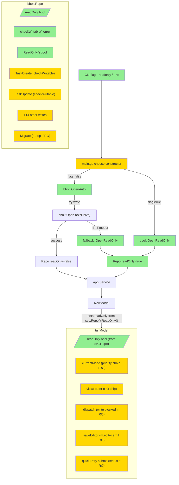

# Read-Only Mode (v0.7.0) — Design

## 2.1 Overview

5-layer change implementing read-only fallback для bbolt single-writer constraint:

1. **Storage interface** — new `ErrReadOnly` sentinel + `Repository.ReadOnly() bool` method.
2. **bbolt impl** — `Repo.readOnly bool` field; new constructors `OpenReadOnly(path)` and `OpenAuto(path)`; 16+ write methods check writability via `checkWritable()` helper; `Migrate` no-op в RO.
3. **fakes impl** — `ReadOnly() bool` returns `false` (in-memory test fixture).
4. **CLI** — `--readonly` (+ `--ro` alias) persistent flag на root; `Deps.ReadOnly bool` field.
5. **TUI** — `Model.readOnly bool`; new `modeReadOnly` shellMode (priority HELP > EDITOR > CONFIRM > FILTER > SELECT > **READ-ONLY** > NORMAL); mode chip rendering; write-key blocking via centralized `blockIfReadOnly()` helper в handlers (complete/cancel/delete/pin/quick-entry, editor save, bulk dispatcher).

Auto-fallback: `OpenAuto` пробует write mode → на `ErrTimeout` retries `OpenReadOnly` → success returns RO Repo. Auto-fallback logs warning to stderr.

## 2.2 Architecture



### Implementation Order

1. **Storage interface:** `storage.ErrReadOnly` + `Repository.ReadOnly()` method.
2. **Fakes:** add `ReadOnly() bool { return false }`.
3. **bbolt:** add `readOnly` field, `ReadOnly()`, `checkWritable()` helper, `OpenReadOnly`, `OpenAuto`.
4. **bbolt write methods:** insert `checkWritable()` calls в начале каждого. Update Migrate (no-op в RO).
5. **CLI:** `--readonly` + `--ro` persistent flag; `Deps.ReadOnly` field.
6. **main.go:** wire constructor based on flag.
7. **TUI Model + shellMode:** `Model.readOnly` field; `modeReadOnly` const; `currentMode` priority update.
8. **TUI Footer:** mode chip extension.
9. **TUI Write-block:** `blockIfReadOnly()` helper в handlers (dispatch, saveEditor, quickEntry submit).
10. **Tests:** unit + property.

## 2.3 Components and Interfaces

### Files Requiring Changes

| File | Change Type | Description |
|------|-------------|-------------|
| `internal/storage/repository.go` | `[MODIFIED]` | Add `var ErrReadOnly = errors.New(...)`; add `ReadOnly() bool` to `Repository` interface |
| `internal/storage/bbolt/bbolt.go` | `[MODIFIED]` | Add `readOnly` field в `Repo`; add `ReadOnly()`, `checkWritable()`, `OpenReadOnly`, `OpenAuto` functions; existing `Open` unchanged; Migrate guarded by checkWritable |
| `internal/storage/bbolt/tasks.go`, `projects.go`, `headings.go`, `areas.go`, `tags.go` | `[MODIFIED]` | All 16+ write methods: add `if err := r.checkWritable(); err != nil { return err }` at start |
| `internal/storage/bbolt/bbolt_test.go` | `[MODIFIED]` | Add tests for OpenReadOnly, OpenAuto, checkWritable, write methods в RO |
| `internal/storage/fakes/inmemrepo.go` | `[MODIFIED]` | Add `ReadOnly() bool { return false }` |
| `internal/storage/fakes/repository.go` (if exists) | `[MODIFIED]` | Same |
| `internal/cli/deps.go` | `[MODIFIED]` | Add `ReadOnly bool` field в `Deps` struct |
| `internal/cli/root.go` | `[MODIFIED]` | Add `--readonly` and `--ro` persistent BoolVar flags |
| `cmd/todushka/main.go` | `[MODIFIED]` | Choose `OpenReadOnly` vs `OpenAuto` based on `Deps.ReadOnly`; log warning if auto-fallback triggered |
| `internal/tui/app.go` | `[MODIFIED]` | Add `Model.readOnly bool` field; `NewModel` accepts new readOnly param (or auto-detect from svc); editor save check; quick-entry submit check |
| `internal/tui/run.go` | `[MODIFIED]` | Pass `svc.Repo().ReadOnly()` to `NewModel` |
| `internal/tui/shell.go` | `[MODIFIED]` | Add `modeReadOnly` constant; extend `currentMode` priority chain; `modeLabel()` returns `"READ-ONLY"`; mode chip rendering supports new mode |
| `internal/tui/bulk.go` | `[MODIFIED]` | `dispatch` checks `m.readOnly` first → block with status message |
| `internal/tui/*_test.go` | `[MODIFIED]` | Update tests for new NewModel signature if changed; add RO mode tests |

### Files NOT Requiring Changes

| File | Reason Unchanged |
|------|-----------------|
| `internal/app/service.go` | Service layer transparent; errors from Repo propagate as-is |
| `internal/app/queries.go` | Read-only queries work in both modes |
| `internal/domain/*` | Domain types unchanged |
| `internal/tui/filter.go`, `details.go`, `editor.go`, `keys.go` | Read-only views работают normally; editor opens fine (REQ-7.2); save check added в app.go's saveEditor handler |
| `internal/config/*` | Config unchanged |

### Interface Signatures

```go
// storage/repository.go

// ErrReadOnly is returned by Repository write methods when the repository
// was opened in read-only mode (typically as a fallback when another
// process holds the exclusive lock).
var ErrReadOnly = errors.New("storage: repository is read-only")

type Repository interface {
    // ... existing methods ...

    // ReadOnly reports whether the repository is in read-only mode.
    // When true, all write methods return ErrReadOnly without performing
    // any state change. Read methods are unaffected.
    ReadOnly() bool
}

// storage/bbolt/bbolt.go

type Repo struct {
    db       *bolt.DB
    path     string
    readOnly bool  // [NEW]
}

// Open opens the database in exclusive write mode (existing behavior).
func Open(path string) (*Repo, error)

// OpenReadOnly opens the database in shared read-only mode. Multiple
// read-only opens на одном файле допускаются bbolt'ом. File must exist;
// returns error if missing.
func OpenReadOnly(path string) (*Repo, error)

// OpenAuto attempts to open in write mode. On storage.ErrDatabaseLocked
// (lock conflict), retries via OpenReadOnly. Other errors are returned
// as-is. Returns either a writable or read-only Repo.
func OpenAuto(path string) (*Repo, error)

// ReadOnly returns whether this Repo is in read-only mode.
func (r *Repo) ReadOnly() bool { return r.readOnly }

// checkWritable returns storage.ErrReadOnly if the repo is read-only,
// nil otherwise. Called at the start of every write method.
func (r *Repo) checkWritable() error

// internal/tui/shell.go

const (
    modeNormal shellMode = iota
    modeFilter
    modeSelect
    modeConfirm
    modeEditor
    modeHelp
    modeReadOnly  // [NEW] — priority between SELECT and NORMAL
)

// currentMode priority (REQ-6.2):
//   HELP > EDITOR > CONFIRM > FILTER > SELECT > READ-ONLY > NORMAL
func currentMode(m Model) shellMode  // [MODIFIED]

// internal/tui/app.go

type Model struct {
    // ... existing
    readOnly bool  // [NEW] — from svc.Repo().ReadOnly() at NewModel time
}

// internal/cli/deps.go

type Deps struct {
    // ... existing
    ReadOnly bool  // [NEW]
}
```

## 2.4 Key Decisions (ADR)

### ADR-1: Write-method check via `checkWritable()` helper

- **Context:** 16+ write methods нужно проверять `r.readOnly` first.
- **Options:**
  - **A. Inline check in each method:** `if r.readOnly { return storage.ErrReadOnly }`.
  - **B. Central helper `r.checkWritable() error`:** call at start, `if err != nil { return err }`.
  - **C. Middleware wrapper interface:** wrap Repo with proxy that checks before delegating.
- **Decision:** B (helper).
- **Rationale:** ~1 line per method (similar to inline) but central place to change behavior. Cleaner than inline; less abstract than wrapper. Easier to extend later (e.g., add metrics).
- **Consequences:** Need to add helper call to each method. Mechanical.

### ADR-2: Separate constructors (`Open`, `OpenReadOnly`, `OpenAuto`)

- **Context:** Three different open semantics.
- **Options:**
  - **A. Three separate functions.**
  - **B. Central `OpenWith(opts Options)` configurable.**
  - **C. Single `Open(path, mode string)` with string enum.**
- **Decision:** A.
- **Rationale:** Each function has distinct semantic intent. Easier to discover (`OpenReadOnly` self-documenting). Avoids parameter parsing.
- **Consequences:** 3 functions vs 1. Acceptable for small surface.

### ADR-3: TUI write-block at handler-level via inline `m.readOnly` check

- **Context:** Need to block writes в TUI before they reach service.
- **Options:**
  - **A. Per-handler inline check at start.**
  - **B. New early-return в `handleKey` для всех write keys.**
  - **C. Trust service layer — write fails with ErrReadOnly, surface in status bar.**
- **Decision:** A.
- **Rationale:** Per-handler check позволяет custom messages (`"read-only mode: bulk disabled"` vs generic). Editor save имеет own err field — needs different routing than status bar. Centralized handleKey check был бы terser но требует знание всех "write keys".
- **Consequences:** ~5-7 inline checks (dispatch, saveEditor, quickEntry submit). Small.

### ADR-4: Mode chip uses standard `theme.Header` style (no warning yellow)

- **Context:** Could differentiate RO via warning color.
- **Options:**
  - **A. Same `theme.Header` (accent background).**
  - **B. `theme.StatusError` (red) for emphasis.**
  - **C. New `theme.Warning` (yellow).**
- **Decision:** A.
- **Rationale:** Consistency with other mode chips. Label `READ-ONLY` self-explanatory. Warning color может отвлекать в long sessions. Tests на mode chip style уже existing — не ломаем.
- **Consequences:** RO not visually "alarming" — pure informational. Acceptable; user inferred intent (opening second instance) знает что happens.

### ADR-5: `--readonly` + `--ro` via two separate BoolVar registrations

- **Context:** Need alias for short form.
- **Options:**
  - **A. Two `PersistentFlags().BoolVar(&deps.ReadOnly, ...)` calls.**
  - **B. `PersistentFlags().BoolVarP(...)` with shorthand `-r`?**
  - **C. cobra alias mechanism.**
- **Decision:** A — register `--readonly` AND `--ro` to same variable.
- **Rationale:** Both flags visible in `--help`. `BoolVarP` shorthand uses single char; `--ro` is two chars (not standard shorthand). cobra alias is for commands, not flags.
- **Consequences:** `--help` shows both flags. User confused if shows both? — alias documented in description. Acceptable.

### ADR-6: Auto-fallback logs warning to stderr

- **Context:** User may not realize fallback happened.
- **Options:**
  - **A. Silent — only mode chip indicates RO.**
  - **B. Stderr warning: `warning: database locked, opened in read-only mode`.**
  - **C. LogPath only (in state dir).**
- **Decision:** B.
- **Rationale:** Visible feedback на старте TUI. User видит сообщение перед TUI отрисуется (Bubble Tea full-screen takes over after). Stderr — стандартный канал для diagnostics.
- **Consequences:** Brief flash of message before TUI takes over (Bubble Tea AltScreen). May be missed. Acceptable; mode chip is persistent indication.

### ADR-7: Editor in RO — minimal behavioral change (just save fails)

- **Context:** REQ-7.2 says editor open allowed; REQ-7.3 says save returns error в `m.editor.err`.
- **Options:**
  - **A. No editor visual change beyond save error.**
  - **B. Add "View only" badge в editor title.**
  - **C. Disable editing of fields (read-only textinputs).**
- **Decision:** A.
- **Rationale:** Minimal scope. RO mode chip in footer already shows global RO state. Editor title "Edit task" + save error sufficient. Option C would require widespread textinput.Blur() pattern adjustments.
- **Consequences:** User may type into editor fields and "lose" changes on Esc/save. Annoying but explicit (error shown).

## 2.5 Data Models

```go
// [MODIFIED] storage.Repository interface — adds ReadOnly() bool method.
type Repository interface {
    // ... existing 25+ methods ...
    ReadOnly() bool
}

// [NEW] storage.ErrReadOnly sentinel.
var ErrReadOnly = errors.New("storage: repository is read-only")

// [MODIFIED] bbolt.Repo struct.
type Repo struct {
    db       *bolt.DB
    path     string
    readOnly bool  // [NEW]
}

// [MODIFIED] cli.Deps struct.
type Deps struct {
    // ... existing fields ...
    ReadOnly bool  // [NEW]
}

// [MODIFIED] tui.Model struct.
type Model struct {
    // ... existing fields ...
    readOnly bool  // [NEW]
}

// [MODIFIED] tui.shellMode enum — adds modeReadOnly.
type shellMode int
const (
    modeNormal shellMode = iota
    modeFilter
    modeSelect
    modeConfirm
    modeEditor
    modeHelp
    modeReadOnly  // [NEW]
)
```

## 2.6 Correctness Properties

### Property 1: Write methods return ErrReadOnly in RO

- **Category:** Absence
- **Statement:** For all `Repo r` with `r.readOnly == true` and for all write methods `M ∈ {TaskCreate, TaskUpdate, TaskDelete, ProjectCreate, ProjectUpdate, ProjectDelete, HeadingCreate, HeadingUpdate, HeadingDelete, AreaCreate, AreaUpdate, AreaDelete, TagCreate, TagUpsert, TagRename, TagDelete}`, calling `M(...)` returns `storage.ErrReadOnly` AND does not modify the database state.
- **Validates:** Requirement 1.3

### Property 2: Read methods work in both modes

- **Category:** Equivalence
- **Statement:** For all `Repo r` regardless of `r.readOnly`, read methods (`TaskGet`, `TaskList`, `TaskMatchShort`, `ProjectGet`, `ProjectList`, `ProjectFindByName`, `HeadingList`, `AreaGet`, `AreaList`, `AreaFindByNormalized`, `TagGet`, `TagList`, `SchemaVersion`, `Close`) return the same results as a writable `Repo` opened на that same path.
- **Validates:** Requirement 1.4

### Property 3: OpenAuto fallback semantics

- **Category:** Propagation
- **Statement:** For all `path string` referring to an existing database file, when `OpenAuto(path)` is called:
- If the file is not locked → returns Repo with `ReadOnly() == false`.
- If the file is locked by another process → returns Repo with `ReadOnly() == true` AND no error.
- **Validates:** Requirement 2.3

### Property 4: OpenReadOnly explicit semantics

- **Category:** Equivalence
- **Statement:** For all existing `path`, `OpenReadOnly(path)` returns `Repo r` with `r.ReadOnly() == true`. Subsequent calls on the same path also succeed (shared lock allows multiple readers).
- **Validates:** Requirement 2.2

### Property 5: ReadOnly() reflects construction

- **Category:** Equivalence
- **Statement:** Repo opened via `Open(path)` returns `ReadOnly() == false`. Repo opened via `OpenReadOnly(path)` returns `ReadOnly() == true`.
- **Validates:** Requirement 2.6

### Property 6: Migrate is no-op in RO

- **Category:** Absence
- **Statement:** For all `Repo r` with `r.readOnly == true`, `r.Migrate(ctx, target)` returns nil AND does not modify the database state.
- **Validates:** Requirement 2.5

### Property 7: Fakes ReadOnly always false

- **Category:** Equivalence
- **Statement:** For all `fakes.Repo`, `ReadOnly() == false`.
- **Validates:** Requirement 3.1

### Property 8: TUI Model.readOnly reflects Repo

- **Category:** Propagation
- **Statement:** For all `svc *app.Service`, `NewModel(svc, theme, cfg)` results in `Model.readOnly == svc.Repo().ReadOnly()`.
- **Validates:** Requirement 6.1

### Property 9: currentMode priority places READ-ONLY between SELECT and NORMAL

- **Category:** Equivalence
- **Statement:** For all `Model m` with `m.readOnly == true` AND no transient mode (no editor/help/confirm/filter/select), `currentMode(m) == modeReadOnly`. Adding any transient mode results в that transient mode (higher priority).
- **Validates:** Requirement 6.2

### Property 10: Mode chip label "READ-ONLY"

- **Category:** Equivalence
- **Statement:** For all `Model m` with `currentMode(m) == modeReadOnly`, `viewFooter(m)` contains the substring `"-- READ-ONLY --"`.
- **Validates:** Requirement 6.3

### Property 11: Write key in RO blocks service call

- **Category:** Absence
- **Statement:** For all `Model m` with `m.readOnly == true` and write key `K ∈ {c, x, d, p, n}`, after `m.Update(KeyMsg{K})`, the resulting Cmd does not perform any service write operation (verified via spy / sentinel pattern).
- **Validates:** Requirement 7.1

### Property 12: Write key in RO sets status

- **Category:** Propagation
- **Statement:** For all `Model m` with `m.readOnly == true` and write key `K`, after `m.Update(KeyMsg{K})`, the resulting Model has `statusMsg` containing the substring `"read-only mode"`.
- **Validates:** Requirement 7.1

### Property 13: Editor save in RO returns error

- **Category:** Propagation
- **Statement:** For all `Model m` with `m.readOnly == true` AND `m.screen == screenEditor`, pressing Ctrl+S results in `m.editor.err` containing `"read-only mode"` AND no `EditTask` call to the service.
- **Validates:** Requirement 7.3

### Property 14: --readonly and --ro flags equivalent

- **Category:** Equivalence
- **Statement:** Invoking todushka with `--readonly` and with `--ro` produces identical `Deps.ReadOnly == true` and the same final TUI behavior.
- **Validates:** Requirement 4.1

### Property 15: Auto-fallback warning logged

- **Category:** Propagation
- **Statement:** When `cmd/todushka/main.go` invokes `OpenAuto` AND the returned Repo has `ReadOnly() == true`, the system writes a warning message to stderr containing `"read-only"` (lowercase).
- **Validates:** ADR-6 / requirement subset

## 2.7 Error Handling

| Scenario | Detection | Action |
|----------|-----------|--------|
| `Open(path)` returns ErrTimeout in OpenAuto | `errors.Is(err, storage.ErrDatabaseLocked)` | Retry via OpenReadOnly(path); return result of retry |
| `Open(path)` returns other error in OpenAuto | other err | Return error to caller; do not fallback |
| `OpenReadOnly(path)` called on non-existent file | bbolt returns file not found | Return error wrapped: `"cannot open in read-only mode: ..."` |
| `OpenReadOnly(path)` succeeds on a deleted file mid-session | bbolt internal handling | Best-effort; if file replaced, behavior undefined. Acceptable. |
| Write method called in RO | `r.checkWritable()` returns ErrReadOnly | Return ErrReadOnly immediately, no state change |
| Migrate called in RO | `r.readOnly == true` check | Return nil silently (no-op) |
| Editor save in RO | `m.readOnly == true` check в saveEditor | Set `m.editor.err = "read-only mode: writes disabled"`; do not call service |
| Quick entry submit in RO | `m.readOnly == true` check в Update case quickEntrySubmittedMsg or handleQuickEntryKey | Set `m.statusMsg = "read-only mode: writes disabled"`; do not call service |
| Bulk dispatch in RO | `m.readOnly == true` check в dispatch | Set status message; do not open confirm modal; do not call runBulk |
| Refresh key `r` in RO | (none — read-only refresh allowed) | Process normally; loadCurrentList works |
| Filter input в RO | (none — filter is read-only operation) | Process normally |
| Selection toggle (Space, *, Esc) in RO | (none — selection in-memory) | Allow; bulk dispatch will block downstream |

## 2.8 Testing Strategy

**Test Style Source:** Tier 2
- Adjacent test files: `internal/storage/bbolt/bbolt_test.go`, `internal/tui/*_test.go`, `internal/cli/cli_test.go`.
- testify `require`; existing fixtures.
- For bbolt fallback testing: use `t.TempDir()` + `bolt.Open` directly to acquire lock, then test OpenAuto behavior.
- Property tests: `pgregory.net/rapid`.

### Project Commands

| Action     | Command          |
|------------|------------------|
| Test       | `task test`      |
| Test race  | `task test-race` |
| Build      | `task build`     |
| Lint       | `task lint`      |
| Format     | `task fmt`       |

### Unit Tests

| Test | Description | Tags |
|------|-------------|------|
| `TestErrReadOnly_IsSentinel` | `errors.Is` works with `ErrReadOnly` | `Feature/storage` |
| `TestBbolt_OpenRWReadOnlyFalse` | Open(path) returns Repo with ReadOnly()==false | `Feature/bbolt` `Property/5` |
| `TestBbolt_OpenReadOnlyTrue` | OpenReadOnly(path) returns Repo with ReadOnly()==true | `Feature/bbolt` `Property/5` `Property/4` |
| `TestBbolt_OpenReadOnlyMissingFile` | OpenReadOnly(nonexistent) returns error | `Feature/bbolt` |
| `TestBbolt_OpenAutoUnlockedReturnsWrite` | OpenAuto on unlocked → ReadOnly==false | `Feature/bbolt` `Property/3` |
| `TestBbolt_OpenAutoLockedFallsBackToReadOnly` | Acquire lock via direct bolt.Open; OpenAuto → ReadOnly==true | `Feature/bbolt` `Property/3` |
| `TestBbolt_OpenAutoOtherErrorPropagates` | Inject non-timeout error → returned as-is | `Feature/bbolt` |
| `TestBbolt_WriteReturnsErrReadOnly` | ReadOnly repo + TaskCreate → ErrReadOnly | `Feature/bbolt` `Property/1` |
| `TestBbolt_AllWritesReturnErrReadOnly` | parameterized over all 16+ write methods | `Feature/bbolt` `Property/1` |
| `TestBbolt_ReadsWorkInRO` | ReadOnly repo + TaskList, TaskGet, ProjectList, etc. → no error, returns data | `Feature/bbolt` `Property/2` |
| `TestBbolt_MigrateNoOpInRO` | ReadOnly repo + Migrate → nil, no schema change | `Feature/bbolt` `Property/6` |
| `TestFakes_ReadOnlyAlwaysFalse` | fakes.New().ReadOnly() == false | `Feature/fakes` `Property/7` |
| `TestCLI_ReadOnlyFlagParsed` | `--readonly` sets Deps.ReadOnly==true | `Feature/cli` `Property/14` |
| `TestCLI_ROAliasParsed` | `--ro` sets Deps.ReadOnly==true | `Feature/cli` `Property/14` |
| `TestTUI_ModelReadOnlyReflectsRepo` | NewModel with RO repo → m.readOnly==true | `Feature/tui` `Property/8` |
| `TestTUI_CurrentModeReadOnly` | m.readOnly + no transient → modeReadOnly | `Feature/tui` `Property/9` |
| `TestTUI_CurrentModePriorityRespected` | m.readOnly + m.filtering → modeFilter (RO overridden) | `Feature/tui` `Property/9` |
| `TestTUI_ModeChipReadOnly` | viewFooter contains `-- READ-ONLY --` | `Feature/tui` `Property/10` |
| `TestTUI_WriteKeyBlockedInRO_Complete` | RO + press 'c' → status set, no service call | `Feature/tui` `Property/11` `Property/12` |
| `TestTUI_WriteKeyBlockedInRO_Cancel` | RO + 'x' → blocked | `Feature/tui` `Property/11` |
| `TestTUI_WriteKeyBlockedInRO_Delete` | RO + 'd' → blocked | `Feature/tui` `Property/11` |
| `TestTUI_WriteKeyBlockedInRO_Pin` | RO + 'p' → blocked | `Feature/tui` `Property/11` |
| `TestTUI_QuickEntryBlockedInRO` | RO + 'n' then submit → blocked, status set | `Feature/tui` `Property/11` |
| `TestTUI_EditorOpensInRO` | RO + Enter → screen=screenEditor (allowed) | `Feature/tui` |
| `TestTUI_EditorSaveBlockedInRO` | RO + Ctrl+S in editor → m.editor.err set, no EditTask | `Feature/tui` `Property/13` |
| `TestTUI_BulkDispatchBlockedInRO` | RO + selected≥1 + 'c' → blocked at dispatcher | `Feature/tui` `Property/11` |
| `TestTUI_RefreshAllowedInRO` | RO + 'r' → loadCurrentList works | `Feature/tui` |
| `TestTUI_FilterAllowedInRO` | RO + '/' → filtering=true | `Feature/tui` |
| `TestTUI_SelectionAllowedInRO` | RO + space → selected updated (in-memory) | `Feature/tui` |

### Property-Based Tests

| Test | Property | Generator | Tags |
|------|----------|-----------|------|
| `TestProp_WritesReturnErrReadOnly` | Property 1 | parameterized over write methods | `Property/1` |
| `TestProp_ReadsWorkInBothModes` | Property 2 | random task slice; compare RW vs RO outputs | `Property/2` |
| `TestProp_OpenAutoFallback` | Property 3 | with vs without prior lock | `Property/3` |
| `TestProp_OpenReadOnlyTrue` | Property 4 | random valid paths | `Property/4` |
| `TestProp_ReadOnlyReflectsConstruction` | Property 5 | Open vs OpenReadOnly | `Property/5` |
| `TestProp_MigrateNoOpInRO` | Property 6 | various target schema versions | `Property/6` |
| `TestProp_FakesReadOnlyAlwaysFalse` | Property 7 | any fakes operation | `Property/7` |
| `TestProp_ModelReadOnlyFromRepo` | Property 8 | RW and RO repos | `Property/8` |
| `TestProp_CurrentModePriority` | Property 9 | random Model state + readOnly | `Property/9` |
| `TestProp_ModeChipLabel` | Property 10 | various readOnly+other state | `Property/10` |
| `TestProp_WriteKeyNoServiceCall` | Property 11 | random write key | `Property/11` |
| `TestProp_WriteKeyStatusSet` | Property 12 | random write key | `Property/12` |
| `TestProp_EditorSaveBlocked` | Property 13 | random editor state в RO | `Property/13` |
| `TestProp_FlagsEquivalent` | Property 14 | both flag forms | `Property/14` |
