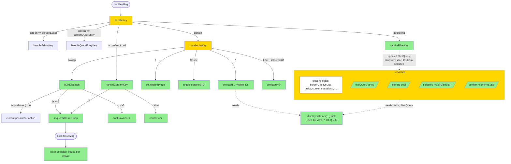
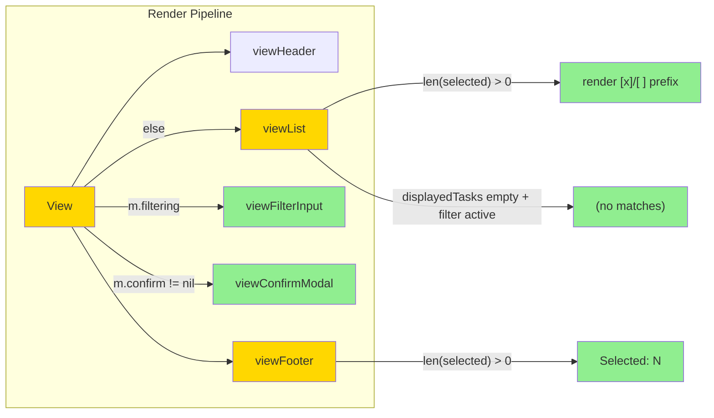

# Search & Multi-Select for TUI — Design

## 2.1 Overview

Фича добавляет два изолированных state-машины в `tui.Model`:

1. **Filter Mode** — текущий список сужается substring-match'ем по `Task.Title`, обновление live на каждый keypress, чисто in-memory.
2. **Selection Set** — `Space` тоггл, `*` select-all-visible, `Esc` сброс. Bulk-операции (`c`/`x`/`d`/`p`) автоматически работают над выделенными при непустом наборе; при пустом — текущее поведение per-cursor сохраняется.

Bulk-операции при `N ≥ 5` требуют подтверждения через ASCII-модалку. Все изменения изолированы в пакете `internal/tui`; контракты `storage` и `app` не меняются. Реализация разделена по cohesion-ориентированным файлам (`filter.go`, `bulk.go`) — `app.go` остаётся центральным dispatcher'ом.

## 2.2 Architecture





### Implementation Order

1. **Selection foundation** — `Model.selected`, `Space` toggle, `*` select-all-visible, `Esc` clear, view prefix `[x]`/`[ ]`. No dependency on filter.
2. **Filter foundation** — `Model.filterQuery`/`filtering`, `displayedTasks()` helper, `/`-binding, filter input render, `Esc`/`Enter` handling, `(no matches)` placeholder.
3. **Filter-Selection bridge** — REQ-2.6: при изменении `filterQuery` IDs, выпавшие из видимости, удаляются из `selected`.
4. **List-switch cleanup** — REQ-1.6 / REQ-2.7: `switchList` сбрасывает оба state'а.
5. **Bulk dispatch** — рефактор `completeSelected`/`cancelSelected`/`deleteSelected`/`pinSelected` в `bulkDispatch(action)` — empty selection → fallthrough к per-cursor; non-empty → sequential Cmd.
6. **Confirm modal** — `confirmState`, `handleConfirmKey`, view rendering. Активируется при `len(selected) ≥ 5`.
7. **Help & footer hints** — REQ-4.1, REQ-4.2.

## 2.3 Components and Interfaces

### Files Requiring Changes

| File | Change Type | Description |
|------|-------------|-------------|
| `internal/tui/app.go` | `[MODIFIED]` | Расширение `Model` четырьмя полями (`filterQuery`, `filtering`, `selected`, `confirm`); split `handleKey` на четыре подветви по приоритетам screen→filtering→confirm→listKey; обновление `View()` для filter input и confirm modal; обновление `viewList` под `[x]/[ ]` префикс и `(no matches)`; рефактор per-action хелперов в `dispatch(action bulkAction)`. |
| `internal/tui/keys.go` | `[MODIFIED]` | Новые bindings: `Filter` (`/`), `ToggleSelect` (`Space`), `SelectAll` (`*`), `ClearSelection` (`Esc` в list-режиме). |
| `internal/tui/msgs.go` | `[MODIFIED]` | Новые сообщения: `bulkResultMsg{action, succeeded, failed, lastErr, fatal}`. |
| `internal/tui/filter.go` | `[NEW]` | `displayedTasks(m Model) []task.Task`; `foldCaseContains(haystack, needle string) bool` — Unicode fold-case substring; `handleFilterKey(m Model, msg tea.KeyMsg) (Model, tea.Cmd)`. |
| `internal/tui/bulk.go` | `[NEW]` | `type bulkAction int` константы; `dispatch(m Model, action bulkAction) (Model, tea.Cmd)` — main switch (empty→cursor, <5→run, ≥5→confirm); `runBulk(svc, action, ids) tea.Cmd` — последовательный цикл; `handleConfirmKey(m Model, msg tea.KeyMsg) (Model, tea.Cmd)`. |
| `internal/tui/filter_test.go` | `[NEW]` | Unit + property тесты для filter state и `displayedTasks`. |
| `internal/tui/bulk_test.go` | `[NEW]` | Unit + property тесты для bulk dispatch, confirm threshold, partial-failure агрегации. |
| `internal/tui/app_test.go` | `[MODIFIED]` | Добавление тестов на интеграцию filter+selection+list-switch (cross-cutting REQ-2.6, REQ-1.6, REQ-2.7). |

### Files NOT Requiring Changes

| File | Reason Unchanged |
|------|-----------------|
| `internal/storage/repository.go` | Поиск in-memory; новых методов на repository не нужно. |
| `internal/storage/bbolt/bbolt.go` | Та же причина — нет storage-level фильтра. |
| `internal/storage/fakes/*` | Не нужны новые fakes — переиспользуем существующие. |
| `internal/app/service.go` | Bulk = N × single, без новых service-методов. Сохраняется per-task transactional semantics. |
| `internal/app/queries.go` | Не меняется список list-функций. |
| `internal/domain/*` | Никаких новых domain-типов. |
| `internal/tui/editor.go` | Editor — отдельный screen (`screenEditor`); не пересекается с filter/select. |
| `internal/tui/style.go` | Переиспользуем существующие `theme.Modal` (для confirm), `theme.Selected` (для префикса), `theme.Dim` (для placeholder). Новых стилей не нужно. |
| `cmd/todushka/main.go` | TUI wiring без изменений. |
| `internal/cli/*` | CLI не затрагивается (фича только TUI). |

### Interface Signatures

```go
// filter.go

// displayedTasks returns the subset of m.tasks visible under the current filter.
// When m.filterQuery is empty (or whitespace-only after TrimSpace), returns m.tasks unchanged.
// Returns a new slice; m.tasks is not mutated. Order is preserved.
func displayedTasks(m Model) []task.Task

// foldCaseContains reports whether needle is a substring of haystack
// under Unicode case-folding (using strings.EqualFold semantics generalized to substring).
// Precondition: needle and haystack are valid UTF-8.
func foldCaseContains(haystack, needle string) bool

// handleFilterKey processes keystrokes while m.filtering == true.
// Returns updated Model and any commands (typically none — pure state).
// Side-effect: if filterQuery changes, drops invisible IDs from m.selected (REQ-2.6).
func handleFilterKey(m Model, msg tea.KeyMsg) (Model, tea.Cmd)

// bulk.go

type bulkAction int

const (
    bulkActionComplete bulkAction = iota
    bulkActionCancel
    bulkActionDelete
    bulkActionPin
)

const bulkConfirmThreshold = 5

// dispatch routes an action key based on the size of m.selected.
// - len(selected) == 0 → applies to m.selectedTask() (preserves current per-cursor behavior, REQ-3.1)
// - 1 ≤ len(selected) < 5 → runBulk immediately (REQ-3.2)
// - len(selected) ≥ 5     → sets m.confirm and renders modal (REQ-3.3)
func dispatch(m Model, action bulkAction) (Model, tea.Cmd)

// runBulk executes action sequentially over ids, aggregating successes and failures.
// Returns a single tea.Cmd that produces exactly one bulkResultMsg.
// Stops early and marks msg.fatal=true on context.Canceled or storage.ErrDatabaseLocked.
func runBulk(svc *app.Service, action bulkAction, ids []id.ID) tea.Cmd

// handleConfirmKey processes keystrokes while m.confirm != nil.
// - 'y' → dispatches the pending action (clears m.confirm)
// - any other key → dismisses m.confirm without dispatch (REQ-3.4)
func handleConfirmKey(m Model, msg tea.KeyMsg) (Model, tea.Cmd)
```

## 2.4 Key Decisions (ADR)

### ADR-1: Filter input placement — inline footer vs modal overlay

- **Context:** REQ-1.1 указывает "в нижней части экрана", но не уточняет — заменять ли footer hints, или показывать как отдельный modal.
- **Options:**
  - **A. Inline в месте footer hints** — пока `m.filtering == true`, footer заменяется на `Filter: <query>_  Enter=save Esc=cancel`.
  - **B. Modal overlay** — отдельная панель над footer, как `viewQuickEntry`.
  - **C. Top of list** — input над списком, footer не трогаем.
- **Decision:** A (inline в footer).
- **Rationale:** Filter — режим помощник, не первичный (не как Quick Entry, где ввод — единственная цель). Inline-замена footer'а минимально нарушает existing layout; список остаётся полностью видимым; перевод footer'а уже несёт контекст ("сейчас вы фильтруете"). Modal (B) дублирует Quick Entry-паттерн где не нужно. Top (C) разделит header и список визуально, ломая сканирование.
- **Consequences:** При активном filter пользователь не видит обычные hints (`?: help  ⇥: next view ...`) — это компромисс. Mitigation: filter mode короткий по интенту (несколько секунд), пользователь сам инициирует и выходит.

### ADR-2: Bulk confirm — single `y` vs `y` + `Enter` vs full word

- **Context:** REQ-3.3 требует confirm-модалку при `N ≥ 5`. Не уточнено, какое нажатие подтверждает.
- **Options:**
  - **A. Single `y`** — нажал y → выполнилось.
  - **B. `y` + `Enter`** — двойное подтверждение.
  - **C. Текст "yes"** — печатать целиком.
- **Decision:** A (single `y`).
- **Rationale:** Bulk-операция уже прошла через две точки решения — выделение `Space` (или `*`) и нажатие action key. Третья ступень в виде `y+Enter` избыточна; "yes" — медленно и нетипично для TUI. Things 3 использует single-key подтверждение. Однократное нажатие `y` не случайно происходит в UI-flow — пользователь только что вошёл в modal через известное действие.
- **Consequences:** Случайный touch `y` подтвердит. Mitigation: модалка показывается **только** при `N ≥ 5` — пороги выставлены под "достаточно сильное намерение, чтобы помнить о подтверждении".

### ADR-3: Bulk execution model — sequential vs parallel

- **Context:** REQ-3.2/3.5 требуют последовательного выполнения с агрегированной отчётностью. Bubble Tea допускает `tea.Batch` с N параллельными `tea.Cmd`.
- **Options:**
  - **A. Sequential single Cmd** — один Cmd внутри цикла, возвращает агрегированный `bulkResultMsg`.
  - **B. `tea.Batch` параллельных Cmd** — каждая задача = отдельный Cmd, агрегация через множественные сообщения.
  - **C. Goroutine fan-out** — внутри одной Cmd запускаем N goroutine.
- **Decision:** A (sequential single Cmd).
- **Rationale:** bbolt сериализует writes через single mutex — параллельность не даёт perf-выигрыша. Sequential обеспечивает deterministic ordering для error reporting; одно сообщение на UI с финальным результатом проще для status bar. Parallelism (B/C) усложняет агрегацию (нужно собирать N сообщений) без реальной выгоды. Для типичных N ≤ 50 sequential отрабатывает за <50ms на SSD — UX-блокировка несущественна.
- **Consequences:** При очень больших N (тысячи) UI может зависнуть на ~секунду. Mitigation: confirm-threshold ограничивает реалистичный N; если нужно — позже добавим progress indicator. Acceptable trade-off для v1.

### ADR-4: Selection marker — ASCII vs Unicode

- **Context:** REQ-2.2 говорит про `[x]`/`[ ]` префикс, но это можно прочитать буквально (ASCII) или эстетически (Unicode `☑`/`☐` / `●`/`○`).
- **Options:**
  - **A. ASCII `[x]` / `[ ]`** — 4 столбца, гарантированно рендерится везде.
  - **B. Unicode checkbox `☑` / `☐`** — 2 столбца, требует поддержки шрифта.
  - **C. Unicode dot `●` / `○`** — 2 столбца, минималистичнее.
- **Decision:** A (ASCII).
- **Rationale:** todushka должен работать в любом терминале, включая ssh-сессии и embedded shells. Unicode checkboxes не во всех шрифтах (например, дефолтный шрифт macOS Terminal на server'е иногда даёт `□` для отсутствующего глифа). ASCII — 0 риска. Эстетика — минорный trade-off на v1; можно сделать настраиваемым в v2.
- **Consequences:** Префикс занимает 4 столбца вместо 2 — заметнее, но также чётче парсится визуально. Длинные титлы обрезаются раньше при узком терминале.

### ADR-5: New files vs extending app.go

- **Context:** `app.go` уже 460 строк; добавление filter + bulk + confirm + view-обновлений принесёт ещё ~300-400 строк.
- **Options:**
  - **A. Всё в `app.go`** — единый файл со всей логикой Model.
  - **B. Split в `filter.go` и `bulk.go`** — по cohesion.
- **Decision:** B.
- **Rationale:** Cohesion-разделение упрощает code review (один файл = одна функциональная область), даёт явное "where to look". `app.go` остаётся центральным dispatcher'ом и Model definition'ом — это естественная граница ответственности. Pattern уже частично применён (`editor.go`, `keys.go`, `msgs.go`).
- **Consequences:** Дополнительные файлы и cross-file references. Mitigation: package-private функции живут в одном package, не требуют дополнительных export'ов.

### ADR-6: Filter Mode — new `screenKind` vs boolean flag

- **Context:** Текущий код использует `screenKind` enum для exclusive modes (list/quickEntry/editor/help). Filter — sub-state списка.
- **Options:**
  - **A. New `screenFilter` value** — добавить в enum.
  - **B. Boolean `Model.filtering`** — отдельное поле, скрин остаётся `screenList`.
- **Decision:** B.
- **Rationale:** Filter не скрывает список — он отображается параллельно. Семантически filter — это "режим ввода поверх screenList", а не "отдельный экран". Boolean flag отражает это точнее. Дополнительно: `screenKind` exclusive, что усложняет одновременное `screen == screenList && m.confirm != nil` (confirm также sub-state).
- **Consequences:** В `handleKey` появится приоритетная цепочка проверок (screen → filtering → confirm → listKey) вместо плоского switch'а на screen. Документируется в коде как explicit precedence comment.

## 2.5 Data Models

```go
// [MODIFIED] tui.Model — добавлены 4 новых поля. Существующие поля сохранены.
type Model struct {
    // ... existing fields ...
    service     *app.Service
    keys        KeyMap
    theme       Theme
    screen      screenKind
    activeList  listKind
    tasks       []task.Task
    cursor      int
    statusMsg   string
    statusUntil time.Time
    quickInput  textinput.Model
    editor      EditorModel
    width       int

    // [NEW] Filter Mode state
    filterQuery string                // Raw query string (printable runes only)
    filtering   bool                  // True while filter input accepts keys; false after Enter/Esc

    // [NEW] Selection set (set semantics; value is empty struct for zero allocation)
    selected    map[id.ID]struct{}

    // [NEW] Pending bulk-confirm modal. Nil when no modal is shown.
    confirm     *confirmState
}

// [NEW] confirmState describes a pending bulk operation awaiting user confirmation.
type confirmState struct {
    action bulkAction              // Which op to perform on selected
    ids    []id.ID                 // Snapshot of selected at the moment dispatch was triggered
                                   // (defensive: prevents drift if user mutates selected mid-modal)
}

// [NEW] bulkAction discriminator for filter/bulk dispatchers.
type bulkAction int
const (
    bulkActionComplete bulkAction = iota
    bulkActionCancel
    bulkActionDelete
    bulkActionPin
)

// [NEW] bulkResultMsg published by runBulk Cmd. Single message per bulk invocation.
type bulkResultMsg struct {
    action    bulkAction        // Which action ran
    succeeded int               // Count of successful applies
    failed    int               // Count of recoverable per-task failures
    lastErr   error             // Most recent non-nil error (for status bar); nil if all succeeded
    fatal     bool              // True if a non-recoverable error halted the bulk (e.g. db locked, context canceled)
}
```

## 2.6 Correctness Properties

### Property 1: Filter result equivalence

- **Category:** Equivalence
- **Statement:** For all `tasks []task.Task` and `query string`, `displayedTasks(Model{tasks: tasks, filterQuery: query})` equals `{t ∈ tasks | foldCaseContains(t.Title, strings.TrimSpace(query))}` preserving order. When `strings.TrimSpace(query) == ""`, the result equals `tasks`.
- **Validates:** Requirements 1.2, 1.7

### Property 2: Filter state transitions

- **Category:** Propagation
- **Statement:** For all `Model M` in screenList with `filtering == false`, after `handleKey('/')`, the resulting Model has `filtering == true`. For all `Model M` with `filtering == true`, after `handleKey(Esc)`, the resulting Model has `filtering == false` and `filterQuery == ""`. After `handleKey(Enter)` with non-empty query, Model has `filtering == false` and `filterQuery` preserved.
- **Validates:** Requirements 1.1, 1.3, 1.4

### Property 3: Empty Visible Tasks renders placeholder

- **Category:** Propagation
- **Statement:** For all `Model M` where `filterQuery` is non-empty and `displayedTasks(M)` is empty, `viewList(M)` contains the substring `(no matches)`.
- **Validates:** Requirement 1.5

### Property 4: List switch resets filter and selection

- **Category:** Equivalence
- **Statement:** For all `Model M` and switch-key K ∈ `{Tab, Shift+Tab, 1, 2, 3, 4, 5, 6}`, after `handleKey(K, M)`, the resulting Model has `filterQuery == ""`, `filtering == false`, and `selected` empty.
- **Validates:** Requirements 1.6, 2.7

### Property 5: Space toggle is involutive

- **Category:** Round-trip
- **Statement:** For all `Model M` in screenList with cursor on a visible task `t`, applying `handleKey(Space)` twice returns Model.selected to its original state (i.e., toggle is its own inverse).
- **Validates:** Requirement 2.1

### Property 6: Prefix renders iff selection non-empty

- **Category:** Exclusion
- **Statement:** For all `Model M`, `viewList(M)` contains the substring `[x]` or `[ ]` if and only if `len(M.selected) > 0`.
- **Validates:** Requirements 2.2, 2.3

### Property 7: `*` selects all visible

- **Category:** Equivalence
- **Statement:** For all `Model M`, after `handleKey('*')`, `{t.ID | t ∈ displayedTasks(M)} ⊆ M.selected`.
- **Validates:** Requirement 2.4

### Property 8: Esc clears selection in list mode

- **Category:** Equivalence
- **Statement:** For all `Model M` with `screen == screenList`, `filtering == false`, `confirm == nil`, and `len(selected) > 0`, after `handleKey(Esc, M)`, `M.selected` is empty.
- **Validates:** Requirement 2.5

### Property 9: Selection is subset of visible

- **Category:** Absence
- **Statement:** For all `Model M` after any sequence of `handleKey` calls including filter input changes, `M.selected ⊆ {t.ID | t ∈ displayedTasks(M)}`.
- **Validates:** Requirement 2.6

### Property 10: Selection counter in status

- **Category:** Propagation
- **Statement:** For all `Model M` with `len(M.selected) > 0`, `viewFooter(M)` contains the substring `Selected: N` where N equals `len(M.selected)`.
- **Validates:** Requirement 2.8

### Property 11: Empty selection action equivalence

- **Category:** Equivalence
- **Statement:** For all `Model M` with `len(M.selected) == 0` and action key K ∈ `{c, x, d, p}`, the `tea.Cmd` returned by `handleKey(K, M)` is functionally equivalent to the current per-cursor action on `m.selectedTask()`.
- **Validates:** Requirement 3.1

### Property 12: Bulk threshold gate

- **Category:** Exclusion
- **Statement:** For all `Model M` with `len(M.selected) > 0` and action key K ∈ `{c, x, d, p}`, after `handleKey(K, M)`:
  - If `len(M.selected) < 5`: resulting Model has `confirm == nil` and a non-nil `tea.Cmd` is returned.
  - If `len(M.selected) >= 5`: resulting Model has `confirm != nil` with the correct `action` and `ids` snapshot, and no operation Cmd is returned (only a redraw).
  These two branches are mutually exclusive.
- **Validates:** Requirements 3.2, 3.3

### Property 13: Only `y` confirms

- **Category:** Exclusion
- **Statement:** For all `Model M` with `M.confirm != nil` and any key K, after `handleKey(K, M)`:
  - If K == 'y': resulting Model has `confirm == nil` AND `tea.Cmd` dispatches the bulk operation.
  - If K != 'y': resulting Model has `confirm == nil` AND `tea.Cmd` is nil (modal dismissed, no operation).
- **Validates:** Requirement 3.4

### Property 14: Bulk result aggregates correctly

- **Category:** Equivalence
- **Statement:** For all `runBulk` invocations with N IDs where K result in recoverable error (not fatal), the emitted `bulkResultMsg` satisfies `succeeded + failed == N` AND `failed == K`.
- **Validates:** Requirement 3.5

### Property 15: Successful bulk clears selection

- **Category:** Equivalence
- **Statement:** For all `Model M` receiving `bulkResultMsg{fatal: false}`, the resulting Model has `selected` empty.
- **Validates:** Requirement 3.6

### Property 16: Fatal bulk preserves selection

- **Category:** Absence
- **Statement:** For all `Model M` receiving `bulkResultMsg{fatal: true}`, the resulting Model has `selected` unchanged from before the message.
- **Validates:** Requirement 3.7

### Property 17: Help includes new bindings

- **Category:** Propagation
- **Statement:** For all `Model M`, `viewHelp(M)` contains help text for at least the keys `/`, `space`, and `*`.
- **Validates:** Requirement 4.1

### Property 18: Footer hints include new keys

- **Category:** Propagation
- **Statement:** For all `Model M` with `screen == screenList`, `filtering == false`, `confirm == nil`, `viewFooter(M)` contains substrings `/` (for filter) and `space` (or `Space`) (for select).
- **Validates:** Requirement 4.2

## 2.7 Error Handling

| Scenario | Detection | Action |
|----------|-----------|--------|
| Per-task bulk failure (e.g. `app.ErrTaskNotFound`) | `runBulk` checks each call's `error` return | Increment `failed` counter, save error to `lastErr`, **continue** with remaining IDs |
| `context.Canceled` mid-bulk | `errors.Is(err, context.Canceled)` | Set `fatal=true` in `bulkResultMsg`, abort remaining IDs |
| `storage.ErrDatabaseLocked` mid-bulk | `errors.Is(err, storage.ErrDatabaseLocked)` | Set `fatal=true`, abort remaining; status bar shows "database is locked by another process" |
| Bulk operation on empty visible (post-filter) | `len(ids) == 0` in `dispatch` | No-op; do not emit `bulkResultMsg`; treat as silent skip |
| Filter receives non-printable bytes | `textinput` filters these by default | No-op (bubbles handles) |
| Filter query >256 chars | `textinput.CharLimit = 256` | Bubbles truncates; no error |
| Confirm modal active and user switches list (`Tab`, `1-6`) | `handleConfirmKey` consumes all keys until dismissed | Modal stays; list-switch keys are ignored while `confirm != nil` |
| Task ID in `selected` but task gone from `m.tasks` (e.g. completed externally) | bulk `runBulk` returns ErrTaskNotFound for that ID | Counted as recoverable failure (see row 1) |
| `Space` pressed when cursor is on out-of-range index | `selectedTask()` returns nil | No-op (consistent with current single-task behavior) |
| `*` pressed when `displayedTasks` is empty | `len(ids) == 0` after iteration | No-op (selected unchanged) |
| Selection survives across `loadCurrentList` (which fires after bulk) | `tasksLoadedMsg` handler does not modify `selected` | Acceptable — REQ-3.6 already cleared it in `bulkResultMsg` handler |

## 2.8 Testing Strategy

**Test Style Source:** Tier 2
- Adjacent test files: `internal/tui/app_test.go` (Bubble Tea Model unit tests via direct `Update(tea.KeyMsg{...})` dispatch), `internal/domain/repeat/*_test.go` (rapid property tests).
- Key patterns:
  - Test fixture: `newTestModel(t) Model` constructs a Model with `fakes.New()` repository and `fixedClock{}`. New tests should use the same fixture.
  - testify `require` for assertions (not `assert`).
  - Direct dispatch via `tea.KeyMsg{Type: tea.KeyRunes, Runes: []rune{'q'}}` or `tea.KeyMsg{Type: tea.KeyCtrlC}` etc. — no Bubble Tea runtime is started.
  - `Cmd` results validated by **invoking** `cmd()` and type-asserting the resulting `tea.Msg`.
  - Table-driven tests with `name`-keyed cases.
  - Property tests: `pgregory.net/rapid` (`rapid.Check(t, func(t *rapid.T) {...})`).

### Project Commands

| Action     | Command          |
|------------|------------------|
| Test       | `task test`      |
| Test race  | `task test-race` |
| Build      | `task build`     |
| Lint       | `task lint`      |
| Format     | `task fmt`       |

### Unit Tests

| Test | Description | Tags |
|------|-------------|------|
| `TestFilter_SlashEntersMode` | `/` устанавливает `m.filtering == true`; printable runes расширяют `filterQuery`; `displayedTasks` обновляется live | `Feature/filter` `Property/2` |
| `TestFilter_EnterPreservesQuery` | После Enter в Filter Mode: `m.filtering == false`, `m.filterQuery` сохранён | `Feature/filter` `Property/2` |
| `TestFilter_EscClearsQuery` | После Esc в Filter Mode: `m.filtering == false`, `m.filterQuery == ""` | `Feature/filter` `Property/2` |
| `TestFilter_WhitespaceQueryEquivEmpty` | Query `"   "` даёт `displayedTasks == tasks` | `Feature/filter` `Property/1` |
| `TestFilter_CaseInsensitiveMatch` | Query `"купить"` находит `"Купить молоко"` (Unicode fold-case) | `Feature/filter` `Property/1` |
| `TestFilter_NoMatchesPlaceholder` | `displayedTasks` пустой → `viewList` содержит `(no matches)` | `Feature/filter` `Property/3` |
| `TestSwitchList_ClearsFilterAndSelection` | Tab/Shift+Tab/1-6 сбрасывают `filterQuery`, `filtering`, `selected` | `Feature/filter` `Feature/selection` `Property/4` |
| `TestSelection_SpaceToggle` | Первый `Space` добавляет ID, второй — удаляет | `Feature/selection` `Property/5` |
| `TestSelection_PrefixVisibleWhenNonEmpty` | `len(selected) > 0` → `viewList` содержит `[x]` или `[ ]` | `Feature/selection` `Property/6` |
| `TestSelection_PrefixHiddenWhenEmpty` | `len(selected) == 0` → нет `[x]` или `[ ]` в `viewList` | `Feature/selection` `Property/6` |
| `TestSelection_StarSelectsAllVisible` | После `*` все ID из `displayedTasks` в `selected` | `Feature/selection` `Property/7` |
| `TestSelection_EscClearsSelection` | Esc при non-empty selected (и не в Filter Mode) очищает | `Feature/selection` `Property/8` |
| `TestSelection_FilterChangeDropsHidden` | После изменения filterQuery, скрытые ID удаляются из `selected` | `Feature/selection` `Feature/filter` `Property/9` |
| `TestSelection_StatusBarCounter` | `viewFooter` содержит `Selected: N` | `Feature/selection` `Property/10` |
| `TestBulk_EmptyDispatchesPerCursor` | `len(selected) == 0` + `c` → cursor task completed | `Feature/bulk` `Property/11` |
| `TestBulk_BelowThresholdNoConfirm` | `len(selected) == 4` + `c` → operation dispatched, `confirm == nil` | `Feature/bulk` `Property/12` |
| `TestBulk_AtThresholdRequiresConfirm` | `len(selected) == 5` + `c` → `confirm != nil`, no operation Cmd | `Feature/bulk` `Property/12` |
| `TestBulk_YConfirmsAndDispatches` | confirm != nil → `y` → operation runs, `confirm == nil` | `Feature/bulk` `Property/13` |
| `TestBulk_NonYDismissesNoDispatch` | confirm != nil → `n` или Esc → `confirm == nil`, no op | `Feature/bulk` `Property/13` |
| `TestBulk_AggregateMath` | runBulk над 3 успешными + 2 failing → `bulkResultMsg{succeeded:3, failed:2}` | `Feature/bulk` `Property/14` |
| `TestBulk_SuccessClearsSelection` | bulkResultMsg{fatal:false} → `selected` пустой | `Feature/bulk` `Property/15` |
| `TestBulk_FatalPreservesSelection` | bulkResultMsg{fatal:true} → `selected` без изменений | `Feature/bulk` `Property/16` |
| `TestBulk_DatabaseLockedIsFatal` | Mock возвращает `storage.ErrDatabaseLocked` → `fatal == true` | `Feature/bulk` |
| `TestBulk_EmptyVisibleIsNoop` | `len(selected) == 0` AND `len(displayedTasks) == 0` + `c` → нет команд | `Feature/bulk` |
| `TestHelp_IncludesNewBindings` | `viewHelp` содержит `/`, `space`, `*` | `Feature/help` `Property/17` |
| `TestFooter_IncludesNewHints` | `viewFooter` (нормальный режим) содержит `/` и `space` | `Feature/help` `Property/18` |
| `TestConfirm_BlocksListSwitch` | `confirm != nil` + Tab/1-6 → no list switch, modal stays | `Feature/bulk` |
| `TestFilter_ChainEntryAndSelection` | `/` → введён query → `*` selects only visible | `Feature/filter` `Feature/selection` |

### Property-Based Tests

| Test | Property | Generator description | Tags |
|------|----------|-----------------------|------|
| `prop_FilterIsSubstringSubset` | Property 1 | `rapid.SliceOf(rapid.StringMatching(.*))` для titles; `rapid.String()` для query | `Property/1` |
| `prop_FilterStateTransitions` | Property 2 | Случайные последовательности `/`/printable/Enter/Esc; assert финального состояния | `Property/2` |
| `prop_NoMatchesShowsPlaceholder` | Property 3 | tasks с deterministic titles + query, не дающий совпадений | `Property/3` |
| `prop_SwitchListResetsState` | Property 4 | произвольные предыдущие filter/selection states + switch key | `Property/4` |
| `prop_SpaceIsInvolution` | Property 5 | произвольный начальный selected; cursor на видимой task | `Property/5` |
| `prop_PrefixIffNonEmpty` | Property 6 | произвольный `selected`; проверка `viewList` | `Property/6` |
| `prop_StarSelectsAllVisible` | Property 7 | произвольные tasks + filterQuery | `Property/7` |
| `prop_EscClearsSelection` | Property 8 | произвольные non-empty selected | `Property/8` |
| `prop_SelectionSubsetOfVisible` | Property 9 | произвольные tasks, selected, filterQuery | `Property/9` |
| `prop_StatusBarShowsCount` | Property 10 | произвольный `selected` size 1..50 | `Property/10` |
| `prop_EmptySelectionEquivCursor` | Property 11 | пустой selected; cursor на task; для каждого action | `Property/11` |
| `prop_BulkThresholdGate` | Property 12 | произвольный selected size 1..20; assert поведения вокруг 5 | `Property/12` |
| `prop_OnlyYConfirms` | Property 13 | произвольный confirm state + произвольный key | `Property/13` |
| `prop_BulkAggregateMath` | Property 14 | произвольный набор ID; mock service с детерминированной долей failures | `Property/14` |
| `prop_SuccessClearsSelection` | Property 15 | произвольный selected + bulkResultMsg{fatal:false} | `Property/15` |
| `prop_FatalPreservesSelection` | Property 16 | произвольный selected + bulkResultMsg{fatal:true} | `Property/16` |
| `prop_HelpContainsNewKeys` | Property 17 | произвольный Model state | `Property/17` |
| `prop_FooterContainsNewKeys` | Property 18 | произвольный Model state в screenList | `Property/18` |
