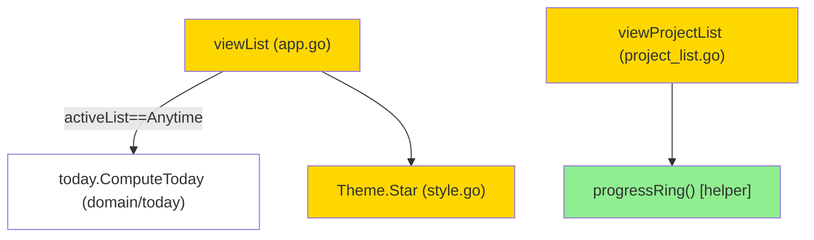

# things-visual (Фаза A) — Design

## 2.1 Overview
Три независимые презентационные доработки в `internal/tui`:
1. **Кольцо прогресса** у проектов (BL-9) — чистая функция `progressRing(open,total)` → глиф ◯◔◑◕●, встраивается в строку `viewProjectList`.
2. **Звезда «today»** в Anytime (BL-10) — `viewList` при `activeList==listAnytime` строит множество ID через `today.ComputeToday(disp, time.Now(), 0)` и рисует ★ в слоте фиксированной ширины.
3. **Приглушение завершённых строк** — для Completed/Cancelled весь префикс строки (short ID) рендерится faint, не только заголовок.

Поддержка: новое поле `Theme.Star` (+ обновление monochrome-темы).

## 2.2 Architecture

**Implementation order:** (1) `Theme.Star` → (2) `progressRing` + `viewProjectList` (BL-9) → (3) `viewList` звезда + faint (BL-10). Группы 2 и 3 независимы от 1 после того, как поле темы добавлено.

## 2.3 Components and Interfaces

### Files Requiring Changes
| File | Change Type | Description |
|------|-------------|-------------|
| `internal/tui/style.go` | `[MODIFIED]` | добавить поле `Star lipgloss.Style`; заполнить в `newColorTheme` (Bold, Foreground `t.Warning`) и `NewMonochromeTheme` (Bold) |
| `internal/tui/project_list.go` | `[MODIFIED]` | добавить `progressRing(open, total int) string`; в строке проекта вставить кольцо перед `[open/total]` |
| `internal/tui/app.go` | `[MODIFIED]` | `viewList`: для `listAnytime` посчитать today-set; добавить слот звезды в `firstLinePrefix`; для done-строк рендерить short ID faint |
| `internal/tui/things_visual_test.go` | `[NEW]` | unit + PBT для кольца, звезды, faint, monochrome |

### Interfaces
```go
// progressRing returns ◯ when done==0 (incl. total==0), ● when done==total>0,
// else one of ◔◑◕ rising with the completed ratio. done = total-open.
func progressRing(open, total int) string
```
`viewList` и `viewProjectList` сохраняют текущие сигнатуры (методы `Model`).

### Files NOT Requiring Changes
| File | Reason Unchanged |
|------|-----------------|
| `internal/domain/today/today.go` | `ComputeToday` переиспользуется как есть |
| `internal/app/queries.go` | списки Today/Anytime уже корректны |
| `internal/tui/viewport.go` | windowing не меняется (звезда/кольцо в пределах строки) |
| `internal/tui/keys.go` | бинды не добавляются |

## 2.4 Key Decisions (ADR)

**ADR-1: источник «today» для звезды**
- **Context:** нужно знать, какие строки Anytime — сегодняшние.
- **Options:** (A) `time.Now()` + `ComputeToday` в рендере; (B) предвычислять set при загрузке и хранить в Model; (C) дублировать предикат в TUI.
- **Decision:** A (выбрано пользователем).
- **Rationale:** ноль нового состояния, переиспользует доменный движок (без дублирования правил). Детерминизм тестов — задачи строятся относительно `time.Now()`.
- **Consequences:** `View` time-dependent; тесты не завязываются на абсолютную дату, а используют сегодня/завтра относительно `time.Now()`.

**ADR-2: стиль звезды**
- **Context:** звезда должна быть жёлтой и работать в monochrome.
- **Options:** (A) новое поле `Theme.Star`; (B) переиспользовать `theme.Deadline` (тоже `Warning`); (C) inline-стиль на строку.
- **Decision:** A — добавить `Theme.Star`.
- **Rationale:** соответствует паттерну проекта (предсобранные семантические стили), без per-row аллокаций, без семантической путаницы с дедлайном.
- **Consequences:** изменение контракта `Theme` → релиз **minor (v0.11.0)** по [[release-cadence]]; monochrome-тема обновляется в том же коммите (без runtime-поломки; пакет `internal`, внешнего API нет).

**ADR-3: пороги кольца**
- **Context:** отобразить 5 глифов по доле выполненных.
- **Options:** (A) округление до ближайшей четверти с зарезервированными краями; (B) равные интервалы 20%.
- **Decision:** A. `done==0→◯`, `done==total→●`, иначе `k=round(done/total*4)`; `k==0→◔`, `k==4→◕`, иначе `[◯◔◑◕●][k]`.
- **Rationale:** ◯ означает «ничего», ● — «всё»; частичный прогресс никогда не выглядит как полный/пустой.
- **Consequences:** 99% покажет ◕, 1% покажет ◔ — ожидаемо.

## 2.5 Data Models
```go
// [MODIFIED] Theme gains one field:
Star lipgloss.Style // ★ today-marker; color theme: Bold+Foreground(Warning); monochrome: Bold
```
Новых доменных типов нет.

## 2.6 Correctness Properties

```
Property 1: Ring endpoints & count
Category: Equivalence
Statement: For all (open,total) with 0<=open<=total, progressRing == ◯ iff done==0, == ● iff (done==total ∧ total>0); and the project row text still contains "[open/total]".
Validates: Requirements 1.1, 1.2, 1.4

Property 2: Ring monotonic
Category: Propagation
Statement: For all (o1,total),(o2,total) with (total-o1)<=(total-o2), ringIndex(o1,total) <= ringIndex(o2,total).
Validates: Requirements 1.3

Property 3: Star presence in Anytime
Category: Propagation
Statement: For all tasks t passing ComputeToday at render time, when activeList==listAnytime the rendered row for t contains ★.
Validates: Requirements 2.1

Property 4: Star exclusion & alignment
Category: Exclusion
Statement: For all tasks, when activeList != listAnytime no row contains ★; and within Anytime the leading prefix width (lipgloss.Width) is identical for starred and unstarred rows.
Validates: Requirements 2.2, 2.3

Property 5: Done-row content preserved
Category: Absence
Statement: For all tasks with status Completed/Cancelled, the rendered row never loses the title text nor the ✓/✗ status glyph (faint styling does not drop content).
Validates: Requirements 3.1, 3.2

Property 6: Monochrome runes & no overflow
Category: Absence
Statement: For all task/project lists rendered under NO_COLOR, ring and star runes are still present and the body line count never exceeds visibleRows; the cursor marker stays visible.
Validates: Requirements 4.1, 4.2
```

## 2.7 Error Handling
| Scenario | Detection | Action |
|----------|-----------|--------|
| `total==0` (проект без задач) | `total==0` в `progressRing` | вернуть ◯, без деления |
| Anytime пуст / нет today-задач | `ComputeToday` вернул пусто | звёзд нет, слот всё равно фиксированной ширины |
| Ambiguous-width руны (★◯●) | измерение слота | ширину префикса считать через `lipgloss.Width`, не `len` |
| Терминал без размера (`m.height==0`) | `visibleRows==0` | существующее поведение `windowLines` (без обрезки) сохраняется |

## 2.8 Testing Strategy

**Test Style Source:** Tier 2
- `test_skill` не сконфигурирован. Референсы: `internal/tui/viewport_test.go`, `internal/tui/project_list_test.go`.
- Паттерны: `lipgloss.SetColorProfile(termenv.Ascii)` + cleanup; `newTestModel(t)`; table-driven; PBT через `pgregory.net/rapid`; проверка контента строк по рунам (ANSI снят).

**Project Commands:**
| Action | Command |
|--------|---------|
| Test | `task test` |
| Build | `task build` |
| Lint | `task lint` |
| Fmt | `task fmt` |

### Unit Tests
| Test | Description | Tags |
|------|-------------|------|
| `TestProgressRing_Endpoints` | `progressRing(0,0)`→◯, `(0,5)`→●, `(5,5)`→◯, `(3,4)`→◔/◑/◕ | `Feature/things-visual` |
| `TestViewProjectList_RingAndCount` | строка проекта содержит и кольцо, и `[open/total]` | `Feature/things-visual` |
| `TestViewList_StarOnTodayInAnytime` | задача с `PinnedToday`=сегодня в Anytime → строка содержит ★ | `Feature/things-visual` |
| `TestViewList_NoStarOutsideAnytime` | та же задача в Today/Inbox → ★ отсутствует | `Feature/things-visual` |
| `TestViewList_StarSlotAlignment` | starred и unstarred строки в Anytime имеют равный prefix width | `Feature/things-visual` |
| `TestViewList_DoneRowKeepsContent` | completed-строка сохраняет заголовок и ✓ | `Feature/things-visual` |
| `TestThingsVisual_Monochrome` | под `NewMonochromeTheme` кольцо ◯◔◑◕● и ★ присутствуют | `Feature/things-visual` |

### Property-Based Tests
| Test | Property | Generator description | Tags |
|------|----------|-----------------------|------|
| `TestProp_RingEndpoints` | Property 1 | random `total∈[0,50]`, `open∈[0,total]` | `Property/1` |
| `TestProp_RingMonotonic` | Property 2 | random `total∈[1,50]`, две точки `done1<=done2` | `Property/2` |
| `TestProp_StarPresence` | Property 3 | random today-задачи (pinned/start сегодня) в Anytime | `Property/3` |
| `TestProp_StarExclusionAndAlignment` | Property 4 | random список + random активный список | `Property/4` |
| `TestProp_DoneContentPreserved` | Property 5 | random done-задачи с непустыми заголовками | `Property/5` |
| `TestProp_MonochromeNoOverflow` | Property 6 | random списки, NO_COLOR, random height | `Property/6` |
