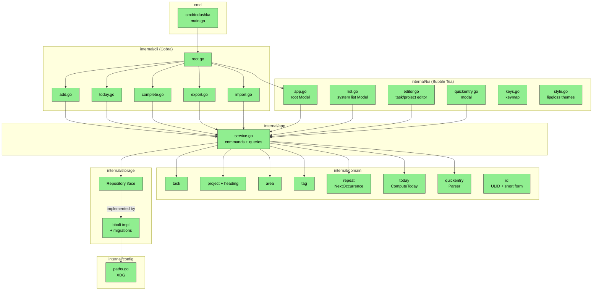

# todushka — Design

**Status:** Draft
**Author:** Claude (spec-driven-dev pipeline)
**Date:** 2026-05-25
**Feature:** todo-tui

## 2.1 Overview

`todushka` строится как чистослойное Go-приложение с двумя front-end-овыми способами доступа к одной и той же доменной модели: интерактивный TUI на Bubble Tea (MVU) и набор не-интерактивных CLI-команд на Cobra. Между ними лежит:

1. **Domain** (`internal/domain/...`) — чистые типы и бизнес-правила (Task, Project, Area, Tag, RepeatRule, Today Engine, Quick Entry parser, NextOccurrence). Без зависимостей от хранилища и UI; полностью покрыто unit + property-based тестами.
2. **Storage** (`internal/storage`) — интерфейс `Repository` + реализация на bbolt в `internal/storage/bbolt`. Domain не знает о bbolt.
3. **Application service** (`internal/app`) — оркестрирует use-cases: `AddTask`, `CompleteTask`, `ListToday`, `Export`, `Import` и т.д. Использует `Repository` и domain-функции. Все мутации проходят через service — TUI и CLI не зовут repository напрямую.
4. **TUI** (`internal/tui/...`) — Bubble Tea модели по экранам (Inbox/Today/Upcoming/…), Quick Entry модалка, редактор задач/проектов. Каждый Msg → чистая редукция состояния + опциональная команда (`tea.Cmd`) для I/O.
5. **CLI** (`internal/cli/...`) — Cobra-команды `add`, `today`, `complete`, `export`, `import`, плюс `todushka` без аргументов запускает TUI.
6. **Config / paths** (`internal/config`) — XDG paths, env, дефолты.

Логические части:

- (A) Domain core + storage (фундамент, REQ-9.x, REQ-5.x, REQ-3.x, REQ-4.x, REQ-6.x).
- (B) Today Engine + Repeat (REQ-7.x, REQ-8.x).
- (C) System list queries (REQ-2.x).
- (D) Quick Entry parser (REQ-1.x).
- (E) TUI shells: списки, редакторы, навигация (REQ-12.x, REQ-13.x, REQ-14.x).
- (F) CLI non-interactive (REQ-11.x).
- (G) Export/Import (REQ-10.x).

## 2.2 Architecture



Все компоненты — `[NEW]`, потому что проект greenfield (только `go.mod` есть). Жёлтый/`[MODIFIED]` цвет не используется.

**Implementation order:**

1. **Iteration 1 — Domain core + Storage** (часть A): `internal/domain/id`, `internal/domain/task`, `internal/domain/project`, `internal/domain/area`, `internal/domain/tag`, `internal/storage` интерфейс + bbolt-реализация с миграциями. Это даёт способность сохранять/читать сущности.
2. **Iteration 2 — Today + Repeat** (часть B): `internal/domain/today`, `internal/domain/repeat` (включая `NextOccurrence` — needs spike из exploration). Чистые функции, тяжёлое property-based покрытие.
3. **Iteration 3 — Application service** (часть C): `internal/app/service.go` с командами AddTask/CompleteTask/CancelTask/PinToday/EditTask, запросы ListInbox/ListToday/…, использует Repository и domain-функции.
4. **Iteration 4 — Quick Entry parser** (часть D): `internal/domain/quickentry`, table-driven тесты.
5. **Iteration 5 — TUI** (часть E): `internal/tui/app.go` (root Model), отдельные модели для списка, редактора, Quick Entry. Интеграция с Service через `tea.Cmd`.
6. **Iteration 6 — CLI** (часть F): Cobra-обвязка, использует тот же Service.
7. **Iteration 7 — Export/Import** (часть G): сериализация в JSON, импорт с валидацией версии и пользовательским подтверждением.

Iteration 1–2 — наибольший объём работы и наибольшая ценность тестируемости (всё чистый Go без I/O или TUI). Iteration 5 — самая большая «склейка».

## 2.3 Components and Interfaces

### Files Requiring Changes

| File | Change Type | Description |
|------|-------------|-------------|
| `go.mod` | `[MODIFIED]` | добавляются зависимости: `github.com/charmbracelet/bubbletea`, `bubbles`, `lipgloss`, `go.etcd.io/bbolt`, `github.com/spf13/cobra`, `github.com/oklog/ulid/v2`, `github.com/stretchr/testify`, `pgregory.net/rapid` |
| `go.sum` | `[NEW]` | создаётся `go mod tidy` |
| `Taskfile.yml` | `[NEW]` | таргеты `test`, `test-race`, `build`, `lint`, `run`, `fmt`, `tidy` |
| `.golangci.yml` | `[NEW]` | базовая конфигурация линтеров: govet, staticcheck, errcheck, gosec, gocritic, revive |
| `cmd/todushka/main.go` | `[NEW]` | точка входа: парсит env, инициализирует config, передаёт управление в `internal/cli.Execute()` |
| `internal/config/paths.go` | `[NEW]` | `DataDir()`, `StateDir()`, `LogPath()`, реализация XDG fallback |
| `internal/domain/id/id.go` | `[NEW]` | тип `ID = string` (ULID Crockford base32), функции `New()`, `Short(id) string` (6-char prefix), `Parse(s) (ID, error)`, `MatchShort(prefix, all) ([]ID, error)` |
| `internal/domain/task/task.go` | `[NEW]` | `Task`, `Status`, `ChecklistItem`, валидация (Validate()) |
| `internal/domain/project/project.go` | `[NEW]` | `Project`, `ProjectStatus`, `Heading`, валидация |
| `internal/domain/area/area.go` | `[NEW]` | `Area`, валидация |
| `internal/domain/tag/tag.go` | `[NEW]` | `Tag`, `Normalize(name) string` (lowercase + trim) |
| `internal/domain/repeat/repeat.go` | `[NEW]` | `RepeatRule`, `RepeatKind` enum, `Validate(r) error`, `NextOccurrence(r, after time.Time) (time.Time, error)` |
| `internal/domain/today/today.go` | `[NEW]` | чистая функция `ComputeToday(tasks []task.Task, now time.Time, deadlineWindowDays int) []task.Task` |
| `internal/domain/quickentry/parser.go` | `[NEW]` | `Parse(input string, projects []Project) (Parsed, error)`, токенайзер для `#tag`, `@today`, `@<project>`, `!YYYY-MM-DD` |
| `internal/storage/repository.go` | `[NEW]` | интерфейс `Repository` с методами CRUD для tasks/projects/areas/tags/headings; `Filter` структуры; `SchemaVersion()`, `Migrate()` |
| `internal/storage/bbolt/bbolt.go` | `[NEW]` | реализация `Repository` поверх `go.etcd.io/bbolt`, открытие/закрытие, обработка lock-конфликтов |
| `internal/storage/bbolt/migrations.go` | `[NEW]` | список миграций `[]Migration{ {Version: 1, Apply: func(tx *bbolt.Tx) error}, ... }`, applyAll() |
| `internal/storage/bbolt/encoding.go` | `[NEW]` | JSON-сериализация сущностей (`encoding/json` со stable field order — через явные struct tags) |
| `internal/storage/bbolt/indexes.go` | `[NEW]` | индексные bucket'ы и helpers: `tasks_by_status`, `tasks_by_project`, `tasks_by_area`, `tasks_by_tag`, `tag_by_name`, `area_by_name` |
| `internal/app/service.go` | `[NEW]` | `Service` структура; методы команд (AddTask, CompleteTask, CancelTask, PinToToday, MoveTask, EditTask, DeleteTask, AddProject, DeleteArea, …) и запросов (ListInbox, ListToday, ListUpcoming, ListAnytime, ListSomeday, ListLogbook, ListTrash, GetProject, FindByShortID) |
| `internal/app/clock.go` | `[NEW]` | `Clock` интерфейс (`Now() time.Time`) для тестируемости |
| `internal/app/export.go` | `[NEW]` | `ExportJSON(w io.Writer) error`, формат описан в §2.5 |
| `internal/app/import.go` | `[NEW]` | `ImportJSON(r io.Reader, confirm bool) error` с валидацией версии |
| `internal/tui/app.go` | `[NEW]` | root `tea.Model` — содержит активный экран, status bar, обработку глобальных хоткеев |
| `internal/tui/list.go` | `[NEW]` | модель списка задач (один компонент для всех системных списков, конфигурируется фильтром) |
| `internal/tui/editor.go` | `[NEW]` | модель редактора задачи / проекта (форма с полями) |
| `internal/tui/quickentry.go` | `[NEW]` | модальная модель Quick Entry, рендерится поверх любого экрана |
| `internal/tui/help.go` | `[NEW]` | контекстная помощь по клавишам (REQ-12.4) |
| `internal/tui/keys.go` | `[NEW]` | `KeyMap` с дефолтными биндингами (vim + стрелки) |
| `internal/tui/style.go` | `[NEW]` | lipgloss-стили, тёмная и monochrome темы (REQ-14.x) |
| `internal/tui/msgs.go` | `[NEW]` | все `Msg`-типы между моделями (`TasksLoaded`, `TaskSaved`, `ErrorOccurred`, `QuickEntrySubmitted`, ...) |
| `internal/cli/root.go` | `[NEW]` | Cobra root command, default action = запуск TUI |
| `internal/cli/add.go` | `[NEW]` | `todushka add` с флагами `--project`, `--area`, `--tag`, `--start`, `--deadline`, `--someday` |
| `internal/cli/today.go` | `[NEW]` | `todushka today [--json]` |
| `internal/cli/complete.go` | `[NEW]` | `todushka complete <short-id-or-full-id>` |
| `internal/cli/export.go` | `[NEW]` | `todushka export [--json <path>]`, дефолт — stdout |
| `internal/cli/import.go` | `[NEW]` | `todushka import --json <path> [--yes]` |
| `internal/cli/output.go` | `[NEW]` | форматирование вывода для CLI (тексто-цветной по умолчанию, JSON для скриптинга), уважает `NO_COLOR` |
| `README.md` | `[NEW]` | минимальный README с install + быстрым стартом (одна страница) |

### Files NOT Requiring Changes

| File | Reason Unchanged |
|------|-----------------|
| `.gitignore` | Уже корректен для Go-проекта (бинари, `*.test`, `vendor/`, `*.out`) — новых типов артефактов фича не добавляет |
| `go.mod` (поле module) | Имя модуля `github.com/jtprogru/todushka` остаётся; меняется только список зависимостей |

### Interfaces (signatures only)

```go
// internal/storage/repository.go
package storage

type Repository interface {
    // Lifecycle
    Close() error
    SchemaVersion(ctx context.Context) (int, error)
    Migrate(ctx context.Context, target int) error

    // Tasks
    TaskCreate(ctx context.Context, t task.Task) error
    TaskGet(ctx context.Context, id id.ID) (task.Task, error)
    TaskList(ctx context.Context, f TaskFilter) ([]task.Task, error)
    TaskUpdate(ctx context.Context, t task.Task) error
    TaskDelete(ctx context.Context, id id.ID, soft bool) error
    TaskMatchShort(ctx context.Context, prefix string) ([]task.Task, error)

    // Projects
    ProjectCreate(ctx context.Context, p project.Project) error
    ProjectGet(ctx context.Context, id id.ID) (project.Project, error)
    ProjectList(ctx context.Context, f ProjectFilter) ([]project.Project, error)
    ProjectUpdate(ctx context.Context, p project.Project) error
    ProjectDelete(ctx context.Context, id id.ID, soft bool) error
    ProjectFindByName(ctx context.Context, name string) ([]project.Project, error)
    HeadingCreate(ctx context.Context, h project.Heading) error
    HeadingUpdate(ctx context.Context, h project.Heading) error
    HeadingDelete(ctx context.Context, id id.ID) error

    // Areas
    AreaCreate(ctx context.Context, a area.Area) error
    AreaGet(ctx context.Context, id id.ID) (area.Area, error)
    AreaList(ctx context.Context) ([]area.Area, error)
    AreaUpdate(ctx context.Context, a area.Area) error
    AreaDelete(ctx context.Context, id id.ID, soft bool) error
    AreaFindByName(ctx context.Context, normalizedName string) (area.Area, error)

    // Tags
    TagUpsert(ctx context.Context, name string) (tag.Tag, error)
    TagGet(ctx context.Context, id id.ID) (tag.Tag, error)
    TagList(ctx context.Context) ([]tag.Tag, error)
    TagRename(ctx context.Context, id id.ID, newName string) error
    TagDelete(ctx context.Context, id id.ID) error

    // Transactional batch (used by Import)
    InTx(ctx context.Context, fn func(Repository) error) error
}

type TaskFilter struct {
    Statuses      []task.Status
    AreaID        *id.ID
    ProjectID     *id.ID
    HeadingID     *id.ID
    TagsAll       []id.ID
    Someday       *bool
    HasStartDate  *bool
    StartDateFrom *time.Time
    StartDateTo   *time.Time
    DeadlineTo    *time.Time
    PinnedToday   *bool
    IncludeDeleted bool
}

type ProjectFilter struct {
    AreaID         *id.ID
    Statuses       []project.ProjectStatus
    IncludeDeleted bool
}
```

```go
// internal/app/service.go
package app

type Service struct {
    repo  storage.Repository
    clock Clock
}

func New(repo storage.Repository, clock Clock) *Service

// Commands
func (s *Service) AddTask(ctx context.Context, input AddTaskInput) (task.Task, error)
func (s *Service) EditTask(ctx context.Context, t task.Task) error
func (s *Service) CompleteTask(ctx context.Context, id id.ID) (next *task.Task, err error)
func (s *Service) CancelTask(ctx context.Context, id id.ID) error
func (s *Service) DeleteTask(ctx context.Context, id id.ID, hard bool) error
func (s *Service) PinToToday(ctx context.Context, id id.ID) error
func (s *Service) UnpinFromToday(ctx context.Context, id id.ID) error
func (s *Service) MoveTask(ctx context.Context, taskID id.ID, target MoveTarget) error
func (s *Service) AddProject(ctx context.Context, input AddProjectInput) (project.Project, error)
func (s *Service) AddArea(ctx context.Context, name string) (area.Area, error)
func (s *Service) DeleteArea(ctx context.Context, id id.ID, confirm bool) error
func (s *Service) AddHeading(ctx context.Context, projectID id.ID, name string) (project.Heading, error)
func (s *Service) RenameTag(ctx context.Context, id id.ID, newName string) error
func (s *Service) DeleteTag(ctx context.Context, id id.ID) error
func (s *Service) QuickEntry(ctx context.Context, raw string) (task.Task, error)

// Queries
func (s *Service) ListInbox(ctx context.Context) ([]task.Task, error)
func (s *Service) ListToday(ctx context.Context) (TodayView, error)
func (s *Service) ListUpcoming(ctx context.Context) ([]task.Task, error)
func (s *Service) ListAnytime(ctx context.Context) ([]task.Task, error)
func (s *Service) ListSomeday(ctx context.Context) ([]task.Task, error)
func (s *Service) ListLogbook(ctx context.Context) ([]task.Task, error)
func (s *Service) ListTrash(ctx context.Context) (TrashView, error)
func (s *Service) ListAreas(ctx context.Context) ([]area.Area, error)
func (s *Service) ListProjects(ctx context.Context, areaID *id.ID) ([]project.Project, error)
func (s *Service) GetProjectFull(ctx context.Context, id id.ID) (ProjectFull, error)
func (s *Service) FindTaskByShort(ctx context.Context, shortOrFull string) (task.Task, error)

// Export / Import
func (s *Service) ExportJSON(ctx context.Context, w io.Writer) error
func (s *Service) ImportJSON(ctx context.Context, r io.Reader) (Snapshot, error)

type Clock interface { Now() time.Time }
```

```go
// internal/domain/repeat
func Validate(r Rule) error
func NextOccurrence(r Rule, after time.Time) (time.Time, error) // monotonic: result > after
```

```go
// internal/domain/today
func ComputeToday(
    tasks []task.Task,
    now time.Time,         // local-zoned now
    deadlineWindowDays int, // REQ-8.2 default 0
) []task.Task
```

```go
// internal/domain/quickentry
type Parsed struct {
    Title     string
    Tags      []string      // raw names
    StartDate *time.Time    // @today resolves to local 00:00:00
    Deadline  *time.Time
    ProjectRef *string      // @<project_name>
}

func Parse(input string) (Parsed, error)
```

Все signatures выше — это контракты. Никаких function bodies на этой фазе.

## 2.4 Key Decisions (ADR)

### ADR-1: TUI framework — Bubble Tea (MVU) вместо tview

- **Context:** Нужен интерактивный, keyboard-first TUI с моделью данных, легко тестируемой без эмуляции терминала.
- **Options considered:**
  1. Bubble Tea (`charmbracelet/bubbletea`) + `bubbles` + `lipgloss` — MVU-архитектура.
  2. `rivo/tview` — retained-mode widget tree, ближе к обычным GUI-фреймворкам.
  3. Cursive (Rust) — отвергнут на фазе exploration.
- **Decision:** Bubble Tea + bubbles + lipgloss.
- **Rationale:** MVU позволяет писать unit-тесты на `Update(msg)` без терминала; `bubbles/list` уже имеет виртуализацию для тысяч элементов (REQ-2.6); `lipgloss` корректно деградирует в 16/monochrome (REQ-14.2). tview сложнее тестировать (его state живёт внутри виджетов, не в pure data).
- **Consequences:** Каждый экран — отдельный `tea.Model` со своими Msg-типами; общий root объединяет их через композицию. Все I/O — через `tea.Cmd` (асинхронно). Зависимость от стека Charm — он стабилен, но v2 bubbletea ещё в активной разработке: фиксируем мажорную версию в `go.mod` и обновляем только осознанно.

### ADR-2: Хранилище — bbolt вместо SQLite

- **Context:** Нужен embedded persistent store без CGO для тривиальной кросс-компиляции под `linux/amd64`, `linux/arm64`, `darwin/amd64`, `darwin/arm64` (REQ-14.3).
- **Options considered:**
  1. `go.etcd.io/bbolt` — pure-Go embedded KV.
  2. `modernc.org/sqlite` — pure-Go SQLite (CGO-free).
  3. `mattn/go-sqlite3` — SQLite с CGO.
  4. JSON-файл целиком в памяти + atomic write.
- **Decision:** bbolt.
- **Rationale:**
  - Pure-Go без CGO ⇒ `GOOS=darwin GOARCH=arm64 go build` «из коробки» (REQ-14.3).
  - Эксклюзивная блокировка файла «бесплатно» через `flock` внутри bbolt — естественное поведение для REQ-9.3.
  - Транзакции `Update`/`View` дают серриализуемую семантику без явных locks в коде.
  - Размер бинаря: ~3-4 MB на TUI + ~1 MB на bbolt vs ~10 MB на `modernc.org/sqlite`.
  - SQL не нужен в v1 — все запросы простые (получить задачи по статусу/проекту/тегам), индексы строятся вручную через bucket-схему. Для smart lists в v2 — миграция (см. ADR-13).
  - JSON-целиком отвергнут: при тысячах задач rewrite на каждую мутацию даёт неприемлемую задержку и риск повреждения файла без полноценной транзакционности.
- **Consequences:** SQL-аналитика для будущих smart lists потребует либо ручной агрегации, либо миграции на SQLite. Domain полностью изолирован от bbolt через `Repository` интерфейс — миграция = новая реализация интерфейса. Schema migrations нужно писать самостоятельно (тривиально для KV).

### ADR-3: Идентификаторы — ULID + 6-символьный prefix для CLI

- **Context:** Нужен уникальный ID и удобный способ адресовать задачу в CLI (`todushka complete <id>`). Полный UUID/ULID — 26-36 символов, нечитабельно.
- **Options considered:**
  1. UUIDv4 + первые 8 hex-символов для CLI.
  2. ULID + первые 6 символов Crockford base32 для CLI.
  3. Автоинкрементный целочисленный ID (`task #142`).
- **Decision:** ULID (`github.com/oklog/ulid/v2`), полный ID = 26-char Crockford base32, короткая форма = первые 6 символов.
- **Rationale:**
  - ULID отсортирован по времени → дешёвые time-based индексы и stable ordering.
  - Crockford base32 — без визуально похожих символов (`I/l/1`, `0/O`).
  - 6 символов base32 = 32⁶ ≈ 1 миллиард — достаточно для разрешения по prefix среди живых задач. При коллизии CLI выводит список совпадений (REQ-11.3 уточняется тут).
  - Автоинкрементные ID отвергнуты: ломают экспорт/импорт между БД и при синке (v2).
- **Consequences:** Нужна функция `TaskMatchShort(prefix)` в Repository — линейный скан по индексу `tasks_by_id` (быстрый, ID — это ключи). В UI отображаем короткую форму, в JSON-экспорте — полную.

### ADR-4: Repeat rule serialization — внутренний формат, не iCal RRULE

- **Context:** Open Design Question из requirements: хранить `RepeatRule` как внутренний struct или iCal-совместимый RRULE.
- **Options considered:**
  1. Внутренний struct, сериализуется как JSON-объект `{"kind": "weekly_weekdays", "weekdays": ["MO","WE"]}`.
  2. iCalendar RFC 5545 RRULE: `FREQ=WEEKLY;BYDAY=MO,WE`.
- **Decision:** Внутренний формат в v1.
- **Rationale:** RRULE-парсер — отдельная задача с большим test surface (RRULE имеет десятки опций, мы поддерживаем 4); правила Things 3 не сериализуются в RRULE один в один (например, «every weekday» эквивалент `BYDAY=MO,TU,WE,TH,FR`). В v2 при добавлении интеграции с CalDAV/Things3 import напишем adapter RRULE ↔ внутренний формат.
- **Consequences:** Экспорт-формат JSON будет содержать поле `repeat: {kind, n?, weekdays?, day?}`. При импорте чужих RRULE в будущем — adapter.

### ADR-5: Today Engine — pure function, TZ из системного `time.Now().Local()`

- **Context:** Open Design Question: как определить «сегодня». Хранить TZ создания задачи или использовать текущую системную TZ.
- **Options considered:**
  1. Системная локальная TZ на момент вычисления (`time.Now().Local()`).
  2. TZ создания задачи (хранится в таске).
- **Decision:** Системная локальная TZ; TZ задачи не хранится.
- **Rationale:** Things 3 ведёт себя так же — «сегодня» означает текущий локальный день пользователя. Хранение TZ создания усложняет модель и редко даёт ожидаемое поведение (пользователь, переехавший из MSK в LA, ожидает что задачи «сегодня» отражают LA, а не MSK). `ComputeToday` остаётся чистой функцией: `(tasks, now, deadlineWindow) -> []Task` — `now` инжектируется в тесты, в production = `time.Now().Local()`.
- **Consequences:** При длительных полётах между TZ задача может «перепрыгнуть» календарный день дважды или вообще не появиться. Документировать как known behaviour. Pin to today (REQ-8.3) — отдельное поле `pinned_today_date date`, при чтении сравниваем с `now.Date()` — если не совпадает, считаем непиннованным (auto-reset в полночь, см. ADR-12).

### ADR-6: NextOccurrence для weekly late completion — отсчёт от `completed_at`

- **Context:** Open Design Question: если weekly-задача (например, понедельник) выполнена в среду, следующий экземпляр — следующий понедельник (отсчёт от completed_at) или сегодняшняя пятница? Things 3 продвигает «следующий» от момента выполнения.
- **Options considered:**
  1. От `completed_at`: следующий weekday, попадающий в правило, *после* `completed_at`.
  2. От `start_date` исходной задачи: следующий weekday правила *после* `start_date` (может оказаться в прошлом, тогда подвинуть на ближайшее будущее).
- **Decision:** От `completed_at` (вариант 1).
- **Rationale:** Согласуется с REQ-7.2 («start date равной `NextOccurrence(rule, completed_at)`»), повторяет поведение Things 3, проще для пользовательской модели — повтор «привязан к моменту, когда я реально сделал».
- **Consequences:** Если задача выполнена с опозданием в несколько недель, следующий экземпляр всё равно появится через стандартный интервал относительно сегодня (а не задним числом). Это и хотим.

### ADR-7: Pin to today auto-reset в полночь

- **Context:** Open Design Question: `pinned_to_today` снимается автоматически или до явного действия пользователя?
- **Options considered:**
  1. Auto-reset в полночь (как Things 3).
  2. Pin сохраняется до явного отключения.
- **Decision:** Auto-reset в полночь.
- **Rationale:** Хранить `pinned_today_date date` (а не bool). При запросе `ComputeToday(now)`: задача считается pinned ⇔ `pinned_today_date == now.Date()`. Это «безпрограммный» auto-reset — нам не нужен фоновый таймер.
- **Consequences:** Если задача была pinned вчера и не выполнена — сегодня она появляется в Today только по обычным правилам (start_date ≤ today, deadline ≤ today, и т.д.). Это и есть поведение Things 3.

### ADR-8: Logbook без retention в v1

- **Context:** Open Design Question: ограничивать ли Logbook временем (1 год) или хранить неограниченно.
- **Decision:** Без retention в v1, заложить config-знак `logbook_retention_days = -1` (no limit) с возможностью переопределения в v2.
- **Rationale:** Пользователь, переходящий из Things 3, ожидает увидеть свою историю. Удаление сюрпризно. БД при 1000 задач/год + 10 лет = 10K записей — это килобайты в bbolt. Реальной проблемы с размером нет.
- **Consequences:** Размер БД растёт; пользователь может явно очистить через `todushka cleanup --older-than <duration>` (deferred в v2).

### ADR-9: Tags только на Task в v1 (не на Project)

- **Context:** Open Design Question: разрешить теги на проектах.
- **Decision:** Только Task → Tag в v1.
- **Rationale:** Упрощает модель (одна junction-таблица), большинство сценариев Things 3 покрывает теги на задачах. Расширение на проекты — additive change в v2: добавить bucket `project_tags`, без миграции схемы Task.
- **Consequences:** Документировать ограничение в README.

### ADR-10: Hotkeys — vim primary + arrows alternates по умолчанию

- **Context:** Open Design Question: только vim или дублирование.
- **Decision:** В дефолтном KeyMap оба варианта (j/k и стрелки, gg/G и Home/End). Конфигурируется в v2 через config-файл.
- **Rationale:** Маленькая стоимость, низкий барьер для новых пользователей.
- **Consequences:** При написании help-экрана (REQ-12.4) показываем основной (vim) биндинг и помечаем alternate.

### ADR-11: Cobra для CLI

- **Context:** Нужна CLI-обвязка с подкомандами и флагами.
- **Options considered:**
  1. `spf13/cobra` — индустриальный стандарт.
  2. `urfave/cli/v2` — легче, но менее распространён.
  3. `flag` stdlib + ручной dispatch.
- **Decision:** Cobra.
- **Rationale:** Поддерживает shell completion (полезно в v2), subcommands hierarchies (на случай группировки команд), уже понятен большинству Go-разработчиков. urfave — почти эквивалент, но Cobra шире распространён в нашей экосистеме (kubectl, gh, hugo, helm).
- **Consequences:** +1 зависимость с транзитивными (`spf13/pflag`). Размер бинаря увеличится незначительно.

### ADR-12: Stable JSON-сериализация в bbolt (encoding/json + явные tags)

- **Context:** Нужно сериализовать domain-структуры в bbolt-значения. Формат должен быть стабильным между версиями бинаря.
- **Options considered:**
  1. `encoding/json` — stdlib, читабельно, легко мигрировать.
  2. `encoding/gob` — бинарный, не читаемый снаружи.
  3. protobuf — типобезопасно, но требует codegen.
  4. msgpack — компактнее JSON, но требует зависимость.
- **Decision:** `encoding/json` с явными `json:"..."` тегами на всех полях.
- **Rationale:** Читаемые backup'ы, простой отладочный осмотр через `bolt-cli`/собственную утилиту. Производительность не критична (тысячи записей). Schema migrations пишем на уровне domain-структур.
- **Consequences:** Поля domain-типов должны быть обратно совместимыми (никогда не удалять/переименовывать поля без миграции). Этот контракт фиксируется в коде через `// json: stable contract — see migrations.go`-комментарий на каждом domain-типе, который пишется в bbolt.

### ADR-13: Versioning & Backward Compatibility

- **Context:** Фича вводит новый persistent format (bbolt buckets + JSON export) — это публичный контракт между бинарником и БД пользователя, а также с внешним инструментарием (бэкапы).
- **Schema versioning strategy:**
  - На уровне bbolt: bucket `meta`, ключ `schema_version` → uint32 (big-endian для лекс-сортируемости). v1 = 1.
  - Миграции применяются монотонно: `Migrate(targetVersion)` идёт от `current+1` до `target` в одной транзакции.
  - Бинарник знает `currentSchemaVersion = 1` константой.
  - REQ-9.4/9.5 покрывают политику: меньше → migrate, больше → refuse.
- **Export-format versioning:**
  - JSON export содержит верхнеуровневое поле `"schema_version": 1`.
  - Import отказывается читать, если `schema_version > currentSchemaVersion` бинарника (REQ-10.3).
  - Если `schema_version < currentSchemaVersion`, import тоже сначала валидирует структуру, затем во внутреннем представлении делает migration up.
- **Breaking change assessment:**
  - В v1 это первая публикация — несовместимость с прошлым не возможна.
  - Любое будущее изменение, удаляющее поле или меняющее семантику, требует bump `schema_version` и миграции.
  - Версия CLI/TUI **не** зашита в bbolt; пользователь может ставить любой бинарь поверх существующей БД при условии что `schema_version` совместим.
- **Migration path:**
  - Установка нового бинаря автоматически запустит миграцию при первом старте (REQ-9.4).
  - Перед миграцией бинарь делает копию файла БД в `db.backup.<timestamp>` в той же директории — на случай отката.
  - Если миграция упала — БД остаётся в transactionально откатанном состоянии (bbolt rollback), backup-файл сохраняется.

## 2.5 Data Models

```go
// internal/domain/id  [NEW]
type ID string  // ULID, 26 chars Crockford base32

func New() ID                                     // creates ULID with current ms timestamp
func Parse(s string) (ID, error)                  // validates
func Short(i ID) string                           // first 6 chars

// internal/domain/task  [NEW]
type Status string
const (
    StatusOpen      Status = "open"
    StatusCompleted Status = "completed"
    StatusCancelled Status = "cancelled"
)

// Date stores a calendar day in local time, normalized to 00:00:00 of that day.
// Persisted as RFC3339 date-only string "YYYY-MM-DD".
type Date struct{ time.Time }

type Task struct {
    ID          id.ID                  `json:"id"`
    Title       string                 `json:"title"`
    Notes       string                 `json:"notes,omitempty"`
    Status      Status                 `json:"status"`
    AreaID      *id.ID                 `json:"area_id,omitempty"`
    ProjectID   *id.ID                 `json:"project_id,omitempty"`
    HeadingID   *id.ID                 `json:"heading_id,omitempty"`
    Tags        []id.ID                `json:"tags,omitempty"`
    StartDate   *Date                  `json:"start_date,omitempty"`
    Deadline    *Date                  `json:"deadline,omitempty"`
    Someday     bool                   `json:"someday,omitempty"`
    PinnedToday *Date                  `json:"pinned_today,omitempty"` // date of pinning; auto-resets via comparison
    Checklist   []ChecklistItem        `json:"checklist,omitempty"`
    Repeat      *repeat.Rule           `json:"repeat,omitempty"`
    CreatedAt   time.Time              `json:"created_at"`
    UpdatedAt   time.Time              `json:"updated_at"`
    CompletedAt *time.Time             `json:"completed_at,omitempty"`
    CancelledAt *time.Time             `json:"cancelled_at,omitempty"`
    DeletedAt   *time.Time             `json:"deleted_at,omitempty"` // soft delete (Trash)
    Position    int64                  `json:"position"`
}

type ChecklistItem struct {
    ID   id.ID  `json:"id"`
    Text string `json:"text"`
    Done bool   `json:"done"`
}

func (t Task) Validate() error  // enforces invariants: completed_at iff status=completed, etc.

// internal/domain/project  [NEW]
type ProjectStatus string
const (
    ProjectOpen      ProjectStatus = "open"
    ProjectCompleted ProjectStatus = "completed"
    ProjectCancelled ProjectStatus = "cancelled"
)

type Project struct {
    ID          id.ID          `json:"id"`
    Name        string         `json:"name"`
    Notes       string         `json:"notes,omitempty"`
    AreaID      *id.ID         `json:"area_id,omitempty"`
    Deadline    *Date          `json:"deadline,omitempty"`
    Status      ProjectStatus  `json:"status"`
    AutoClose   bool           `json:"auto_close,omitempty"`
    Position    int64          `json:"position"`
    CreatedAt   time.Time      `json:"created_at"`
    UpdatedAt   time.Time      `json:"updated_at"`
    CompletedAt *time.Time     `json:"completed_at,omitempty"`
    CancelledAt *time.Time     `json:"cancelled_at,omitempty"`
    DeletedAt   *time.Time     `json:"deleted_at,omitempty"`
}

type Heading struct {
    ID        id.ID     `json:"id"`
    ProjectID id.ID     `json:"project_id"`
    Name      string    `json:"name"`
    Position  int64     `json:"position"`
    CreatedAt time.Time `json:"created_at"`
}

// internal/domain/area  [NEW]
type Area struct {
    ID        id.ID      `json:"id"`
    Name      string     `json:"name"`
    Position  int64      `json:"position"`
    CreatedAt time.Time  `json:"created_at"`
    UpdatedAt time.Time  `json:"updated_at"`
    DeletedAt *time.Time `json:"deleted_at,omitempty"`
}

// internal/domain/tag  [NEW]
type Tag struct {
    ID         id.ID     `json:"id"`
    Name       string    `json:"name"`        // display form
    Normalized string    `json:"normalized"`  // lowercase, trimmed; uniqueness key
    CreatedAt  time.Time `json:"created_at"`
}

// internal/domain/repeat  [NEW]
type Kind string
const (
    KindDaily          Kind = "daily"
    KindEveryNDays     Kind = "every_n_days"
    KindWeeklyWeekdays Kind = "weekly_weekdays"
    KindMonthlyDay     Kind = "monthly_day"
)

type Rule struct {
    Kind     Kind           `json:"kind"`
    N        int            `json:"n,omitempty"`         // for KindEveryNDays
    Weekdays []time.Weekday `json:"weekdays,omitempty"`  // for KindWeeklyWeekdays
    Day      int            `json:"day,omitempty"`       // for KindMonthlyDay; 1..28 in v1
}

// internal/storage  [NEW] (export snapshot)
type Snapshot struct {
    SchemaVersion int                `json:"schema_version"`
    ExportedAt    time.Time          `json:"exported_at"`
    Areas         []area.Area        `json:"areas"`
    Projects      []project.Project  `json:"projects"`
    Headings      []project.Heading  `json:"headings"`
    Tags          []tag.Tag          `json:"tags"`
    Tasks         []task.Task        `json:"tasks"`
}
```

bbolt buckets (high-level layout — not user-visible types, but part of design):

```
meta
  schema_version : uint32be
  created_at     : RFC3339

tasks
  <task_id>      : json(task.Task)

projects
  <project_id>   : json(project.Project)

headings
  <heading_id>   : json(project.Heading)

areas
  <area_id>      : json(area.Area)

tags
  <tag_id>       : json(tag.Tag)

idx_tag_by_name
  <normalized_name> : <tag_id>

idx_area_by_name
  <normalized_name> : <area_id>

idx_tasks_by_project
  <project_id>:<position>:<task_id> : (empty)

idx_tasks_by_area
  <area_id>:<position>:<task_id>    : (empty)

idx_tasks_by_tag
  <tag_id>:<task_id>                : (empty)

idx_tasks_by_status
  <status>:<created_at_unix>:<task_id> : (empty)

idx_projects_by_area
  <area_id>:<position>:<project_id> : (empty)
```

Все индексы поддерживаются транзакционно вместе с записью в основной bucket.

## 2.6 Correctness Properties

### Property 1: Inbox composition
**Category:** Equivalence
**Statement:** For all sets of Tasks `T` in the repository, `ListInbox(T)` equals exactly the subset of `T` where `status == open ∧ area_id == nil ∧ project_id == nil ∧ start_date == nil ∧ someday == false ∧ deleted_at == nil`.
**Validates:** Requirements 2.1, 1.2

### Property 2: Today inclusion completeness
**Category:** Propagation
**Statement:** For all Tasks `t` and `now`, if `t.status == open ∧ deleted_at == nil` and at least one of `(t.start_date != nil ∧ t.start_date ≤ now.Date())`, `(t.start_date == nil ∧ t.deadline != nil ∧ t.deadline ≤ now.Date() + deadlineWindow)`, `(t.pinned_today == now.Date())` holds, then `t ∈ ComputeToday([t], now, deadlineWindow)`.
**Validates:** Requirements 8.1, 8.2, 8.3

### Property 3: Today exclusion
**Category:** Exclusion
**Statement:** For all Tasks `t` and `now`, if `t.status ∈ {completed, cancelled}` or `t.deleted_at != nil` or (`t.start_date != nil ∧ t.start_date > now.Date() ∧ t.pinned_today != now.Date()`), then `t ∉ ComputeToday([t], now, deadlineWindow)`.
**Validates:** Requirements 8.4, 8.5

### Property 4: Today engine determinism
**Category:** Equivalence
**Statement:** For all `(tasks, now, window)`, `ComputeToday(tasks, now, window) == ComputeToday(tasks, now, window)` (pure function, no global state read).
**Validates:** Requirements 8.1, 8.2, 8.3, 8.4, 8.5

### Property 5: Quick Entry empty input absence
**Category:** Absence
**Statement:** For all input strings `s` where `strings.TrimSpace(s) == ""`, `Service.QuickEntry(ctx, s)` returns `ErrEmptyInput` and the repository contains zero new tasks.
**Validates:** Requirement 1.3

### Property 6: Quick Entry tag idempotence
**Category:** Equivalence
**Statement:** For all tag names `n`, after executing `Service.QuickEntry(ctx, "buy milk #" + n)` followed by `Service.QuickEntry(ctx, "buy bread #" + N)` where `N` differs from `n` only in casing, the repository contains exactly one `Tag` with `normalized == strings.ToLower(strings.TrimSpace(n))`.
**Validates:** Requirements 1.4, 6.1

### Property 7: Quick Entry invalid token absence
**Category:** Absence
**Statement:** For all input strings containing a malformed token (`!YYYY-MM-DD` with invalid date, or `@<unknown_project>`), `Service.QuickEntry(ctx, s)` returns an error and the repository state is unchanged (zero new tasks, zero new tags, zero new projects).
**Validates:** Requirements 1.6, 1.7, 1.8

### Property 8: Quick Entry start-date semantics
**Category:** Propagation
**Statement:** For all input strings `s` containing the token `@today`, `Service.QuickEntry(ctx, s)` creates a Task with `start_date == clock.Now().Date()` (local).
**Validates:** Requirement 1.5

### Property 9: Tag uniqueness
**Category:** Exclusion
**Statement:** For all pairs of Tags `t1, t2` persisted in the repository, `t1.normalized == t2.normalized` implies `t1.id == t2.id`.
**Validates:** Requirements 6.1, 6.4

### Property 10: NextOccurrence monotonicity
**Category:** Propagation
**Statement:** For all valid `Rule r` and all `after time.Time`, `NextOccurrence(r, after) > after`.
**Validates:** Requirements 7.1, 7.2

### Property 11: Repeat rule validation absence of mutation
**Category:** Absence
**Statement:** For all invalid `Rule r` (`N < 1`, empty `Weekdays`, `Day` outside `[1, 28]`, or unknown `Kind`), `Service.EditTask(ctx, t)` with `t.Repeat = &r` returns `ErrInvalidRepeatRule` and the task in the repository is unchanged.
**Validates:** Requirements 7.4, 7.5

### Property 12: Complete-with-repeat creates exactly one successor
**Category:** Propagation
**Statement:** For all Tasks `t` with `status == open ∧ Repeat != nil`, after `Service.CompleteTask(ctx, t.ID)`, the repository contains exactly two tasks `t', t''` where `t'.ID == t.ID ∧ t'.Status == completed ∧ t'.CompletedAt != nil` and `t''.ID != t.ID ∧ t''.Status == open ∧ t''.StartDate.Time == NextOccurrence(t.Repeat, t'.CompletedAt) ∧ t''.Title == t.Title ∧ t''.Notes == t.Notes ∧ t''.Tags == t.Tags ∧ t''.ProjectID == t.ProjectID ∧ t''.AreaID == t.AreaID ∧ all checklist items in t'' have Done == false`.
**Validates:** Requirements 5.6, 7.2

### Property 13: Cancel-with-repeat creates no successor
**Category:** Absence
**Statement:** For all Tasks `t` with `Repeat != nil` and `t.Status == open`, after `Service.CancelTask(ctx, t.ID)`, no new Task with a different ID exists in the repository (only `t` updated to `cancelled`).
**Validates:** Requirements 7.3, 5.7

### Property 14: Storage round-trip
**Category:** Round-trip
**Statement:** For all valid `Task t`, after `repo.TaskCreate(ctx, t)` followed by `t' := repo.TaskGet(ctx, t.ID)`, `t' == t` modulo `UpdatedAt` (which `repo` may bump on write).
**Validates:** Requirements 9.6, 5.1

### Property 15: Export-Import round-trip
**Category:** Round-trip
**Statement:** For all valid repository states `S₁`, after `s := ExportJSON(S₁); S₂ := ImportJSON(emptyRepo, s)`, the snapshots of `S₁` and `S₂` are equal (i.e., `ExportJSON(S₂) == ExportJSON(S₁)` modulo `Snapshot.ExportedAt`).
**Validates:** Requirements 10.1, 10.2

### Property 16: Import rejects future schema version
**Category:** Absence
**Statement:** For all import payloads where `schema_version > currentSchemaVersion`, `Service.ImportJSON(ctx, r)` returns `ErrSchemaTooNew` and the repository state is unchanged.
**Validates:** Requirements 10.3, 9.5

### Property 17: Schema migration monotonicity
**Category:** Propagation
**Statement:** For all on-disk databases with `meta.schema_version == v`, after `repo.Migrate(ctx, currentSchemaVersion)`, `repo.SchemaVersion(ctx) >= v ∧ repo.SchemaVersion(ctx) == currentSchemaVersion`.
**Validates:** Requirement 9.4

### Property 18: Schema future version rejection on open
**Category:** Absence
**Statement:** For all on-disk databases with `meta.schema_version > currentSchemaVersion`, attempting `bbolt.Open(...)` followed by `repo.Migrate(...)` returns `ErrSchemaTooNew` and the database file is byte-identical before and after the failed attempt.
**Validates:** Requirement 9.5

### Property 19: Tag deletion preserves tasks
**Category:** Propagation
**Statement:** For all repositories `R` containing tag `g` and tasks `T_g ⊆ tasks(R)` referencing `g`, after `repo.TagDelete(ctx, g.ID)`: tag `g` is absent from `tags(R')`, every task `t ∈ T_g` exists in `R'` with `g.ID ∉ t.Tags`, and `|tasks(R')| == |tasks(R)|`.
**Validates:** Requirement 6.2

### Property 20: Area deletion moves children to Inbox
**Category:** Propagation
**Statement:** For all repositories `R` with area `a` containing projects `P_a` and orphan tasks `T_a` (tasks with `area_id == a.ID ∧ project_id == nil`), after `Service.DeleteArea(ctx, a.ID, true)`: every `p ∈ P_a` exists in `R'` with `p.AreaID == nil`, every `t ∈ T_a` exists in `R'` with `t.AreaID == nil`, and `a` is absent from `areas(R')`.
**Validates:** Requirement 3.3

### Property 21: Deadline-before-start rejection
**Category:** Absence
**Statement:** For all Tasks `t` with `t.StartDate != nil ∧ t.Deadline != nil ∧ t.Deadline < t.StartDate`, `Service.EditTask(ctx, t)` returns `ErrDeadlineBeforeStart` and the repository version of the task is unchanged.
**Validates:** Requirement 5.3

### Property 22: Concurrent process DB lock rejection
**Category:** Absence
**Statement:** For all DB files `f` already opened with exclusive lock by process P₁, any second open by process P₂ on `f` returns `ErrDatabaseLocked` within the configured lock timeout, and the file content of `f` is byte-identical before and after P₂'s attempt.
**Validates:** Requirement 9.3

### Property 23: Status invariants
**Category:** Exclusion
**Statement:** For all Tasks `t` persisted in the repository: (`t.Status == open` ⇔ `t.CompletedAt == nil ∧ t.CancelledAt == nil`), (`t.Status == completed` ⇔ `t.CompletedAt != nil ∧ t.CancelledAt == nil`), (`t.Status == cancelled` ⇔ `t.CompletedAt == nil ∧ t.CancelledAt != nil`). No task in the repository violates these biconditionals.
**Validates:** Requirements 5.6, 5.7

### Property 24: Synchronous commit durability
**Category:** Propagation
**Statement:** For all successful `Service.AddTask / EditTask / CompleteTask / CancelTask / DeleteTask` calls that return nil error: a subsequent process restart (close + reopen the underlying `*bbolt.DB`) yields a repository state that contains the mutation. Equivalent: after `Update(...)` returns nil, the change survives a hard crash modulo OS-level page cache lies (acceptable boundary in v1).
**Validates:** Requirement 9.6

### Property 25: Quick Entry project ambiguity rejection
**Category:** Absence
**Statement:** For all input strings containing `@<name>` where multiple Projects in the repository share the same case-insensitive name, `Service.QuickEntry(ctx, s)` returns `ErrAmbiguousProject` and the repository state is unchanged.
**Validates:** Requirement 1.6

### Coverage matrix (Requirement → Properties)

| Requirement group | Requirements                            | Properties             |
|-------------------|-----------------------------------------|------------------------|
| 1 Quick Capture   | 1.1, 1.2, 1.3, 1.4, 1.5, 1.6, 1.7, 1.8 | CP-1, CP-5, CP-6, CP-7, CP-8, CP-9, CP-25 |
| 2 System lists    | 2.1, 2.2, 2.3, 2.4, 2.5, 2.6, 2.7      | CP-1, CP-2, CP-3, CP-4 (Today subset); list-composition unit tests for Upcoming/Anytime/Someday/Logbook/Trash |
| 3 Areas           | 3.1, 3.2, 3.3, 3.4                     | CP-20; unit tests for naming uniqueness |
| 4 Projects        | 4.1..4.5                                | unit tests (no global invariant); auto-close behavior covered in service tests |
| 5 Task editing    | 5.1..5.7                                | CP-14, CP-21, CP-23                |
| 6 Tags            | 6.1..6.4                                | CP-9, CP-19                        |
| 7 Repeats         | 7.1..7.5                                | CP-10, CP-11, CP-12, CP-13         |
| 8 Today engine    | 8.1..8.5                                | CP-2, CP-3, CP-4                   |
| 9 Storage         | 9.1..9.6                                | CP-14, CP-17, CP-18, CP-22, CP-24  |
| 10 Export/Import  | 10.1, 10.2, 10.3                        | CP-15, CP-16                       |
| 11 CLI            | 11.1..11.4                              | service-level + integration tests (no domain property) |
| 12 Navigation     | 12.1..12.4                              | TUI model unit tests (no domain property) |
| 13 Errors         | 13.1, 13.2                              | TUI error-handling unit tests; recover() coverage |
| 14 Terminal       | 14.1, 14.2, 14.3                        | build matrix in CI (cross-compile); style fallback unit tests |

## 2.7 Error Handling

| Scenario | Detection | Action |
|----------|-----------|--------|
| БД-файл уже залочен другим процессом todushka | `bbolt.Open` возвращает `Timeout` или `IO error` | Завершить с кодом ≠0, в stderr — «Database is locked by another todushka process»; CLI и TUI обрабатывают одинаково (REQ-9.3) |
| schema_version в БД > поддерживаемой бинарём | После `bbolt.Open` читаем `meta.schema_version` — больше константы | Закрыть БД без записи; завершить с понятным сообщением (REQ-9.5) |
| Миграция упала в середине | bbolt rollback внутри транзакции (`db.Update` возвращает err) | Откатываемая транзакция не оставляет частичных изменений; backup-файл `db.backup.<ts>` создаётся до миграции — пользователь может откатиться вручную |
| Quick Entry: невалидный токен (`!2026-13-40`, `#`-без-имени) | Парсер `quickentry.Parse` возвращает `ParseError{Position, Token, Reason}` | Service пробрасывает; TUI: модалка остаётся открытой с подсветкой токена и сообщением; CLI: текст ошибки в stderr, код выхода ≠0 |
| Quick Entry: `@<name>` неоднозначен | Service.QuickEntry находит несколько Projects | Возврат `ErrAmbiguousProject` со списком id+name; UI показывает выбор (TUI) или dump кандидатов в stderr и просит уточнить (CLI) |
| Edit: deadline < start_date | Service.EditTask проверяет до записи | `ErrDeadlineBeforeStart`; форма редактора подсвечивает поле deadline (TUI) |
| Edit: пустой title | Validate() в domain слое | `ErrEmptyTitle`; форма не закрывается (TUI) |
| Repeat: невалидное правило | repeat.Validate | `ErrInvalidRepeatRule{Reason}`; форма подсвечивает поле repeat |
| Repeat: monthly day > 28 в v1 | repeat.Validate | `ErrMonthlyDayUnsupportedInV1` с понятным сообщением о deferred-фиче |
| Tag rename привёл к коллизии | TagRename проверяет нормализованное имя | `ErrTagAlreadyExists{ExistingID}`; UI предлагает объединение (deferred) или отмену |
| Area delete с содержимым без confirm | DeleteArea(ctx, id, confirm=false) | `ErrAreaNotEmpty`; TUI запрашивает подтверждение; CLI требует `--force` (deferred — пока CLI не поддерживает delete-area) |
| Import: невалидный JSON | json.Decode возвращает ошибку | `ErrInvalidImport{Reason}`; БД нетронута |
| Import: schema_version > current | Заголовок Snapshot проверяется первым | `ErrSchemaTooNew`; до открытия транзакции записи |
| Import без `--yes` в CLI | Cobra-флаг отсутствует | Прерывание с подсказкой «pass --yes to confirm replacing the database» |
| Panic в TUI Update | recover() в обёртке `tea.Program` или в `tui/app.go` верхнего уровня | Восстановить терминал (Bubble Tea это делает через `defer p.RestoreInput`), вывести в stderr краткое сообщение, stack trace в `$XDG_STATE_HOME/todushka/log` (REQ-13.2) |
| Любая non-fatal ошибка операции в TUI | Service возвращает err → `tea.Msg ErrorOccurred{err}` | Показ в status bar внизу экрана с auto-fade (5 сек); полный текст и stack — в лог (REQ-13.1) |
| Каталог `$XDG_DATA_HOME/todushka/` отсутствует и не может быть создан | os.MkdirAll → err | Сообщение в stderr с путём и причиной; код выхода ≠0 |
| Терминал не поддерживает ANSI / запущен в TTY-less среде | bubbletea сам детектирует, lipgloss возвращает 0-color | UI деградирует до bold/underline; CLI-вывод уважает `NO_COLOR=1` (REQ-14.2) |
| Сигнал SIGINT / SIGTERM | bubbletea ловит и завершается; CLI добавляет signal.Notify | Корректное закрытие БД, сброс терминала, exit code 130 для SIGINT |

## 2.8 Testing Strategy

**Test Style Source:** Tier 3 (no adjacent tests found — repository contains only `go.mod` and `.gitignore`).

- Evidence: `ls .` shows only `go.mod`, `.gitignore`, `.git/`, `.serena/`, `.spec/`. No existing test files.
- Chosen conventions (to be applied uniformly across the codebase):
  - **Test framework:** stdlib `testing` with `t.Run` для table-driven subtests.
  - **Assertion library:** `github.com/stretchr/testify/require` (fail-fast) для проверок; `assert` только для секций, где имеет смысл собирать несколько ошибок в одном subtest.
  - **Property-based testing:** `pgregory.net/rapid` — современная pure-Go библиотека, активно поддерживается, лучше альтернатив (`leanovate/gopter` устарел).
  - **Test layout:** тесты в одном пакете (`package foo`), а не в `package foo_test`, для возможности testing internals; чёрный ящик через `package foo_test` — только когда нужна изоляция API.
  - **Naming:** `func TestFooBar_Scenario(t *testing.T)`, subtest names на английском, кратко описывают сценарий.
  - **Helpers:** `t.Helper()` обязателен; setup через `t.TempDir()` для bbolt-тестов.
  - **Mocking:** ручные стабы, без code-generation; для `Repository` — `internal/storage/fakes/inmemrepo.go` (in-memory реализация интерфейса, используется в service-тестах).
- PBT availability: ✓ `pgregory.net/rapid` доступна как pure Go.

### Project Commands

| Action | Command |
|--------|---------|
| Test | `go test ./...` |
| Test (race) | `go test -race ./...` |
| Build | `go build -o bin/todushka ./cmd/todushka` |
| Lint | `golangci-lint run` |

Generate-строка отсутствует — codegen в v1 не используется.

### Unit Tests

| Test | Description | Tags |
|------|-------------|------|
| `TestID_NewIsULID` | `id.New()` возвращает 26-char Crockford base32 валидную ULID, парсится обратно. | `Feature/id` |
| `TestID_ShortStable` | `id.Short()` детерминированно возвращает первые 6 символов; одинаковые входы — одинаковые выходы. | `Feature/id` |
| `TestTask_ValidateEmptyTitle` | Task с пустым title → `ErrEmptyTitle`. | `Feature/task` |
| `TestTask_ValidateStatusInvariants` | Сочетания status / completed_at / cancelled_at проверяют CP-23 для нескольких представительных кейсов. | `Feature/task`, `Property/23` |
| `TestTag_NormalizeLowercaseAndTrim` | `tag.Normalize("  Work ")` == `"work"`. | `Feature/tag` |
| `TestRepeat_ValidateDailyOK` | Daily без параметров — валидно. | `Feature/repeat` |
| `TestRepeat_ValidateEveryNDaysRejectsZero` | N == 0, отрицательные — отказ. | `Feature/repeat`, `Property/11` |
| `TestRepeat_ValidateWeeklyEmptyWeekdays` | Пустой weekdays → ErrInvalidRepeatRule. | `Feature/repeat`, `Property/11` |
| `TestRepeat_ValidateMonthlyDay29Rejected` | Day=29..31 в v1 → ErrMonthlyDayUnsupportedInV1. | `Feature/repeat`, `Property/11` |
| `TestRepeat_NextOccurrenceDaily` | daily; after=2026-05-25T10:00 → 2026-05-26T00:00. | `Feature/repeat`, `Property/10` |
| `TestRepeat_NextOccurrenceEveryNDays` | N=3; after=2026-05-25 → 2026-05-28. | `Feature/repeat`, `Property/10` |
| `TestRepeat_NextOccurrenceWeeklyWeekdays` | weekdays={Mo, We}; after=пятница → следующий понедельник. Late-completion edge case: weekdays={Mo}, after=среда → следующий понедельник. | `Feature/repeat`, `Property/10` |
| `TestRepeat_NextOccurrenceMonthly` | day=15; after=2026-05-20 → 2026-06-15. day=15, after=2026-05-10 → 2026-05-15. | `Feature/repeat`, `Property/10` |
| `TestToday_StartDateTodayIncluded` | t.start_date == today → включён. | `Feature/today`, `Property/2` |
| `TestToday_StartDateFutureExcluded` | t.start_date == today+1 → исключён. | `Feature/today`, `Property/3` |
| `TestToday_DeadlineWithinWindowIncluded` | start=nil, deadline == today, window=0 → включён. | `Feature/today`, `Property/2` |
| `TestToday_DeadlineFutureWithoutPinExcluded` | start=nil, deadline == today+1, window=0 → исключён. | `Feature/today`, `Property/3` |
| `TestToday_PinnedTodayIncluded` | pinned_today == today → включён независимо от start_date. | `Feature/today`, `Property/2` |
| `TestToday_PinnedYesterdayExcluded` | pinned_today == today-1 → исключён (auto-reset в полночь, ADR-7). | `Feature/today`, `Property/3` |
| `TestToday_CompletedExcluded` | status=completed, start=today → исключён. | `Feature/today`, `Property/3` |
| `TestQuickEntry_BareTitle` | "buy milk" → Parsed{Title: "buy milk"}. | `Feature/quickentry` |
| `TestQuickEntry_TitleWithTags` | "buy milk #shop #fast" → Title="buy milk", Tags=[shop,fast]. | `Feature/quickentry`, `Property/6` |
| `TestQuickEntry_TitleWithTodayAndDeadline` | "report @today !2026-06-01" → StartDate=today, Deadline=2026-06-01. | `Feature/quickentry`, `Property/8` |
| `TestQuickEntry_InvalidDateRejected` | "x !2026-13-40" → ParseError. | `Feature/quickentry`, `Property/7` |
| `TestQuickEntry_EmptyTagIgnored` | "x #" → ParseError или Tag-токен игнорируется (выбираем strict: ParseError). | `Feature/quickentry`, `Property/7` |
| `TestService_AddTaskCreatesInRepo` | Service.AddTask кладёт в Repository корректную Task с заполненными CreatedAt/Status=open. | `Feature/service-add` |
| `TestService_CompleteTaskFiresRepeat` | Task с Rule, CompleteTask создаёт второй Task с правильной start_date. | `Feature/service-complete`, `Property/12` |
| `TestService_CompleteTaskNoRepeatNoSuccessor` | Task без Rule, CompleteTask не создаёт второй task. | `Feature/service-complete` |
| `TestService_CancelTaskNoSuccessor` | Task с Rule, CancelTask не создаёт следующий экземпляр. | `Feature/service-cancel`, `Property/13` |
| `TestService_DeleteAreaMovesChildren` | DeleteArea(id, confirm=true) обнуляет area_id у проектов и задач. | `Feature/service-area`, `Property/20` |
| `TestService_DeleteAreaWithoutConfirm` | DeleteArea(id, confirm=false) при непустой area → ErrAreaNotEmpty. | `Feature/service-area` |
| `TestService_QuickEntryAmbiguousProject` | 2 проекта с одинаковым именем; "x @work" → ErrAmbiguousProject. | `Feature/service-quickentry`, `Property/25` |
| `TestService_ListInboxRespectsFilter` | Создаём набор тасок с разными атрибутами, проверяем что Inbox содержит только подходящие. | `Feature/service-lists`, `Property/1` |
| `TestService_ListUpcomingSortedByStartDate` | Upcoming сортирует по start_date asc. | `Feature/service-lists` |
| `TestService_ListLogbookSortedByCompletedDesc` | Logbook сортирует по completed_at desc. | `Feature/service-lists` |
| `TestBbolt_OpenCreatesFreshDB` | На новом пути создаёт файл, schema_version=1. | `Feature/storage`, `Property/14` |
| `TestBbolt_MigrationUp` | Подсаживаем БД с schema_version=0 (fake), open вызывает миграцию до 1. | `Feature/storage-migration`, `Property/17` |
| `TestBbolt_FutureSchemaRejected` | meta.schema_version=999 → Open возвращает ErrSchemaTooNew. | `Feature/storage-migration`, `Property/18` |
| `TestBbolt_ConcurrentOpenLocked` | Открыли БД, второй открывающий — ErrDatabaseLocked. | `Feature/storage-concurrency`, `Property/22` |
| `TestBbolt_TaskRoundTrip` | Create → Get возвращает идентичную Task. | `Feature/storage`, `Property/14` |
| `TestBbolt_TagDeletePreservesTasks` | Удалили tag, проверили: task сохраняется без этого tag. | `Feature/storage-tag`, `Property/19` |
| `TestExportImport_RoundTrip` | Полный snapshot БД, экспорт, импорт в чистую — equal. | `Feature/export-import`, `Property/15` |
| `TestImport_RejectsFutureSchema` | Snapshot.schema_version=999 → ErrSchemaTooNew, репо нетронуто. | `Feature/export-import`, `Property/16` |
| `TestImport_RejectsMalformedJSON` | Невалидный JSON → ErrInvalidImport. | `Feature/export-import` |
| `TestCLI_AddCreatesTask` | `todushka add "x"` через Cobra-test → ровно одна задача в БД, exit 0. | `Feature/cli-add` |
| `TestCLI_TodayJSON` | `todushka today --json` выводит валидный JSON-массив задач Today. | `Feature/cli-today` |
| `TestCLI_CompleteNonExistent` | `todushka complete xxxxxx` → exit ≠0, stderr содержит сообщение. | `Feature/cli-complete` |
| `TestCLI_CompleteAmbiguousShort` | Если 2 task share 6-char prefix → exit ≠0 + список кандидатов. | `Feature/cli-complete` |
| `TestTUI_AppHandlesQuickEntryHotkey` | tui.App.Update(KeyMsg{...}) переключается в QuickEntryModel. | `Feature/tui-keymap` |
| `TestTUI_ListMovesCursor` | tui.List.Update(KeyMsg "j") → selected_idx+1. | `Feature/tui-keymap` |
| `TestTUI_ListBoundary` | Cursor на последнем элементе + "j" → остаётся на последнем (REQ-12.2). | `Feature/tui-keymap` |
| `TestTUI_HelpToggle` | "?" открывает help, "?" повторно закрывает. | `Feature/tui-help` |
| `TestTUI_ErrorBannerFadesOut` | ErrorOccurred Msg → status bar показывает текст; через timer Msg исчезает. | `Feature/tui-errors` |
| `TestStyle_NoColorRendersBoldUnderline` | NO_COLOR=1 → стиль возвращает строки без ANSI-color, с bold/underline. | `Feature/style`, `Property/14-cross-compile-not-here` |
| `TestPaths_XDGFallback` | `XDG_DATA_HOME=""`, `HOME=/tmp/u` → `paths.DataDir()` == `/tmp/u/.local/share/todushka`. | `Feature/config` |
| `TestPaths_RespectsXDGOverride` | `XDG_DATA_HOME=/custom` → `paths.DataDir()` == `/custom/todushka`. | `Feature/config` |

### Property-Based Tests

Все 25 Correctness Properties покрыты PBT в `pgregory.net/rapid`. Каждый тест получает генератор сущностей (custom rapid Generators в `internal/testgen`).

| Test | Property | Generator description | Tags |
|------|----------|-----------------------|------|
| `prop_InboxComposition` | CP-1 | Случайный набор Task'ов с разными комбинациями area_id/project_id/start_date/someday/status. | `Property/1` |
| `prop_TodayInclusion` | CP-2 | Random Task с открытым статусом + случайный `now` в окне ±30 дней. | `Property/2` |
| `prop_TodayExclusion` | CP-3 | Random Task с completed/cancelled или с start_date > now + не pinned. | `Property/3` |
| `prop_TodayDeterminism` | CP-4 | Random Task slice + 2 одинаковых вызова. | `Property/4` |
| `prop_QuickEntryEmptyAbsence` | CP-5 | Случайные строки из whitespace-only символов. | `Property/5` |
| `prop_QuickEntryTagIdempotence` | CP-6 | Генератор имён с разным регистром. | `Property/6` |
| `prop_QuickEntryInvalidAbsence` | CP-7 | Mutators невалидных дат и несуществующих project-имён. | `Property/7` |
| `prop_QuickEntryTodayStartDate` | CP-8 | Случайные title-строки + token `@today` в случайной позиции. | `Property/8` |
| `prop_TagUniqueness` | CP-9 | Random случайные имена-вариации, повторные TagUpsert. | `Property/9` |
| `prop_NextOccurrenceMonotonic` | CP-10 | Random валидных Rule (все 4 kind) + random `after`. | `Property/10` |
| `prop_RepeatInvalidNoMutation` | CP-11 | Случайные невалидные Rule (N<1, day∉[1,28], пустые weekdays). | `Property/11` |
| `prop_CompleteWithRepeatOneSuccessor` | CP-12 | Random Task + Rule, CompleteTask, checking repo cardinality. | `Property/12` |
| `prop_CancelWithRepeatNoSuccessor` | CP-13 | Random Task + Rule, CancelTask. | `Property/13` |
| `prop_StorageRoundTrip` | CP-14 | Random Task через bbolt Create → Get. | `Property/14` |
| `prop_ExportImportRoundTrip` | CP-15 | Random repository state с N≤50 сущностей разных типов. | `Property/15` |
| `prop_ImportSchemaTooNew` | CP-16 | Random Snapshot с schema_version > current. | `Property/16` |
| `prop_MigrationMonotonic` | CP-17 | Random стартовая schema_version ∈ {0..current} + Migrate(current). | `Property/17` |
| `prop_FutureSchemaRejectedOnOpen` | CP-18 | Подсадка fake schema_version > current. | `Property/18` |
| `prop_TagDeletePreservesTasks` | CP-19 | Random repo state с tag g, attached к N task. | `Property/19` |
| `prop_AreaDeleteMovesChildren` | CP-20 | Random area с N projects + M orphan tasks. | `Property/20` |
| `prop_DeadlineBeforeStartRejected` | CP-21 | Random Task где deadline < start_date. | `Property/21` |
| `prop_DBLockRejected` | CP-22 | Открыть БД, запустить вторую горутину с попыткой Open. | `Property/22` |
| `prop_StatusInvariants` | CP-23 | Random combinations status / completed_at / cancelled_at. | `Property/23` |
| `prop_SyncCommitDurability` | CP-24 | Random sequence of mutations, затем закрытие/переоткрытие репо. | `Property/24` |
| `prop_QuickEntryAmbiguousProjectAbsence` | CP-25 | 2 проекта с одинаковым нормализованным именем + Quick Entry с `@<name>`. | `Property/25` |
