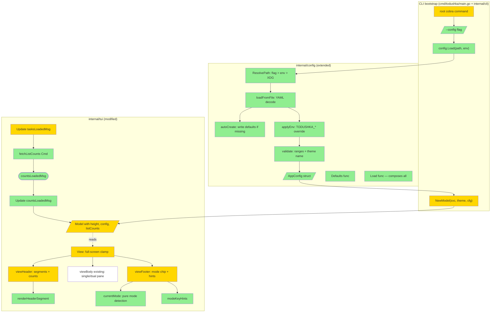

# TUI Shell — Design

## 2.1 Overview

Фича состоит из 4 взаимосвязанных частей:

1. **Config foundation** — новый пакет contracts (`internal/config/app.go` + `loader.go`): YAML загрузка с auto-create, env override, validation, precedence cascade flag > env > file > defaults.
2. **TUI Model расширение** — добавление `m.height int`, `m.config AppConfig`, `m.listCounts map[listKind]int`; `tasksLoadedMsg` теперь триггерит batch `fetchListCounts` Cmd; `countsLoadedMsg` обновляет cache.
3. **Header refactor** — каждый segment рендерится как `(N) Name [Count]` (или `(N)I[Count]` в compact mode при `m.width < 80`), активный inverted bg.
4. **Footer refactor (zellij-style)** — mode chip слева (`-- NORMAL --`/`-- FILTER --`/…) + per-mode key hints, разделённые ` │ `. Mode detection — pure function по приоритету: HELP > EDITOR > CONFIRM > FILTER > SELECT > NORMAL.

Full-screen rendering: `View()` вычисляет `bodyH = m.height - viewHeader_h - viewFooter_h` и клампит body через `lipgloss.NewStyle().Height(bodyH)`. Fallback к legacy при `m.height < 10`, `m.width < 40`, или `m.screen == screenEditor`.

`--config <path>` CLI flag (visible) на root cobra command перекрывает default path.

## 2.2 Architecture



### Implementation Order

1. **Config foundation** — `AppConfig` struct, `Defaults`, `ResolvePath`, `loadFromFile`, `applyEnv`, `validate`, `Load` composition + auto-create + unit tests
2. **Model расширение** — `m.height`, `m.config`, `m.listCounts` fields; `NewModel(svc, theme, cfg)` signature; `WindowSizeMsg` reads both width and height
3. **Constants → config** — `details.go` reads `m.config.DualPaneMinWidth`/`ListPaneShare`/`NotesMaxLines`; `bulk.go` reads `m.config.BulkConfirmThreshold`
4. **Mode detection** — `currentMode(m) shellMode` + `modeKeyHints(mode)` helpers
5. **Header refactor** — new `viewHeader` with segments and counts cache
6. **Footer refactor** — new `viewFooter` with mode chip + per-mode hints + status alignment
7. **Counts refresh** — `fetchListCounts` Cmd + `countsLoadedMsg` handling in `Update`
8. **Full-screen clamp** — `View()` calculates `bodyH` and clamps body
9. **CLI integration** — `--config` persistent flag on root cobra; `main.go` loads config, passes to NewModel
10. **Tests** — unit + property tests

## 2.3 Components and Interfaces

### Files Requiring Changes

| File | Change Type | Description |
|------|-------------|-------------|
| `internal/config/app.go` | `[NEW]` | `AppConfig` struct, `Defaults()`, `Validate()` helpers |
| `internal/config/loader.go` | `[NEW]` | `Load(path string, env Env) (AppConfig, []string, error)` + `ResolvePath(env, flag) (string, error)` + `loadFromFile` + `applyEnv` + auto-create logic |
| `internal/config/app_test.go` | `[NEW]` | Unit + property tests for Defaults, Validate |
| `internal/config/loader_test.go` | `[NEW]` | Unit + property tests for Load, ResolvePath, precedence cascade |
| `internal/tui/shell.go` | `[NEW]` | `shellMode` enum, `currentMode(m)`, `viewHeader`, `viewFooter`, `renderHeaderSegment`, `modeKeyHints`, helper constants |
| `internal/tui/shell_test.go` | `[NEW]` | Unit + property tests for mode detection, header rendering, footer rendering |
| `internal/tui/app.go` | `[MODIFIED]` | `Model` adds `height int`, `config AppConfig`, `listCounts map[listKind]int`; `NewModel` signature `(svc, theme, cfg)`; `WindowSizeMsg` reads both axes; `tasksLoadedMsg` case batches `fetchNameCache` + `fetchListCounts`; new `countsLoadedMsg` case; `View()` calls new `viewHeader`/`viewFooter`/`viewBody` with full-screen clamp; remove old `viewHeader`/`viewFooter` (moved to shell.go) |
| `internal/tui/app_test.go` | `[MODIFIED]` | Update fixtures to use new `NewModel(svc, theme, cfg)` signature; existing assertions that probe `viewHeader`/`viewFooter` content updated for new format |
| `internal/tui/details.go` | `[MODIFIED]` | Replace `const dualPaneMinWidth` / `listPaneShare` / `detailsNotesMaxLines` with reads from `m.config` (rename functions to take `m` and use `m.config.X` OR keep constants as defaults and have functions accept overrides — see ADR-6) |
| `internal/tui/bulk.go` | `[MODIFIED]` | Replace `const bulkConfirmThreshold` with `m.config.BulkConfirmThreshold` access at `dispatch` |
| `internal/tui/msgs.go` | `[MODIFIED]` | Add `countsLoadedMsg{counts map[listKind]int}` type |
| `internal/tui/style.go` | `[MODIFIED]` | `SelectTheme` accepts theme name explicitly (not via env); env handling moves to config loader |
| `internal/cli/root.go` | `[MODIFIED]` | Add `--config <path>` persistent flag to root cobra command; expose its value to `main.go` via callback or function |
| `cmd/todushka/main.go` | `[MODIFIED]` | After config load, pass `cfg` to `NewModel`; resolve config path before service init |
| `go.mod` | `[MODIFIED]` | Make `gopkg.in/yaml.v3` a direct dependency (currently transitive) via `go get` |

### Files NOT Requiring Changes

| File | Reason Unchanged |
|------|-----------------|
| `internal/storage/*` | Counts uses existing `Service.ListXxx` methods. |
| `internal/app/service.go` | Service-level methods unchanged. |
| `internal/app/queries.go` | List query methods unchanged — used as-is for counts. |
| `internal/domain/*` | No domain changes. |
| `internal/tui/keys.go` | Keymap unchanged (mode chip is detected from state, not key). |
| `internal/tui/filter.go` | Filter logic unchanged. |
| `internal/tui/editor.go` | Editor self-contained; `screen == screenEditor` triggers legacy render. |
| `internal/cli/*.go` (except root.go) | Subcommands inherit `--config` flag via cobra's `PersistentFlags`. |
| `internal/config/paths.go` | XDG path helpers stay; new file adds config-specific logic. |

### Interface Signatures

```go
// internal/config/app.go

// AppConfig holds user-configurable TUI/runtime settings.
type AppConfig struct {
    Theme                string  `yaml:"theme"`
    DualPaneMinWidth     int     `yaml:"dual_pane_min_width"`
    ListPaneShare        float64 `yaml:"list_pane_share"`
    BulkConfirmThreshold int     `yaml:"bulk_confirm_threshold"`
    NotesMaxLines        int     `yaml:"notes_max_lines"`
}

// Defaults returns the AppConfig with built-in default values.
func Defaults() AppConfig

// Validate returns a slice of warning messages for out-of-range / unknown values,
// AND a corrected AppConfig (invalid fields replaced with defaults).
func (c AppConfig) Validate() (AppConfig, []string)

// internal/config/loader.go

// Load resolves config from (flag > env > file > defaults) and returns:
// - the final AppConfig (after validation)
// - warnings (e.g. "invalid theme 'foo', using 'macchiato'")
// - error only if path resolution failed (filesystem errors are warnings)
func Load(path string, env Env) (AppConfig, []string, error)

// ResolvePath returns the config-file path according to precedence:
//   flag (if non-empty) > TODUSHKA_CONFIG env > $XDG_CONFIG_HOME/todushka/config.yaml
// Always returns an absolute path; never returns error for empty flag.
func ResolvePath(env Env, flag string) (string, error)

// internal/tui/shell.go

type shellMode int
const (
    modeNormal shellMode = iota
    modeFilter
    modeSelect
    modeConfirm
    modeEditor
    modeHelp
)

// currentMode determines the current Shell Mode from Model state using the
// priority order: HELP > EDITOR > CONFIRM > FILTER > SELECT > NORMAL.
func currentMode(m Model) shellMode

// modeLabel returns the human-readable label ("NORMAL", "FILTER", etc.).
func (m shellMode) modeLabel() string

// modeKeyHints returns the context-aware key hints for a given mode.
func modeKeyHints(mode shellMode) []string

// viewHeader renders the new header with segments (N) Name [Count].
// At m.width < 80, switches to compact mode (N)I[Count].
func (m Model) viewHeader() string

// viewFooter renders the new footer with mode chip + per-mode hints.
// Status message (if any) is appended at the right side.
func (m Model) viewFooter() string

// renderHeaderSegment renders a single list segment.
// compact=true → "(N)I[Count]"; compact=false → "(N) Name [Count]".
// active=true → wraps entire segment in theme.Header (inverted bg).
func renderHeaderSegment(theme Theme, idx int, label string, count int, knownCount bool, active, compact bool) string

// fetchListCounts returns a Cmd that calls Service.List{Inbox,Today,...,Logbook}
// sequentially and emits countsLoadedMsg with the resulting map.
func fetchListCounts(svc *app.Service) tea.Cmd

// internal/cli/root.go

// configFlagPath returns the value of --config flag (empty if not set).
// Set by the root command's PreRun via a package-level callback.
func configFlagPath() string
```

## 2.4 Key Decisions (ADR)

### ADR-1: Config format — YAML via `gopkg.in/yaml.v3`

- **Context:** Need a human-readable config file format. `gopkg.in/yaml.v3` is already transitively present in `go.sum`.
- **Options:**
  - **A. YAML** (gopkg.in/yaml.v3).
  - **B. TOML** (github.com/pelletier/go-toml/v2).
  - **C. JSON.**
- **Decision:** A (YAML).
- **Rationale:** Идиоматический для CLI-инструментов в Go ecosystem (kubectl, helm, viper-based tools). Уже есть в go.sum как transitive — direct dep добавляется одной строкой через `go get`. Supports inline comments — критично для self-documenting auto-created config.
- **Consequences:** Учат пользователей YAML quirks (whitespace-sensitive); pretty lenient parser (`KnownFields(false)` default → unknown fields ignored, что нам и нужно по REQ-4.4).

### ADR-2: Mode chip width — variable per mode

- **Context:** Mode names varying length: `HELP` (4), `NORMAL`/`EDITOR`/`FILTER`/`SELECT` (6), `CONFIRM` (7).
- **Options:**
  - **A. Variable width** (`-- NORMAL --`, `-- HELP --`).
  - **B. Fixed width** (pad to longest = 7 chars: `-- HELP    --`).
- **Decision:** A (variable).
- **Rationale:** Footer layout не имеет alignment-критичных columns (hints flow right with ` │ ` separators). Variable width даёт более компактный вид на узких терминалах.
- **Consequences:** Если в v2 добавим long mode name (`-- MULTI-SELECT --`) — пересмотрим.

### ADR-3: Counts refresh — single sequential Cmd

- **Context:** Six `ListXxx` calls needed for header counts. Could be parallelized.
- **Options:**
  - **A. Single Cmd doing 6 calls sequentially** → one `countsLoadedMsg`.
  - **B. `tea.Batch(6 Cmds)` parallel** → multiple `partialCountMsg` events.
  - **C. Per-list lazy fetch.**
- **Decision:** A.
- **Rationale:** bbolt сериализует reads (single mutex), параллелизм не даёт perf-выигрыша. Sequential проще — один сообщение на UI с complete map; Update case тривиальный. Стоимость ~10ms на 1k tasks — незаметно.
- **Consequences:** Если задач > 100k — sequential будет ощущаться. Acceptable trade-off; для таких размеров есть отдельный issue по индексам.

### ADR-4: Auto-create config — actual values with YAML comments

- **Context:** При первом запуске создаётся `config.yaml`. Два стиля: реальные значения или закомментированный template.
- **Options:**
  - **A. Actual values + inline comments** (e.g. `dual_pane_min_width: 100  # minimum terminal width...`).
  - **B. Commented template** (`# dual_pane_min_width: 100  # ...`) — пользователь раскомментирует чтобы override.
- **Decision:** A.
- **Rationale:** Cтиль A == "explicit defaults visible". Пользователь видит текущее поведение сразу. B создаёт illusion "config not active". Также A проще: один read через `yaml.Unmarshal` без special-case comment parsing.
- **Consequences:** Если меняется default в коде, существующий файл пользователя остаётся со старым value — но это явно (он видит), не surprise. Mitigation: comment hint в файле "Generated by todushka v0.4.0 — edit to customize".

### ADR-5: `--config` flag — visible in help

- **Context:** Cobra flag visibility (`PersistentFlags().StringVar` vs `Hidden = true`).
- **Options:**
  - **A. Visible** (default cobra behavior).
  - **B. Hidden** (advanced/debug).
- **Decision:** A.
- **Rationale:** `--config` — стандартный flag для CLI-инструментов (kubectl, terraform, etc.). Discoverability важна для тестирования / workspace switching. No reason to hide.
- **Consequences:** `--help` показывает один extra flag. Negligible.

### ADR-6: Constants → Model.config fields via method accessors

- **Context:** `dualPaneMinWidth`, `listPaneShare`, `bulkConfirmThreshold`, `detailsNotesMaxLines` сейчас constants. Нужны как values из `m.config`.
- **Options:**
  - **A. Replace constants with `m.config.X` at call sites.**
  - **B. Keep constants as package-level defaults, override in struct fields.**
  - **C. Method accessors `m.dualPaneMinWidth()` that return config value with default fallback.**
- **Decision:** A.
- **Rationale:** Прямолинейно: где используется константа — заменить на `m.config.X`. Загромождает сигнатуры функций (нужно передавать `m` или `cfg`) — но это minor. Cleanest design.
- **Consequences:** Сигнатуры helpers (`isDualPane(m)`, `paneWidths(m.width)`) меняются: `isDualPane` already принимает m — ok. `paneWidths(totalWidth)` — становится `paneWidths(m)` если нужен share из config. Refactor.

### ADR-7: Header compact mode threshold

- **Context:** REQ-2.4 — `m.width < 80` → compact.
- **Options:**
  - **A. 80 (стандарт)** — hardcoded constant `headerCompactThreshold = 80` in `shell.go`.
  - **B. Configurable** — `header_compact_threshold` setting in AppConfig.
- **Decision:** A.
- **Rationale:** 80 cols — established convention. Configurability добавляет complexity без явного use-case. Можно вынести в config в v2 если потребуется.
- **Consequences:** Hardcoded. Acceptable.

## 2.5 Data Models

```go
// [NEW] AppConfig — user-configurable TUI/runtime settings.
type AppConfig struct {
    Theme                string  `yaml:"theme"`                  // macchiato | latte | mono
    DualPaneMinWidth     int     `yaml:"dual_pane_min_width"`    // ≥ 40
    ListPaneShare        float64 `yaml:"list_pane_share"`        // (0.0, 1.0)
    BulkConfirmThreshold int     `yaml:"bulk_confirm_threshold"` // ≥ 1
    NotesMaxLines        int     `yaml:"notes_max_lines"`        // ≥ 1
}

// [NEW] Defaults — built-in fallback values.
// theme=macchiato, dual_pane_min_width=100, list_pane_share=0.45,
// bulk_confirm_threshold=5, notes_max_lines=8.

// [MODIFIED] tui.Model — adds height, config, listCounts.
type Model struct {
    // ... existing fields (service, keys, theme, screen, activeList, tasks,
    //     cursor, statusMsg, statusUntil, quickInput, editor, width,
    //     selected, confirm, filterQuery, filtering,
    //     tagNamesByID, areaNamesByID, projectNamesByID, headingNamesByID) ...

    // [NEW] full-screen rendering
    height int

    // [NEW] user-configurable settings (replaces hardcoded constants)
    config config.AppConfig

    // [NEW] per-list task counts for header display. Initial state empty
    // (header shows [?] until first countsLoadedMsg).
    listCounts map[listKind]int
}

// [NEW] countsLoadedMsg carries refreshed list counts after fetchListCounts Cmd.
type countsLoadedMsg struct {
    counts map[listKind]int
}

// [NEW] shellMode — semantic state of the TUI's chrome.
type shellMode int
const (
    modeNormal shellMode = iota
    modeFilter
    modeSelect
    modeConfirm
    modeEditor
    modeHelp
)
```

## 2.6 Correctness Properties

### Property 1: Mode exclusion

- **Category:** Exclusion
- **Statement:** For all `Model M`, exactly one `shellMode` is returned by `currentMode(M)`, following the priority order: HELP > EDITOR > CONFIRM > FILTER > SELECT > NORMAL.
- **Validates:** Requirement 3.2

### Property 2: Full-screen height invariant

- **Category:** Equivalence
- **Statement:** For all `Model M` with `M.height >= 10 AND M.width >= 40 AND M.screen != screenEditor`, `lipgloss.Height(View(M)) == M.height`. For all other Models, no clamp is applied.
- **Validates:** Requirements 1.2, 1.3, 1.4

### Property 3: WindowSizeMsg propagation

- **Category:** Propagation
- **Statement:** For all `Model M` and `WindowSizeMsg{Width: w, Height: h}`, after applying the message, `M'.width == w AND M'.height == h`.
- **Validates:** Requirement 1.1

### Property 4: Active header segment styled with theme.Header

- **Category:** Propagation
- **Statement:** For all `Model M`, the segment in `viewHeader(M)` corresponding to `M.activeList` contains the styled output of `theme.Header.Render`.
- **Validates:** Requirement 2.3

### Property 5: Header compact mode at width < 80

- **Category:** Propagation
- **Statement:** For all `Model M` with `M.width < 80`, `viewHeader(M)` contains compact segments matching `(N)I[Count]` pattern. For `M.width >= 80`, segments match `(N) Name [Count]` pattern.
- **Validates:** Requirements 2.1, 2.4

### Property 6: Counts refresh propagation

- **Category:** Propagation
- **Statement:** For all `Model M` and a `tasksLoadedMsg{tasks}`, after the Update is processed AND the returned Cmd is executed, the resulting messages include a `countsLoadedMsg` whose `counts` map has entries for all 6 listKinds.
- **Validates:** Requirements 2.5, 2.6

### Property 7: Mode chip text matches current mode

- **Category:** Equivalence
- **Statement:** For all `Model M`, `viewFooter(M)` contains the substring `-- <currentMode(M).modeLabel()> --`.
- **Validates:** Requirement 3.3

### Property 8: Mode-specific key hints

- **Category:** Equivalence
- **Statement:** For all `Model M`, `viewFooter(M)` contains all hint strings returned by `modeKeyHints(currentMode(M))`.
- **Validates:** Requirements 3.4, 3.5, 3.6, 3.7, 3.8, 3.9

### Property 9: Config precedence cascade

- **Category:** Equivalence
- **Statement:** For all `flag string, env Env, file content`, the result of `Load(flag, env)` satisfies:
- If flag is non-empty → flag value is used as path.
- Else if `env("TODUSHKA_CONFIG")` is non-empty → env value used.
- Else default XDG path used.
- For each setting field, `env(TODUSHKA_X)` overrides file value, file overrides default.
- **Validates:** Requirements 4.1, 4.6, 4.8

### Property 10: Invalid config values are corrected with warnings

- **Category:** Absence
- **Statement:** For all `AppConfig c` with at least one invalid field (e.g. `c.Theme = "unknown"` or `c.NotesMaxLines = -5`), `c.Validate()` returns a config `c'` where all fields are valid AND a non-empty warning slice.
- **Validates:** Requirements 4.5, 4.7

### Property 11: Auto-create round-trip

- **Category:** Round-trip
- **Statement:** For any clean filesystem state, calling `Load(defaultPath, env)` twice in succession produces the same `AppConfig` (defaults), AND between calls the config file exists at `defaultPath`.
- **Validates:** Requirement 4.2

### Property 12: List counts match service queries

- **Category:** Equivalence
- **Statement:** For all `Service svc` and tasks state T, after `fetchListCounts(svc)` Cmd executes, the emitted `countsLoadedMsg.counts[listKind]` equals `len(svc.List<Kind>(ctx))` for each of the 6 list kinds.
- **Validates:** Requirement 2.5

### Property 13: `--config` flag takes precedence over env

- **Category:** Propagation
- **Statement:** For all non-empty `flag string` AND non-empty `env("TODUSHKA_CONFIG")`, `ResolvePath(env, flag)` returns `flag` (after absolute normalization).
- **Validates:** Requirements 4.1

### Property 14: Unknown YAML fields ignored

- **Category:** Absence
- **Statement:** For all valid YAML content containing unknown keys (e.g. `feature_x: true`), `loadFromFile` succeeds without error AND does not log warnings for unknown keys (only for unrecognized values of known keys per CP-10).
- **Validates:** Requirement 4.4

## 2.7 Error Handling

| Scenario | Detection | Action |
|----------|-----------|--------|
| Config file missing at resolved path | `os.Stat` returns `ErrNotExist` | Auto-create with defaults + write inline-commented YAML; return defaults. No warning. |
| Config file parent dir creation fails | `os.MkdirAll` error | Log warning to `LogPath`; return defaults; **do not** error out main app. |
| Config file unreadable (permission denied) | `os.ReadFile` error | Log warning; return defaults; continue. |
| Config file malformed YAML | `yaml.Unmarshal` returns error | Log warning with line number; return defaults; continue. |
| Config field invalid value (e.g. `theme: "purple"`) | `Validate()` rule violation | Replace with default; append warning to returned slice; continue. |
| Env var contains invalid value (e.g. `TODUSHKA_NOTES_MAX_LINES=abc`) | `strconv.Atoi` error | Log warning; fall back to next precedence (file or default). |
| `WindowSizeMsg` arrives with very small dims (e.g. width=10, height=3) | `m.width < 40 OR m.height < 10` check | Fall back to legacy render — REQ-1.3. No crash. |
| `Service.ListXxx` returns error during `fetchListCounts` | Per-call error check | Skip that list (omit from result map); continue. Header shows `[?]` for affected list. |
| `bodyH` calculation produces negative (header + footer > height) | Bound check | Clamp `bodyH = max(0, bodyH)`; if 0 → render empty body but valid header/footer. |
| `--config` flag path invalid (e.g. unwritable directory for auto-create) | File system error in `Load` | Log warning; fall back to env or default path. |
| Multiple `tasksLoadedMsg` arrive in quick succession (e.g. bulk → reload → bulk) | Bubble Tea serializes; each spawns its own counts Cmd | Last `countsLoadedMsg` wins (cache overwrite is idempotent). |

## 2.8 Testing Strategy

**Test Style Source:** Tier 2
- Adjacent test files: `internal/tui/app_test.go`, `internal/tui/details_test.go`, `internal/tui/filter_test.go`, `internal/tui/bulk_test.go` — established `newTestModel(t)`, `setupModelWithInboxTasks(t, ...)`, `bareTestModel()` fixtures. Tests use testify `require` and direct `Update(tea.Msg)` dispatch.
- For config: new `internal/config/loader_test.go` follows similar patterns: testify `require`, table-driven, isolated via `t.TempDir()` for filesystem.
- Property tests: `pgregory.net/rapid` with `rapid.Check(t, func(t *rapid.T) {...})`.

### Project Commands

| Action     | Command          |
|------------|------------------|
| Test       | `task test`      |
| Test race  | `task test-race` |
| Build      | `task build`     |
| Lint       | `task lint`      |
| Format     | `task fmt`       |

### Unit Tests

| Test | Description | Tags |
|------|-------------|------|
| `TestAppConfig_DefaultsAreValid` | `Defaults().Validate()` returns no warnings | `Feature/config` `Property/10` |
| `TestAppConfig_ValidateThemeFallback` | `theme = "unknown"` → returns `"macchiato"` + warning | `Feature/config` `Property/10` |
| `TestAppConfig_ValidateNumericRanges` | Negative or zero ranges → defaults + warnings | `Feature/config` `Property/10` |
| `TestLoad_FileMissingCreatesDefault` | `Load(tempPath, env)` on empty dir → file is created + returns defaults | `Feature/config` `Property/11` |
| `TestLoad_FileValidParses` | Pre-written config file → fields parsed correctly | `Feature/config` |
| `TestLoad_EnvOverridesFile` | env `TODUSHKA_NOTES_MAX_LINES=20` + file `notes_max_lines: 8` → result `20` | `Feature/config` `Property/9` |
| `TestLoad_FlagOverridesEnv` | flag `/custom/path` + env `TODUSHKA_CONFIG=/env/path` → flag wins | `Feature/config` `Property/13` |
| `TestLoad_UnknownYAMLFieldsIgnored` | YAML with `feature_x: true` → no error, no warning | `Feature/config` `Property/14` |
| `TestLoad_MalformedYAMLReturnsDefaults` | invalid YAML syntax → returns defaults + warning | `Feature/config` |
| `TestLoad_InvalidEnvFallsBackToFile` | env `TODUSHKA_NOTES_MAX_LINES=abc` + file `notes_max_lines: 8` → result `8` | `Feature/config` `Property/9` |
| `TestResolvePath_FlagAbsolute` | flag is absolute path → returned as-is | `Feature/config` `Property/13` |
| `TestResolvePath_EnvFallback` | flag empty + env set → env used | `Feature/config` `Property/13` |
| `TestResolvePath_XDGDefault` | flag empty + env empty → `$XDG_CONFIG_HOME/todushka/config.yaml` | `Feature/config` |
| `TestCurrentMode_PriorityOrder` | screen=help+confirm!=nil+filtering=true → `modeHelp` (highest priority) | `Feature/mode` `Property/1` |
| `TestCurrentMode_AllSixModes` | one test per mode constructing matching Model state | `Feature/mode` `Property/1` |
| `TestModeKeyHints_Normal` | hints include `/`, `space`, `n`, `↵`, `c`, `?`, `q` | `Feature/mode` `Property/8` |
| `TestModeKeyHints_Filter` | hints include `↵: save`, `esc: cancel` | `Feature/mode` `Property/8` |
| `TestModeKeyHints_Select` | hints include `c/x/d/p: bulk`, `*: all`, `esc: clear` | `Feature/mode` `Property/8` |
| `TestModeKeyHints_Confirm` | hints include `y: yes`, `any: cancel` | `Feature/mode` `Property/8` |
| `TestModeKeyHints_Editor` | hints include `Tab`, `Ctrl+S`, `esc` | `Feature/mode` `Property/8` |
| `TestModeKeyHints_Help` | hints include `?: close` | `Feature/mode` `Property/8` |
| `TestViewHeader_FullModeSegment` | width=120, count 24 for Inbox → output contains `(1) Inbox [24]` | `Feature/header` `Property/5` |
| `TestViewHeader_CompactMode` | width=70 → output contains `(1)I[24]` | `Feature/header` `Property/5` |
| `TestViewHeader_ActiveSegmentInverted` | active list → segment rendered via `theme.Header` (test ANSI escape presence) | `Feature/header` `Property/4` |
| `TestViewHeader_UnknownCountPlaceholder` | listCounts map empty → `[?]` shown | `Feature/header` |
| `TestViewFooter_ModeChipPresent` | viewFooter output contains `-- NORMAL --` for normal mode | `Feature/footer` `Property/7` |
| `TestViewFooter_FilterModeChip` | filtering=true → `-- FILTER --` | `Feature/footer` `Property/7` |
| `TestViewFooter_SelectModeChip` | selected non-empty → `-- SELECT --` | `Feature/footer` `Property/7` |
| `TestViewFooter_ConfirmModeChip` | confirm != nil → `-- CONFIRM --` | `Feature/footer` `Property/7` |
| `TestViewFooter_StatusMessagePreserved` | statusMsg="boom" → output contains "boom" | `Feature/footer` |
| `TestWindowSize_BothAxesTracked` | dispatch `WindowSizeMsg{Width:120, Height:40}` → m.width=120, m.height=40 | `Feature/fullscreen` `Property/3` |
| `TestView_FullScreenClamp` | m.height=40, m.width=120, 5 tasks → `lipgloss.Height(View()) == 40` | `Feature/fullscreen` `Property/2` |
| `TestView_SmallTerminalFallback` | m.height=5 → no clamp; legacy behavior | `Feature/fullscreen` `Property/2` |
| `TestView_EditorIgnoresClamp` | screen=screenEditor + width=200 + height=40 → editor at editorWidth dims (full-screen clamp not applied) | `Feature/fullscreen` `Property/2` |
| `TestFetchListCounts_EmitsMsg` | run Cmd returned by fetchListCounts(svc with 2 inbox tasks) → countsLoadedMsg{counts: {inbox: 2, ...}} | `Feature/counts` `Property/6` `Property/12` |
| `TestUpdate_CountsLoadedPopulatesModel` | dispatch countsLoadedMsg → m.listCounts updated | `Feature/counts` `Property/6` |
| `TestUpdate_TasksLoadedTriggersCountsFetch` | tasksLoadedMsg → returned Cmd batch includes fetchListCounts emitting countsLoadedMsg | `Feature/counts` `Property/6` |
| `TestNewModel_NewSignature` | `NewModel(svc, theme, cfg)` initialises listCounts as non-nil empty map | `Feature/backward-compat` |
| `TestConfig_DualPaneOverride` | `cfg.DualPaneMinWidth = 50`, m.width=60 → isDualPane(m) == true | `Feature/config-integration` |
| `TestConfig_BulkConfirmThresholdOverride` | `cfg.BulkConfirmThreshold = 2`, 2 selected → confirm modal appears | `Feature/config-integration` |
| `TestConfig_NotesMaxLinesOverride` | `cfg.NotesMaxLines = 3`, 10-line notes → 3 lines + `…` | `Feature/config-integration` |

### Property-Based Tests

| Test | Property | Generator description | Tags |
|------|----------|-----------------------|------|
| `TestProp_ModeExclusion` | Property 1 | Random Model state combinations | `Property/1` |
| `TestProp_FullScreenHeight` | Property 2 | `rapid.IntRange(10, 100)` for height, varied tasks | `Property/2` |
| `TestProp_WindowSizeTracked` | Property 3 | Random width × height pairs | `Property/3` |
| `TestProp_ActiveSegmentStyled` | Property 4 | Random listKind active | `Property/4` |
| `TestProp_CompactModeThreshold` | Property 5 | Random width 40-200 | `Property/5` |
| `TestProp_CountsRefreshPropagates` | Property 6 | Random task subset | `Property/6` |
| `TestProp_ModeChipText` | Property 7 | Random Model state → mode chip label matches | `Property/7` |
| `TestProp_KeyHintsMatchMode` | Property 8 | Random Model → key hints set matches expected mode | `Property/8` |
| `TestProp_LoadPrecedence` | Property 9 | Random combinations of flag/env/file values | `Property/9` |
| `TestProp_ValidateCorrectsInvalid` | Property 10 | Random AppConfig with intentionally invalid fields | `Property/10` |
| `TestProp_AutoCreateRoundTrip` | Property 11 | `t.TempDir()` empty → Load twice → both identical | `Property/11` |
| `TestProp_CountsMatchService` | Property 12 | Random number of tasks in each list | `Property/12` |
| `TestProp_FlagBeatsEnv` | Property 13 | Random flag + env paths | `Property/13` |
| `TestProp_UnknownYAMLFieldsIgnored` | Property 14 | Random extra keys appended to valid YAML | `Property/14` |
