# UX Polish (v0.5.0) — Design

## 2.1 Overview

4 cohesive улучшения:

1. **Theme auto-detect** — `theme: auto|system` в `AppConfig` триггерит platform-specific детектор (`detect_dark_darwin.go`, `detect_dark_linux.go`, `detect_dark_other.go`) c 500ms timeout. Результат маппится: dark → macchiato, light → latte, error/unknown → macchiato. `NO_COLOR` имеет absolute precedence.
2. **Refresh after edit** — `editorSavedMsg` теперь делает inline splice обновлённой задачи в `m.tasks` (immediate visual) + параллельно fire `loadCurrentList` для async refresh sort/counts/cache.
3. **Anytime toggle в editor** — поле `someday bool` переименовано в `when shellEditorWhen` (enum Anytime|Someday). View рендерит radio-style; `Space` toggles. Mapping `Anytime → task.Someday=false`, `Someday → task.Someday=true`. Hint при отсутствии area/project.
4. **Section borders** — между header/body и body/footer в full-screen режиме render'ится `strings.Repeat("─", m.width)` через `theme.Help`. Body height clamp скорректирован на 2 row'а separator'ов.

Изменения изолированы в `internal/tui/` + `internal/config/app.go` (validation). Storage / app / domain не затрагиваются.

## 2.2 Architecture

```mermaid
flowchart TB
    config["AppConfig.Theme"]
    config -->|"auto/system"| resolveAutoTheme
    config -->|"macchiato/latte/mono"| selectThemeFromConfig
    resolveAutoTheme --> detectDarkMode
    detectDarkMode -->|darwin| darwin_impl["exec defaults read"]
    detectDarkMode -->|linux| linux_impl["exec gsettings"]
    detectDarkMode -->|other| other_impl["return false, nil"]
    resolveAutoTheme --> selectThemeFromConfig
    selectThemeFromConfig -->|NO_COLOR| monochrome["NewMonochromeTheme"]
    selectThemeFromConfig --> Theme

    subgraph Editor["internal/tui/editor.go"]
        direction TB
        old_someday[/"someday bool (removed)"/]
        new_when[/"when shellEditorWhen enum"/]
        SpaceToggle["Space key handler"]
        ApplyAndSave[ApplyAndSave]
        ViewEditor[View]
    end

    SpaceToggle --> new_when
    new_when --> ApplyAndSave
    ApplyAndSave -->|Anytime → false / Someday → true| task["task.Someday"]
    new_when --> ViewEditor
    ViewEditor --> hint["Anytime hint when no Area/Project"]

    subgraph Update["app.go Update"]
        editorSavedMsg([editorSavedMsg])
        inline_splice["inline splice m.tasks by ID"]
        batch_refresh["tea.Batch(loadCurrentList, fetchListCounts)"]
    end

    editorSavedMsg --> inline_splice
    editorSavedMsg --> batch_refresh

    subgraph View["app.go View"]
        renderSeparator["renderSeparator(width)"]
        view_compose["JoinVertical(header, sep, body, sep, footer)"]
    end

    renderSeparator -->|m.width / theme.Help| view_compose

    style resolveAutoTheme fill:#90EE90
    style detectDarkMode fill:#90EE90
    style darwin_impl fill:#90EE90
    style linux_impl fill:#90EE90
    style other_impl fill:#90EE90
    style new_when fill:#90EE90
    style hint fill:#90EE90
    style inline_splice fill:#90EE90
    style renderSeparator fill:#90EE90
    style SpaceToggle fill:#FFD700
    style ApplyAndSave fill:#FFD700
    style ViewEditor fill:#FFD700
    style editorSavedMsg fill:#FFD700
    style batch_refresh fill:#FFD700
    style view_compose fill:#FFD700
    style selectThemeFromConfig fill:#FFD700
    style old_someday fill:#FFFFFF
    style config fill:#FFFFFF
    style monochrome fill:#FFFFFF
    style Theme fill:#FFFFFF
    style task fill:#FFFFFF
```



### Implementation Order

1. **Config validation** — Validate accepts `"auto"`/`"system"` as valid theme.
2. **Platform detection foundation** — 3 build-tagged files + injectable function var for tests.
3. **Theme resolution** — `resolveAutoTheme` + integration into `selectThemeFromConfig`.
4. **Editor When refactor** — replace `someday bool` field with `when` enum; update View, ApplyAndSave, Space handler.
5. **Edit splice** — modify `editorSavedMsg` Update case.
6. **Section separators** — `renderSeparator` helper + View integration + bodyH adjustment.
7. **Tests** — unit + property.

## 2.3 Components and Interfaces

### Files Requiring Changes

| File | Change Type | Description |
|------|-------------|-------------|
| `internal/config/app.go` | `[MODIFIED]` | `Validate()` accepts `"auto"` and `"system"` as valid Theme values |
| `internal/tui/detect_dark_darwin.go` | `[NEW]` | Build-tagged `//go:build darwin`; provides `detectDarkMode() (bool, error)` via `defaults read -g AppleInterfaceStyle` |
| `internal/tui/detect_dark_linux.go` | `[NEW]` | Build-tagged `//go:build linux`; provides `detectDarkMode()` via `gsettings get org.gnome.desktop.interface color-scheme` |
| `internal/tui/detect_dark_other.go` | `[NEW]` | Build-tagged `//go:build !darwin && !linux`; provides stub returning `(false, nil)` |
| `internal/tui/theme_resolve.go` | `[NEW]` | `resolveAutoTheme(env func(string) string) string` — composes detectDarkMode + NO_COLOR check; package-level `detectDarkModeFn` for test injection |
| `internal/tui/theme_resolve_test.go` | `[NEW]` | Unit + property tests for resolveAutoTheme via injected detectDarkModeFn |
| `internal/tui/run.go` | `[MODIFIED]` | `selectThemeFromConfig` calls `resolveAutoTheme` when `name ∈ {"auto", "system"}` |
| `internal/tui/editor.go` | `[MODIFIED]` | `someday bool` field → `when shellEditorWhen` enum; rename `fieldSomeday` → `fieldWhen`; update View + ApplyAndSave + Space handler; add Anytime hint |
| `internal/tui/app.go` | `[MODIFIED]` | `editorSavedMsg` case: inline splice + batch refresh; View() adds section separators; bodyH calc adjusted |
| `internal/tui/app_test.go` | `[MODIFIED]` | Tab cycling test references `fieldWhen`; new `TestEditorSavedMsg_InlineSplice`; assertion updates for separators and header `m.activeList` change in editor tests |
| `internal/tui/details_test.go` | `[MODIFIED]` | Possibly affected by separator changes — assertion updates if needed |
| `internal/tui/shell_test.go` | `[MODIFIED]` | `TestView_FullScreenClamp` updated for new separator rows |

### Files NOT Requiring Changes

| File | Reason Unchanged |
|------|-----------------|
| `internal/storage/*` | No schema or behavior changes. |
| `internal/app/*` | Service layer unchanged. |
| `internal/domain/*` | `task.Someday bool` field unchanged; editor still maps to it. |
| `internal/tui/style.go` | `Theme` struct stable. Auto resolution sits в `theme_resolve.go`. |
| `internal/tui/keys.go` | Keymaps unchanged. |
| `internal/tui/filter.go`, `bulk.go`, `details.go`, `shell.go` | Unchanged unless test assertions need updates. |
| `internal/cli/*` | CLI surface unchanged. |
| `cmd/todushka/main.go` | Wiring unchanged. |
| `internal/config/paths.go`, `loader.go` | Configuration loader unchanged. |

### Interface Signatures

```go
// internal/tui/theme_resolve.go

// detectDarkModeFn is package-level for tests to override. Production
// initialization delegates to the platform-specific detectDarkMode.
var detectDarkModeFn = detectDarkMode

// resolveAutoTheme returns "macchiato" or "latte" based on detectDarkModeFn().
// Errors and unknown platforms default to "macchiato". This function is
// called only when AppConfig.Theme ∈ {"auto", "system"}.
func resolveAutoTheme() string

// internal/tui/detect_dark_*.go (per build tag)

// detectDarkMode returns whether the OS is set to dark mode.
// Errors are signaled via the error return; callers should fall back
// to a default theme on error.
func detectDarkMode() (bool, error)

// internal/tui/editor.go

type shellEditorWhen int
const (
    whenAnytime shellEditorWhen = iota
    whenSomeday
)

// (m EditorModel) — `when` field replaces `someday bool`. ApplyAndSave
// maps: whenAnytime → t.Someday = false; whenSomeday → t.Someday = true.

// internal/tui/app.go

// renderSeparator returns a one-line horizontal `─` rule of the given
// width, styled via theme.Help. Empty when width <= 0.
func renderSeparator(theme Theme, width int) string
```

## 2.4 Key Decisions (ADR)

### ADR-1: Platform detection via build tags

- **Context:** Need per-platform `detectDarkMode` implementations.
- **Options:**
  - **A. Build tags** (`//go:build darwin`, `linux`, `!darwin && !linux`).
  - **B. Single file with `runtime.GOOS` switch.**
  - **C. Use `golang.org/x/sys` or similar.**
- **Decision:** A (build tags).
- **Rationale:** Idiomatic Go pattern. Compiles only the relevant file per platform — no dead code in production binary. Easy to test per platform (`GOOS=darwin go test`).
- **Consequences:** Three small files instead of one. Acceptable.

### ADR-2: Theme detection caching — sticky for session

- **Context:** Detection involves shell-out (~50-100ms). Could re-run on resize или user signal.
- **Options:**
  - **A. Cache result for session** (one-shot on startup).
  - **B. Re-detect on `tea.WindowSizeMsg`.**
  - **C. Re-detect on explicit refresh key.**
- **Decision:** A.
- **Rationale:** OS theme switching mid-session is rare; one-shot is simple. If user wants to update, they restart. v2 может добавить refresh signal.
- **Consequences:** User changing OS theme during TUI session sees mismatch until restart. Documented in design.

### ADR-3: Edit splice — in-place index swap

- **Context:** `editorSavedMsg{updated: t}` needs to update `m.tasks` immediately for visual feedback.
- **Options:**
  - **A. In-place swap:** iterate `m.tasks`, find index where `task.ID == t.ID`, do `m.tasks[i] = t`.
  - **B. Filter + append:** rebuild slice.
  - **C. Map lookup:** use `m.tasks` index map.
- **Decision:** A.
- **Rationale:** O(n) linear scan; n is small (typically 10-100 tasks visible). Preserves slice order — important for stable cursor position. No allocation.
- **Consequences:** If task moved to different list (sort change), task stays at same visible position until async loadCurrentList — acceptable, hint that splice is "best-effort immediate".

### ADR-4: When toggle — keep `task.Someday` as truth, just rename UI

- **Context:** Adding `task.Anytime bool` would be schema change.
- **Options:**
  - **A. Keep `task.Someday bool`, rename UI to "When".**
  - **B. Add `task.Anytime bool` (mutually exclusive with Someday).**
  - **C. Add `task.When string` field.**
- **Decision:** A.
- **Rationale:** Minimal domain change. `Someday=false` semantically means Anytime (or Inbox if no area/project). UI clarifies through explicit labels. Backward compatible.
- **Consequences:** "Anytime" слегка misleading если у задачи нет area/project (попадёт в Inbox). Mitigated REQ-3.5 hint.

### ADR-5: Section separator — pure string rendering

- **Context:** Need visual separator между header/body and body/footer.
- **Options:**
  - **A. `strings.Repeat("─", width)` rendered via `theme.Help`.**
  - **B. `lipgloss.NewStyle().Border(...).BorderTop(true).Width(width).Render("")` — border-based.**
  - **C. `lipgloss.PlaceHorizontal` with rule.**
- **Decision:** A.
- **Rationale:** Simplest; matches existing TUI string-composition style; no border interaction with dual-pane vertical borders.
- **Consequences:** Borders на dual-pane (vertical `║`) и section separators (horizontal `─`) не визуально соединяются (т.е., no perfect ┼ intersection). Acceptable.

### ADR-6: Detection timeout — 500ms

- **Context:** Shell-out может зависнуть в редких случаях.
- **Options:**
  - **A. 200ms** (tight; risk of false-negatives on slow disks).
  - **B. 500ms** (balanced).
  - **C. 2s** (safe; degrades startup UX).
- **Decision:** B (500ms).
- **Rationale:** macOS `defaults read` обычно <50ms; `gsettings` <200ms. 500ms даёт comfortable buffer без ощутимой задержки старта.
- **Consequences:** На очень нагруженной системе detection может вернуть error → fallback dark. Acceptable.

### ADR-7: When toggle — Space binding preserved

- **Context:** Existing Someday checkbox toggled by Space.
- **Options:**
  - **A. Same Space binding for When toggle.**
  - **B. New keys (e.g., `a` for Anytime, `s` for Someday).**
- **Decision:** A.
- **Rationale:** Preserves user muscle memory.
- **Consequences:** Space cycles Anytime ↔ Someday instead of true/false toggle — same UX feel.

## 2.5 Data Models

```go
// [MODIFIED] AppConfig — Validate now accepts "auto" and "system" as valid Theme.
// AppConfig struct itself unchanged.

// [NEW] shellEditorWhen — enum for the editor "When" field.
type shellEditorWhen int
const (
    whenAnytime shellEditorWhen = iota
    whenSomeday
)

// [MODIFIED] EditorModel — someday bool field replaced with when shellEditorWhen.
type EditorModel struct {
    original task.Task

    title    textinput.Model
    notes    textarea.Model
    start    textinput.Model
    deadline textinput.Model
    tags     textinput.Model
    when     shellEditorWhen   // [NEW] replaces `someday bool`
    focus    editorField

    err string
}

// [MODIFIED] editorField — fieldSomeday renamed to fieldWhen.
const (
    fieldTitle editorField = iota
    fieldNotes
    fieldStart
    fieldDeadline
    fieldTags
    fieldWhen  // [renamed from fieldSomeday]
    fieldCount
)

// No new domain types; task.Someday bool unchanged.
```

## 2.6 Correctness Properties

### Property 1: Auto theme resolves to macchiato or latte

- **Category:** Equivalence
- **Statement:** For all `AppConfig.Theme ∈ {"auto", "system"}` and all `detectDarkModeFn` outputs `(isDark, err)`, `resolveAutoTheme()` returns `"macchiato"` if `isDark || err != nil`, else `"latte"`.
- **Validates:** Requirements 1.1, 1.2, 1.3, 1.4

### Property 2: NO_COLOR overrides theme

- **Category:** Propagation
- **Statement:** For all `Model M` constructed with `NO_COLOR` env set, `M.theme.Name == "monochrome"` regardless of `cfg.Theme` value (including "auto"/"system").
- **Validates:** Requirement 1.6

### Property 3: Edit splice preserves slice length

- **Category:** Round-trip
- **Statement:** For all `Model M` and `editorSavedMsg{updated: t}`, after Update, `len(M'.tasks) == len(M.tasks)` (whether `t.ID` was found or not).
- **Validates:** Requirement 2.4

### Property 4: Edit splice replaces by ID

- **Category:** Propagation
- **Statement:** For all `Model M` where `t.ID == M.tasks[i].ID` for some `i`, after `editorSavedMsg{updated: t}`, `M'.tasks[i] == t` (and all other indices unchanged).
- **Validates:** Requirements 2.1, 2.3

### Property 5: When toggle bidirectional

- **Category:** Round-trip
- **Statement:** For all `EditorModel` with `when = whenAnytime`, pressing Space twice returns to `whenAnytime`. For `when = whenSomeday`, pressing Space twice returns to `whenSomeday`.
- **Validates:** Requirements 3.1, 3.3

### Property 6: When mapping at save

- **Category:** Equivalence
- **Statement:** For all `EditorModel` saved via `ApplyAndSave`, the resulting `task.Task.Someday` equals `(when == whenSomeday)`.
- **Validates:** Requirement 3.4

### Property 7: Anytime hint conditional

- **Category:** Propagation
- **Statement:** For all `EditorModel` with `when == whenAnytime` AND `original.AreaID == nil` AND `original.ProjectID == nil`, `View()` output contains the substring `"(will appear in Inbox without Area/Project)"`. Otherwise (when != whenAnytime OR area/project present), the hint substring is absent.
- **Validates:** Requirement 3.5

### Property 8: Separators in full-screen only

- **Category:** Propagation
- **Statement:** For all `Model M` with `M.height >= 10 AND M.width >= 40 AND M.screen != screenEditor`, `View(M)` output contains 2 occurrences of `strings.Repeat("─", M.width)`. For `M.height < 10 OR M.width < 40 OR M.screen == screenEditor`, the `─`-repeated lines are absent.
- **Validates:** Requirements 4.1, 4.2, 4.4, 4.5

### Property 9: Separator width matches m.width

- **Category:** Equivalence
- **Statement:** For all `Model M` with `M.height >= 10 AND M.width >= 40`, the separator line emitted by `renderSeparator(theme, M.width)` contains exactly `M.width` `─` characters (before any ANSI escapes).
- **Validates:** Requirement 4.3

### Property 10: bodyH accounts for separators

- **Category:** Equivalence
- **Statement:** For all `Model M` rendered in full-screen mode with separators active, `lipgloss.Height(View(M)) == M.height` (existing full-screen height invariant continues to hold).
- **Validates:** Requirement 4.6

### Property 11: auto and system aliases equivalent

- **Category:** Equivalence
- **Statement:** For any `Model M1` constructed with `cfg.Theme = "auto"` and `M2` constructed with `cfg.Theme = "system"`, both Models have identical `theme` fields (assuming same detectDarkModeFn output).
- **Validates:** Requirements 1.1, 1.5

### Property 12: Refresh after edit batch contains expected Cmds

- **Category:** Propagation
- **Statement:** For all `Model M` and `editorSavedMsg`, the returned Cmd executes to produce both a `tasksLoadedMsg` (from loadCurrentList) and a `countsLoadedMsg` (from fetchListCounts).
- **Validates:** Requirement 2.2

## 2.7 Error Handling

| Scenario | Detection | Action |
|----------|-----------|--------|
| `defaults read` timeout / not found | `exec.Command` returns error or exit code != 0 | Return `(false, err)` from `detectDarkMode`; `resolveAutoTheme` falls back to "macchiato" |
| `gsettings` timeout / not installed | Same as above | Same fallback |
| Detection runs for >500ms | Context timeout in `exec.CommandContext` | Cancel exec; return `(false, ctx.Err())`; fallback to "macchiato" |
| `editorSavedMsg.updated.ID` not found in `m.tasks` | Linear search returns no match | Skip inline splice; async `loadCurrentList` handles the change |
| When toggle key event arrives but field not focused | Existing focus check in editor key handler | No-op |
| `m.width <= 0` for separator rendering | Bound check in `renderSeparator` | Return empty string; legacy mode renders no separator |
| User config with old `someday` field (theoretical) | N/A — editor field is in-memory only | No persistence — UI rename has no migration implications |
| `task.Someday` set externally via CLI while editor open | Existing editor state captured at open | Save overwrites with `when` value (existing behavior — editor races with external writes are pre-existing) |

## 2.8 Testing Strategy

**Test Style Source:** Tier 2 — existing adjacent tests:
- `internal/tui/app_test.go`, `editor.go` paths.
- `internal/config/app_test.go` for config validation.
- testify `require`; direct `Update(tea.Msg)` dispatch; table-driven; rapid PBT.

For platform-specific detection: use injectable `detectDarkModeFn` for tests; production binaries call the platform implementation.

### Project Commands

| Action     | Command          |
|------------|------------------|
| Test       | `task test`      |
| Test race  | `task test-race` |
| Build      | `task build`     |
| Lint       | `task lint`      |
| Format     | `task fmt`       |

### Unit Tests

| Test | Description | Tags |
|------|-------------|------|
| `TestAppConfig_AutoThemeIsValid` | `AppConfig{Theme: "auto"}.Validate()` returns no warnings | `Feature/config` `Property/1` `Property/11` |
| `TestAppConfig_SystemThemeIsValid` | `AppConfig{Theme: "system"}.Validate()` returns no warnings | `Feature/config` `Property/11` |
| `TestResolveAutoTheme_DarkModeMacchiato` | `detectDarkModeFn = func() { return true, nil }` → returns `"macchiato"` | `Feature/theme-auto` `Property/1` |
| `TestResolveAutoTheme_LightModeLatte` | `detectDarkModeFn = func() { return false, nil }` → returns `"latte"` | `Feature/theme-auto` `Property/1` |
| `TestResolveAutoTheme_ErrorFallsBackToMacchiato` | `detectDarkModeFn = func() { return false, errors.New("test") }` → returns `"macchiato"` | `Feature/theme-auto` `Property/1` |
| `TestSelectThemeFromConfig_AutoUsesResolved` | `cfg.Theme = "auto"` with mocked dark → theme.Name == "catppuccin-macchiato" | `Feature/theme-auto` `Property/1` |
| `TestSelectThemeFromConfig_NoColorOverridesAuto` | NO_COLOR=1 + cfg.Theme=auto → monochrome | `Feature/theme-auto` `Property/2` |
| `TestEditorSavedMsg_InlineSplicePreservesLength` | 3 tasks in m.tasks; editorSavedMsg with updated[1] → length unchanged | `Feature/refresh` `Property/3` |
| `TestEditorSavedMsg_InlineSpliceByID` | 3 tasks; editorSavedMsg updated has same ID as m.tasks[1] but new title → m.tasks[1].Title == new | `Feature/refresh` `Property/4` |
| `TestEditorSavedMsg_NotFoundIsSkipped` | editorSavedMsg with ID not in m.tasks → m.tasks unchanged | `Feature/refresh` `Property/3` |
| `TestEditorSavedMsg_FiresBatchedRefresh` | editorSavedMsg returns Cmd whose execution emits both tasksLoadedMsg and countsLoadedMsg | `Feature/refresh` `Property/12` |
| `TestEditor_WhenFieldDefaultAnytime` | NewEditor with task.Someday=false → editor.when == whenAnytime | `Feature/anytime` `Property/5` `Property/6` |
| `TestEditor_WhenFieldDefaultSomeday` | NewEditor with task.Someday=true → editor.when == whenSomeday | `Feature/anytime` `Property/5` `Property/6` |
| `TestEditor_SpaceTogglesWhen` | when=Anytime + Space → when=Someday; Space again → when=Anytime | `Feature/anytime` `Property/5` |
| `TestEditor_ApplyAndSaveMapsAnytime` | when=Anytime → ApplyAndSave produces task.Someday=false | `Feature/anytime` `Property/6` |
| `TestEditor_ApplyAndSaveMapsSomeday` | when=Someday → ApplyAndSave produces task.Someday=true | `Feature/anytime` `Property/6` |
| `TestEditor_HintWhenAnytimeNoAreaProject` | Task without area/project + when=Anytime → View contains hint | `Feature/anytime` `Property/7` |
| `TestEditor_NoHintWhenAreaPresent` | Task with AreaID set → View does NOT contain hint | `Feature/anytime` `Property/7` |
| `TestEditor_NoHintWhenSomeday` | when=Someday → View does NOT contain hint regardless of area/project | `Feature/anytime` `Property/7` |
| `TestEditor_TabCycleIncludesWhen` | Tab cycles through all 6 fields including fieldWhen | `Feature/anytime` (backward compat) |
| `TestRenderSeparator_FullWidth` | renderSeparator(theme, 80) contains 80 `─` characters | `Feature/borders` `Property/9` |
| `TestRenderSeparator_EmptyOnZero` | renderSeparator(theme, 0) returns empty string | `Feature/borders` `Property/9` |
| `TestView_HasSeparatorsInFullScreen` | View with m.height=40, m.width=120 → output contains 2 separator lines | `Feature/borders` `Property/8` |
| `TestView_NoSeparatorsInLegacy` | View with m.height=5 → output does NOT contain `─` lines (separators absent) | `Feature/borders` `Property/8` |
| `TestView_NoSeparatorsInEditor` | screen=screenEditor → output does NOT contain separator lines | `Feature/borders` `Property/8` |
| `TestView_FullScreenHeightWithSeparators` | bodyH accounts for separators; lipgloss.Height(View) == m.height | `Feature/borders` `Property/10` |

### Property-Based Tests

| Test | Property | Generator description | Tags |
|------|----------|-----------------------|------|
| `TestProp_AutoThemeResolution` | Property 1 | `rapid.Bool()` для isDark, `rapid.Bool()` для simulateError | `Property/1` |
| `TestProp_NoColorOverridesAuto` | Property 2 | Various cfg.Theme values + NO_COLOR=1 fixed | `Property/2` |
| `TestProp_EditSplicePreservesLength` | Property 3 | random task slice + random task IDs | `Property/3` |
| `TestProp_EditSpliceByID` | Property 4 | random task at random index + matching ID | `Property/4` |
| `TestProp_WhenToggleInvolution` | Property 5 | random initial state + N Space presses | `Property/5` |
| `TestProp_WhenMapping` | Property 6 | random when value → predictable task.Someday | `Property/6` |
| `TestProp_HintConditional` | Property 7 | random combinations of when + area/project nullness | `Property/7` |
| `TestProp_SeparatorsConditional` | Property 8 | random m.width, m.height, screen | `Property/8` |
| `TestProp_SeparatorWidth` | Property 9 | `rapid.IntRange(40, 300)` for width | `Property/9` |
| `TestProp_FullScreenHeightWithSeparators` | Property 10 | random m.width × m.height in valid range | `Property/10` |
| `TestProp_AutoSystemAliases` | Property 11 | Both `"auto"` and `"system"` produce identical Model state | `Property/11` |
| `TestProp_RefreshBatchHasBothCmds` | Property 12 | random tasks; editorSavedMsg → Cmd executes → both messages present | `Property/12` |
