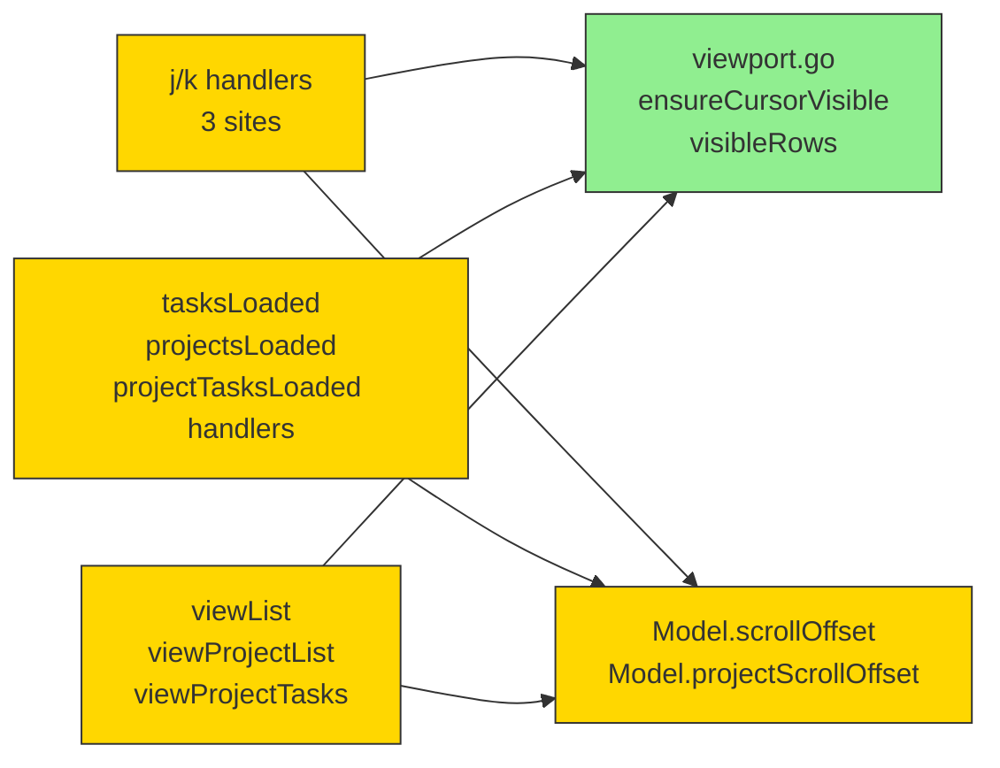

# Viewport Scroll — Design

## 2.1 Overview

Добавить `m.scrollOffset` и `m.projectScrollOffset` в `Model`. Новый
helper `ensureCursorVisible` (чистая функция) вызывается из j/k
handlers и реактивно поправляет scroll-offset. Render-функции слайсят
list по `[offset : offset+visibleCount]`. Visibleness derived
on-the-fly из `m.height` минус height(header)/footer/separators.

## 2.2 Architecture



**Implementation order:** helper (+ tests) → Model fields → handlers →
msg handlers (clamp on reload) → render slicing.

## 2.3 Components and Interfaces

### Files Requiring Changes

| File | Change Type | Description |
|------|-------------|-------------|
| `internal/tui/viewport.go` | `[NEW]` | `ensureCursorVisible(cursor, offset, visibleCount, scrolloff, totalCount int) int`; `visibleRows(m Model) int` |
| `internal/tui/viewport_test.go` | `[NEW]` | Unit + table-driven tests; property tests for invariants |
| `internal/tui/app.go` | `[MODIFIED]` | Add `Model.scrollOffset`, `Model.projectScrollOffset`; init in `NewModel`; update j/k in `handleKey` (screenList) and `handleProjectsKey`, `handleProjectTasksKey`; clamp in `tasksLoadedMsg` / `projectTasksLoadedMsg` handlers; reset on screen changes |
| `internal/tui/project_list.go` | `[MODIFIED]` | Slice `disp[offset:offset+visibleCount]` in `viewProjectList`; clamp offset in `projectsLoadedMsg` |
| `internal/tui/project_tasks.go` | `[MODIFIED]` | Slice `disp[offset:offset+visibleCount]` in `viewProjectTasks` |
| `internal/tui/app.go` (viewList) | (same file) | Slice `disp[offset:offset+visibleCount]` in `viewList` |

### Files NOT Requiring Changes

| File | Reason Unchanged |
|------|------------------|
| `internal/app/*` | Service layer не задействован; scroll — чисто TUI concern |
| `internal/storage/*` | Не задействован |
| `internal/tui/details.go` | viewDetails (правая панель) рендерит **одну** задачу, не список — scroll не нужен |
| `internal/tui/editor.go`, `editor` UI | Editor рендерит форму, не список |
| `internal/tui/shell.go` | Footer/header не задействованы; visibleRows reads existing height fields |
| `internal/tui/filter.go` | `displayedXxx` уже работают на верхнем уровне — scroll применяется поверх |
| `internal/tui/keys.go` | Существующие j/k bindings переиспользуются |
| `internal/config/app.go` | scrolloff=3 — hardcoded const (ASSUMPTION из explore) |

### Interface Signatures

```go
// internal/tui/viewport.go

// ensureCursorVisible returns the new scrollOffset such that cursor is
// rendered within [offset, offset+visibleCount) with at least scrolloff
// rows of buffer above and below (clamped by list ends). totalCount is
// len(disp); offset is clamped to [0, max(0, totalCount-visibleCount)].
//
// When visibleCount <= 0 or totalCount <= visibleCount, the result is 0
// (everything fits, no scroll needed).
func ensureCursorVisible(cursor, offset, visibleCount, scrolloff, totalCount int) int

// visibleRows reports how many task rows can be rendered in the body
// pane: m.height - height(viewHeader) - height(viewFooter) - 2 (separators).
// Returns 0 when m.height <= 0 (initial state) or when the result would
// be negative.
func visibleRows(m Model) int

const scrolloff = 3
```

**Model field additions** (`internal/tui/app.go`):

```go
type Model struct {
    // ... existing ...
    scrollOffset        int  // for m.cursor in screenList & screenProjectTasks
    projectScrollOffset int  // for m.projectCursor in screenProjects
}
```

## 2.4 Key Decisions (ADR)

### ADR-1: Logical-row scroll vs visual-line scroll

- **Context:** `wrapTitleColumn` производит multi-line визуальные строки
  для длинных title. Scroll-математика может оперировать
  логическими (1 задача = 1 unit) или визуальными (counted screen lines).
- **Options:**
  - **A.** Logical-row: scrollOffset — индекс в slice `disp`. Простая
    математика, понятная mental model для пользователя.
  - **B.** Visual-line: для каждой задачи знать сколько строк wrap-нул,
    суммировать. Сложно, требует pre-render каждого задачи во время
    scroll-math.
- **Decision:** A (logical-row).
- **Rationale:** Простота. Пользователь думает в задачах, не в screen
  lines. Wrap длинного title — relative-uncommon edge case; lipgloss
  `MaxHeight` clamp в `View()` остаётся safety net на overflow.
- **Consequences:** При множественных wrap'нутых задачах подряд внизу
  кадра может произойти небольшой visual jitter (последняя строка
  обрежется). Acceptable — пользователь видит, что курсор в кадре.

## 2.5 Data Models

Нет новых доменных типов. Два `int` поля в Model — single-package,
не persistable.

## 2.6 Correctness Properties

```
Property 1: Cursor visible after move
Category: Absence
Statement: For all sequences of j/k key events applied to a Model with non-empty list and visibleRows > 0, after each event m.cursor satisfies: scrollOffset <= m.cursor < scrollOffset + visibleRows.
Validates: REQ-1.1

Property 2: Scroll offset bounded
Category: Absence
Statement: For all Model states, 0 <= scrollOffset <= max(0, totalRows - visibleRows). When visibleRows >= totalRows, scrollOffset == 0.
Validates: REQ-1.2

Property 3: Scrolloff buffer respected
Category: Equivalence
Statement: For all Model states with totalRows > visibleRows + 2*scrolloff, when m.cursor is moved, the resulting scrollOffset satisfies: m.cursor - scrollOffset >= scrolloff (top buffer) AND (scrollOffset + visibleRows - 1) - m.cursor >= scrolloff (bottom buffer). Exceptions: when m.cursor is within scrolloff of list start/end.
Validates: REQ-1.1

Property 4: Reload clamps offset
Category: Absence
Statement: For all reload events (tasksLoadedMsg, projectsLoadedMsg, projectTasksLoadedMsg), after handler: scrollOffset <= max(0, newTotalRows - visibleRows).
Validates: REQ-1.3
```

## 2.7 Error Handling

| Scenario | Detection | Action |
|----------|-----------|--------|
| `m.height == 0` (initial state pre-WindowSizeMsg) | `visibleRows(m) <= 0` | `ensureCursorVisible` возвращает 0; views рендерят все строки (наследие текущего поведения до WindowSize). |
| `visibleRows >= totalRows` | runtime check | `scrollOffset` сразу = 0; slice = `disp[:totalRows]`. |
| `m.cursor < 0` или `>= totalRows` | uncommon (могут случиться при пустом списке после reload) | Cursor handlers уже clamp — invariant сохраняется. Helper safe-guard: если `cursor < 0` → treat as 0. |

## 2.8 Testing Strategy

**Test Style Source:** Tier 2
- `internal/tui/project_navigation_pbt_test.go` (rapid PBT pattern)
- `internal/tui/app_test.go` (cursor-boundary patterns)
- Framework: `testing` + `testify/require` + `pgregory.net/rapid`

**Project Commands:**

| Action     | Command          |
|------------|------------------|
| Test       | `task test`      |
| Test (race)| `task test-race` |
| Build      | `task build`     |
| Lint       | `task lint`      |

### Unit Tests

| Test | Description | Tags |
|------|-------------|------|
| `TestEnsureCursorVisible_FitsInVisible` | total=5, visible=10 → offset=0 | Feature/viewport |
| `TestEnsureCursorVisible_CursorAtStart` | cursor=0, scrolloff=3 → offset=0 | Feature/viewport |
| `TestEnsureCursorVisible_CursorAtEnd` | cursor=last, total=20, visible=10 → offset=11 (last - visible + 1) | Feature/viewport |
| `TestEnsureCursorVisible_CursorMovesDownIntoBuffer` | cursor enters bottom scrolloff → offset shifts down | Feature/viewport, Property/3 |
| `TestEnsureCursorVisible_CursorMovesUpIntoBuffer` | cursor enters top scrolloff → offset shifts up | Feature/viewport, Property/3 |
| `TestEnsureCursorVisible_ClampOnReload` | offset=10, totalRows shrinks to 5, visible=10 → offset=0 | Feature/viewport, Property/4 |
| `TestEnsureCursorVisible_VisibleZero` | visibleCount=0 → offset=0 (no crash) | Feature/viewport |
| `TestModel_ViewList_CursorVisibleAfterJ` | screenList, 30 tasks, height=15, j x 20 → cursor in displayed slice | Feature/viewport, Property/1 |
| `TestModel_ViewProjectList_CursorVisibleAfterJ` | screenProjects, 30 projects, j x 20 → cursor in displayed slice | Feature/viewport, Property/1 |
| `TestModel_ViewProjectTasks_CursorVisibleAfterJ` | screenProjectTasks zoom, 30 tasks, j x 20 → cursor in displayed slice | Feature/viewport, Property/1 |
| `TestModel_ScrollOffsetResetOnSwitchList` | scroll, then Tab → offset back to 0 | Feature/viewport |
| `TestModel_ScrollOffsetClampOnTasksReload` | offset=10, tasksLoadedMsg shrinks list → offset clamped | Feature/viewport, Property/4 |

### Property-Based Tests

| Test | Property | Generator description | Tags |
|------|----------|-----------------------|------|
| `TestProp_CursorAlwaysVisible` | CP-1 | rapid: random total/visible/scrolloff/keystrokes → cursor always within [offset, offset+visible) | Property/1 |
| `TestProp_OffsetBounded` | CP-2 | random states → 0 <= offset <= max(0, total-visible) | Property/2 |
| `TestProp_ScrollOffBuffer` | CP-3 | random state with total > visible + 2*scrolloff → buffer satisfied | Property/3 |
| `TestProp_ReloadClamps` | CP-4 | random newTotal → offset clamped | Property/4 |
