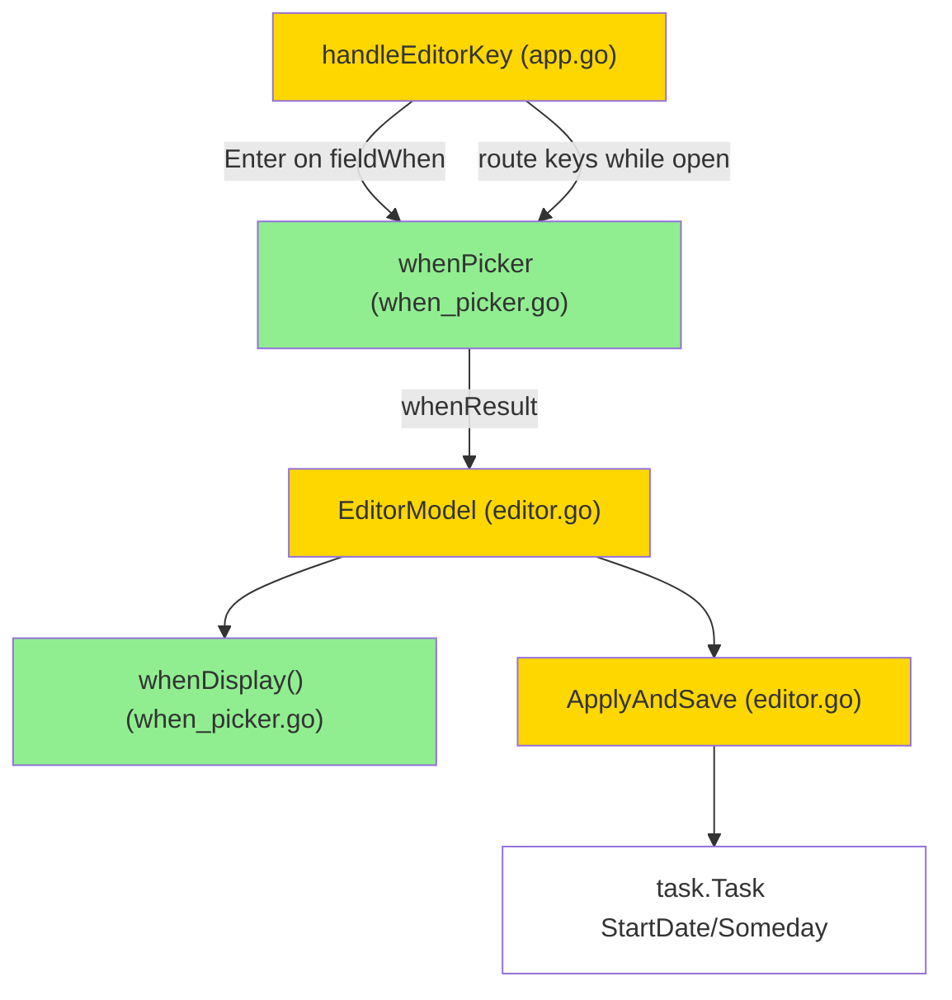

# when-picker (BL-11) — Design

## 2.1 Overview
Новый overlay-компонент `whenPicker` (по образцу `areaPicker`) и рефактор
task-editor: вместо free-text `Start` + тумблера Anytime/Someday — единое
поле «When», открывающее пикер (Today / Pick date… / Someday / Anytime).
Редактор хранит выбор как `(startDate *task.Date, someday bool)`;
`ApplyAndSave` проецирует их на задачу. Доменных изменений нет.

## 2.2 Architecture

**Implementation order:** (1) `whenPicker` + `whenDisplay` (изолированно, с тестами) → (2) интеграция в `EditorModel` (поля, `NewEditor`, `ApplyAndSave`, `View`, удаление `fieldStart`/`shellEditorWhen`) → (3) роутинг в `handleEditorKey`.

## 2.3 Components and Interfaces

### Files Requiring Changes
| File | Change Type | Description |
|------|-------------|-------------|
| `internal/tui/when_picker.go` | `[NEW]` | `whenPicker`, `whenResult`, `newWhenPicker`, `Update`, `View`, `whenDisplay` |
| `internal/tui/editor.go` | `[MODIFIED]` | убрать `start`/`when`/`shellEditorWhen` и `fieldStart`; добавить `startDate`/`someday`/`whenPicker`; правки `NewEditor`, `focusCurrent`, `UpdateForm`, `nextField/prevField` (через `fieldCount`), `ApplyAndSave`, `View` |
| `internal/tui/app.go` | `[MODIFIED]` | `handleEditorKey`: роутить ключи во `whenPicker` пока открыт; открывать по Enter на `fieldWhen`; убрать Space-toggle |
| `internal/tui/when_picker_test.go` | `[NEW]` | unit + PBT |
| `internal/tui/editor_test.go` | `[MODIFIED]` | обновить под удалённый `fieldStart` и новое When-состояние |

### Interfaces (signatures only)
```go
type whenOutcome int
const ( whenNone whenOutcome = iota; whenCancel; whenSelected )

type whenResult struct {
    outcome   whenOutcome
    startDate *task.Date // valid when whenSelected (nil for Someday/Anytime)
    someday   bool
}

// now drives "today" and initial cursor; picker is pure (no svc).
func newWhenPicker(startDate *task.Date, someday bool, now time.Time) whenPicker
func (p whenPicker) Update(msg tea.KeyMsg) (whenPicker, whenResult)
func (p whenPicker) View(theme Theme, width int) string

// whenDisplay renders the When label for the editor field.
func whenDisplay(startDate *task.Date, someday bool, now time.Time) string
```

### Files NOT Requiring Changes
| File | Reason Unchanged |
|------|-----------------|
| `internal/domain/task/*`, `internal/domain/today/*` | используем существующие `StartDate`/`Someday`; домен не меняется |
| `internal/app/queries.go` | списки уже корректны |
| `internal/tui/project_editor.go` | пикер только в task-editor (у проекта нет start-даты) |
| `internal/tui/area_picker.go` | используется как образец, не меняется |

## 2.4 Key Decisions (ADR)

**ADR-1: единый When-пикер вместо `Start`+тумблера** (выбор пользователя, Option A)
- **Options:** A — заменить оба контрола; B — оставить `Start` рядом.
- **Decision:** A.
- **Rationale:** один источник истины для start-даты, Things-подобно, меньше шума.
- **Consequences:** удаляется `fieldStart`; правятся `editor_test.go` и editor round-trip PBT.

**ADR-2: редактор хранит When как `(startDate *task.Date, someday bool)`**
- **Options:** A — держать `textinput`+enum и парсить на save (как сейчас); B — хранить уже разобранное состояние.
- **Decision:** B.
- **Rationale:** round-trip и `ApplyAndSave` тривиальны (`t.StartDate=m.startDate; t.Someday=m.someday`); парсинг даты происходит один раз — в пикере.
- **Consequences:** `NewEditor` инициализирует поля из задачи; убирается start-parsing в `ApplyAndSave`.

**ADR-3: `whenPicker.Update` без `svc`**
- **Context:** `areaPicker.Update` принимает `svc` (inline-create в БД); у When-пикера БД не нужна.
- **Decision:** сигнатура без `svc` — пикер чист.
- **Rationale:** чистый детерминированный компонент, проще тесты.
- **Consequences:** роутинг в `handleEditorKey` для When-пикера проще, чем для area.

**ADR-4 (Versioning): контракт**
- Меняется UI-набор полей редактора (удалён `Start`), но **нет** изменений exported API / `Theme` / config / схемы (пакет `internal`). Это новая пользовательская функция/взаимодействие → предлагаемый bump **minor (v0.12.0)**; финально — на этапе релиза по [[release-cadence]]. Миграции данных нет (поля `StartDate`/`Someday` те же).

## 2.5 Data Models
```go
// [MODIFIED] EditorModel
//   removed: start textinput.Model; when shellEditorWhen
//   added:
startDate  *task.Date  // chosen When start date (nil = none)
someday    bool         // chosen Someday state
whenPicker *whenPicker  // non-nil while overlay open

// [REMOVED] shellEditorWhen enum (whenAnytime/whenSomeday)
// [REMOVED] editorField value fieldStart (fieldCount: 9 → 8)

// [NEW] whenPicker
whenPicker {
    cursor    int             // 0=Today 1=PickDate 2=Someday 3=Anytime
    entering  bool            // date sub-mode active
    dateInput textinput.Model // YYYY-MM-DD, active while entering
    now       time.Time       // injected; today = startOfDay(now)
    err       string          // invalid-date message (keeps picker open)
}

// [NEW] whenResult — see §2.3
```

## 2.6 Correctness Properties
```
Property 1: Choice → state mapping
Category: Propagation
Statement: For all selections, the emitted (startDate, someday) is: Today→(today,false); PickDate(d)→(d,false); Someday→(nil,true); Anytime→(nil,false).
Validates: Requirements 2.1, 2.2, 2.3, 2.4

Property 2: State exclusivity
Category: Exclusion
Statement: For all emitted whenResult with outcome==whenSelected, NOT (someday==true AND startDate!=nil).
Validates: Requirements 2.2

Property 3: Invalid date is inert
Category: Absence
Statement: For all non-parseable date strings entered, Update returns outcome==whenNone, err!="", and emits no (startDate,someday) change.
Validates: Requirements 3.1

Property 4: Open round-trip
Category: Round-trip
Statement: For all (startDate,someday) task states, newWhenPicker positions the cursor on the matching row (Someday→2; startDate==today→0; startDate!=nil→1; else→3), and an editor opened on that task renders the matching When label.
Validates: Requirements 1.3, 6.2

Property 5: Display mapping
Category: Equivalence
Statement: For all (startDate,someday,now), whenDisplay == "Someday" iff someday; else "Anytime" iff startDate==nil; else "Today" iff startDate==today; else the YYYY-MM-DD string.
Validates: Requirements 4.2

Property 6: No Start field / inert cancel
Category: Absence
Statement: For all editor renders, the output contains no free-text "Start" field; Enter on fieldWhen opens the picker (whenPicker!=nil); Esc in list mode and Esc in date sub-mode leave (startDate,someday) unchanged; rows are exactly [Today, Pick date…, Someday, Anytime].
Validates: Requirements 1.1, 1.2, 3.2, 4.1, 5.1

Property 7: Save propagation & preservation
Category: Propagation
Statement: For all editor states, ApplyAndSave sets t.StartDate=startDate and t.Someday=someday and leaves Title/Notes/Deadline/Area/Project/Heading/Tags as otherwise specified.
Validates: Requirements 6.1, 7.2

Property 8: Read-only blocks write
Category: Absence
Statement: For all read-only editors, attempting save performs no EditTask write.
Validates: Requirements 7.1
```

## 2.7 Error Handling
| Scenario | Detection | Action |
|----------|-----------|--------|
| Невалидная дата в под-режиме | `time.ParseInLocation` error | `err` выставлен, пикер открыт, задача не меняется (REQ-3.1) |
| Esc в под-режиме даты | `tea.KeyEsc` | вернуться к списку строк, состояние не тронуто (REQ-3.2) |
| Esc в списке | `tea.KeyEsc` | `whenCancel` → закрыть пикер без изменений (REQ-5.1) |
| Read-only save | `m.readOnly` | существующая ветка в `saveEditor` блокирует запись (REQ-7.1) |

## 2.8 Testing Strategy

**Test Style Source:** Tier 2
- Референсы: `internal/tui/area_picker_test.go`, `internal/tui/editor_test.go`.
- Паттерны: конструирование пикера/редактора напрямую; прогон `Update` с `tea.KeyMsg`; `lipgloss.SetColorProfile(termenv.Ascii)` для View-тестов; PBT через `pgregory.net/rapid`; даты строятся относительно `time.Now()`.

**Project Commands:**
| Action | Command |
|--------|---------|
| Test | `task test` |
| Build | `task build` |
| Lint | `task lint` |

### Unit Tests
| Test | Description | Tags |
|------|-------------|------|
| `TestWhenPicker_SelectToday` | Enter на Today → whenSelected, startDate=today, someday=false | `Feature/when-picker` |
| `TestWhenPicker_SelectSomeday` | Someday → startDate=nil, someday=true | `Feature/when-picker` |
| `TestWhenPicker_SelectAnytime` | Anytime → startDate=nil, someday=false | `Feature/when-picker` |
| `TestWhenPicker_PickDateValid` | Pick date… → ввод "2030-01-02" → startDate=эта дата | `Feature/when-picker` |
| `TestWhenPicker_PickDateInvalid` | ввод "nope" → whenNone, err!="" | `Feature/when-picker` |
| `TestWhenPicker_EscInDateReturnsToList` | Esc в под-режиме → список, без выбора | `Feature/when-picker` |
| `TestWhenPicker_EscInListCancels` | Esc в списке → whenCancel | `Feature/when-picker` |
| `TestWhenPicker_InitialCursor` | курсор по состоянию (today/date/someday/anytime) | `Feature/when-picker` |
| `TestWhenDisplay_Mapping` | таблица Today/date/Someday/Anytime | `Feature/when-picker` |
| `TestEditor_NoStartField` | View редактора не содержит поля "Start" | `Feature/when-picker` |
| `TestEditor_EnterOnWhenOpensPicker` | Enter на fieldWhen → whenPicker!=nil | `Feature/when-picker` |
| `TestEditor_ApplyAndSave_WhenState` | startDate/someday персистятся; прочие поля сохранены | `Feature/when-picker` |

### Property-Based Tests
| Test | Property | Generator description | Tags |
|------|----------|-----------------------|------|
| `TestProp_WhenChoiceMapping` | Property 1 | случайный выбор из 4 строк (+ random date) | `Property/1` |
| `TestProp_WhenExclusivity` | Property 2 | случайные выборы | `Property/2` |
| `TestProp_WhenInvalidDateInert` | Property 3 | случайные непарсящиеся строки | `Property/3` |
| `TestProp_WhenOpenRoundTrip` | Property 4 | random (startDate,someday) состояния | `Property/4` |
| `TestProp_WhenDisplayMapping` | Property 5 | random (startDate,someday) | `Property/5` |
| `TestProp_EditorNoStartInertCancel` | Property 6 | random редактор + Esc-пути | `Property/6` |
| `TestProp_WhenSavePreserves` | Property 7 | random задачи, проверка прочих полей | `Property/7` |
| `TestProp_ReadOnlyBlocksWhenSave` | Property 8 | read-only редактор | `Property/8` |
